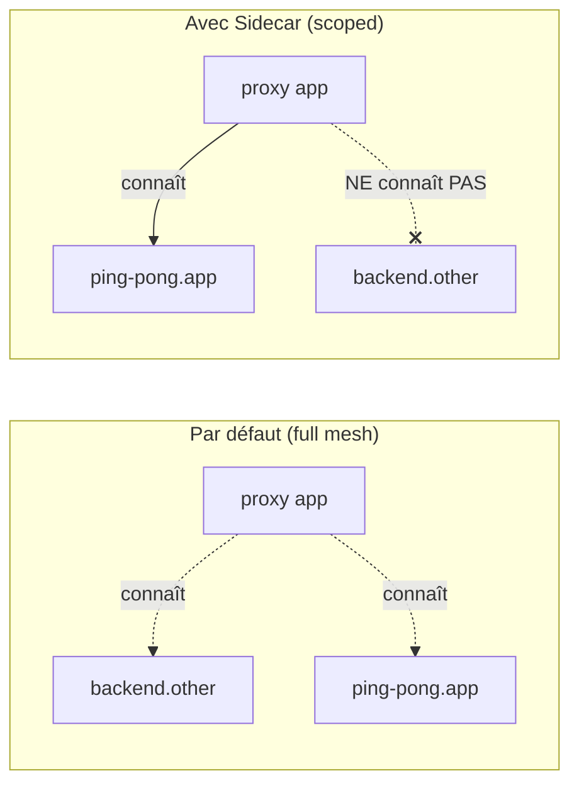

[RU version](README_RU.MD) · [Eng version](README.MD) · [Versión en español](README_ES.MD) · [Deutsche Version](README_DE.MD)

# Lab 21 - Sidecar scoping : restriction de la portée de configuration du proxy

## Vue d'ensemble

Par défaut, Istio fonctionne en « full mesh » : chaque sidecar reçoit d'istiod la
configuration de **tous** les services du maillage - même ceux qu'il ne contacte jamais.
Dans un petit cluster c'est imperceptible, mais avec des milliers de services cela signifie
d'énormes configs Envoy, beaucoup de mémoire par pod et une forte charge sur istiod à chaque
changement.

La ressource **`Sidecar`** permet de restreindre la portée : via `egress.hosts`, vous indiquez
de quels services le proxy doit avoir connaissance. C'est la façon standard de faire monter
Istio en charge : config plus petite, pushes plus rapides, charge moindre sur le control plane,
frontières egress plus nettes.

Dans ce lab, deux namespaces sont déployés :
- `app` avec le service `ping-pong` (avec sidecar) ;
- `other` avec le service `backend` (avec sidecar).

Actuellement, le proxy dans `app` contient un cluster pour `backend.other`, alors qu'il ne le
contacte jamais.



## Infrastructure

| Composant | Type | Nombre | Rôle |
|---|---|---|---|
| control-plane | `t3.medium` | 1 | master + istiod |
| worker | `t3.small` | 1 | capacité pour les services de deux namespaces |
| worker PC | `t3.small` | 1 | poste de travail : `kubectl`, `istioctl`, `check_result` |

Région : `eu-central-1` (AZ `eu-central-1a` / `eu-central-1b`).

## Déploiement

```bash
TASK=21 make run_ica_task
```

## Tâche

1. Observer que par défaut, le proxy dans `app` contient un cluster pour `backend.other`.
2. Appliquer une ressource `Sidecar` dans le namespace `app`, en limitant `egress.hosts` à son
   propre namespace (`./*`) et à `istio-system/*`.
3. Vérifier qu'ensuite :
   - la config du proxy ne contient plus de cluster pour `backend.other` ;
   - le cluster de son propre service `ping-pong.app` est conservé.

## Étape 1. Config par défaut (sans restriction)

```bash
POD=$(kubectl get pod -n app -l app=ping-pong -o jsonpath='{.items[0].metadata.name}')
istioctl proxy-config clusters "$POD" -n app | grep backend.other
# le cluster pour backend.other.svc.cluster.local est présent
```

## Étape 2. Appliquer un Sidecar pour restreindre l'egress

```bash
kubectl apply -f - <<'EOF'
apiVersion: networking.istio.io/v1
kind: Sidecar
metadata:
  name: default
  namespace: app
spec:
  egress:
    - hosts:
        - "./*"
        - "istio-system/*"
EOF
```

- `./*` - tous les services du namespace **local** (`app`) ;
- `istio-system/*` - le namespace du control plane (nécessaire pour la télémétrie, etc.).

Un `Sidecar` nommé `default` sans `workloadSelector` s'applique à tous les workloads du
namespace.

## Étape 3. Vérifier que la config a été réduite

```bash
POD=$(kubectl get pod -n app -l app=ping-pong -o jsonpath='{.items[0].metadata.name}')

# les clusters du namespace other ont disparu
istioctl proxy-config clusters "$POD" -n app | grep backend.other || echo "pruned ✅"

# les clusters de son propre namespace sont conservés
istioctl proxy-config clusters "$POD" -n app | grep ping-pong.app
```

## Comment ça fonctionne et pourquoi c'est utile

- La ressource **`Sidecar`** contrôle quelle configuration istiod pousse dans le proxy.
  `egress.hosts` est une liste blanche des services dont le proxy prend connaissance.
- Le full mesh par défaut ne monte pas en charge : chaque proxy connaît tout le monde. Le
  scoping via `Sidecar` donne des configs plus petites, des pushes rapides, une charge moindre
  sur istiod et des frontières egress plus strictes.
- À l'intérieur d'un `Sidecar`, on peut en plus définir `outboundTrafficPolicy: REGISTRY_ONLY`
  pour bloquer, au niveau du namespace, tout egress non déclaré.

> Important : le scoping concerne la *diffusion de la configuration*, pas l'autorisation. Pour
> réellement interdire les appels, utilisez `AuthorizationPolicy` (Lab 04) ou
> `outboundTrafficPolicy: REGISTRY_ONLY`.

## Vérification du résultat

Lancez sur le worker PC :

```bash
check_result
```

## Conclusion

Vous avez restreint la portée de configuration du proxy via la ressource `Sidecar` et vu les
services superflus disparaître de la config Envoy. La gestion du scoping est une compétence
senior clé pour exploiter Istio dans de grands clusters : sans elle, istiod et les sidecars
se heurtent aux limites de mémoire et de CPU à mesure que le nombre de services croît.
