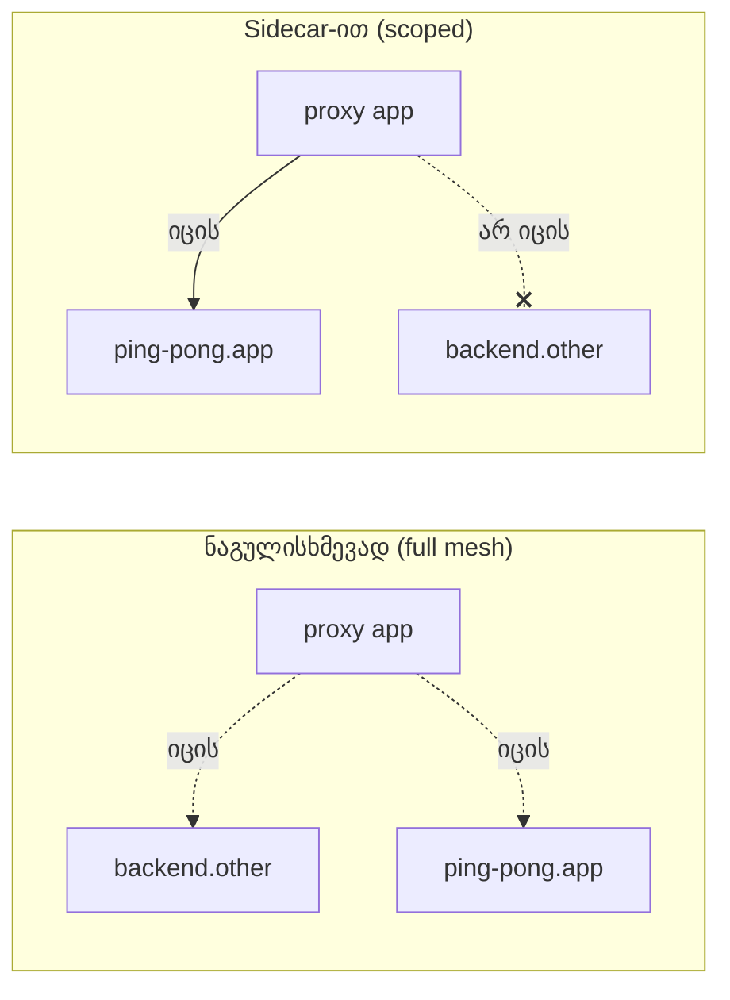

[Русская версия](README_RU.MD) · [Eng version](README.MD) · [Versión en español](README_ES.MD) · [Version française](README_FR.MD) · [Deutsche Version](README_DE.MD) · [繁體中文版](README_TW.MD) · [日本語版](README_JP.MD)

# Lab 21 - Sidecar scoping: პროქსის კონფიგურაციის არეალის შეზღუდვა

> [საცნობარო გადაწყვეტა](worker/files/solutions/1_GE.MD)

## მიმოხილვა

ნაგულისხმევად Istio მუშაობს როგორც „full mesh“: თითოეული sidecar istiod-ისგან
mesh-ის **ყველა** სერვისის კონფიგურაციას იღებს - იმ სერვისებისაც კი, რომლებსაც ის არასდროს მიმართავს.
პატარა კლასტერში ეს შეუმჩნეველია, მაგრამ ათასობით სერვისის შემთხვევაში ეს ნიშნავს Envoy-ის უზარმაზარ
კონფიგურაციებს, თითოეული pod-ის მიერ მეხსიერების დიდ მოხმარებას და ნებისმიერი ცვლილებისას istiod-ზე მაღალ დატვირთვას.

რესურსი **`Sidecar`** არეალის შეზღუდვის საშუალებას იძლევა: `egress.hosts`-ის მეშვეობით მიუთითებთ,
რომელი სერვისების შესახებ უნდა იცოდეს პროქსიმ. ეს Istio-ს მასშტაბირების სტანდარტული გზაა:
უფრო მცირე კონფიგურაცია, უფრო სწრაფი push-ები, control plane-ზე ნაკლები დატვირთვა და egress-ის უფრო მკაფიო საზღვრები.

ლაბორატორიაში გაშლილია ორი namespace:
- `app` სერვისით `ping-pong` (sidecar-ით);
- `other` სერვისით `backend` (sidecar-ით).

ამჟამად `app`-ში არსებული პროქსი შეიცავს cluster-ს `backend.other`-ისთვის, მიუხედავად იმისა, რომ მას არასდროს მიმართავს.



## ინფრასტრუქტურა

| კომპონენტი | ტიპი | რაოდენობა | როლი |
|---|---|---|---|
| control-plane | `t3.medium` | 1 | master + istiod |
| worker | `t3.small` | 1 | ორი namespace-ის სერვისებისთვის განკუთვნილი რესურსები |
| worker PC | `t3.small` | 1 | სამუშაო გარემო: `kubectl`, `istioctl`, `check_result` |

რეგიონი: `eu-central-1` (AZ `eu-central-1a` / `eu-central-1b`).

## გაშლა

```bash
TASK=21 make run_ica_task
```

## დავალება

1. შეამოწმეთ, რომ ნაგულისხმევად `app`-ის პროქსი შეიცავს cluster-ს `backend.other`-ისთვის.
2. namespace `app`-ში გამოიყენეთ რესურსი `Sidecar` და `egress.hosts` შეზღუდეთ მხოლოდ საკუთარი
   namespace-ით (`./*`) და `istio-system/*`-ით.
3. დარწმუნდით, რომ ამის შემდეგ:
   - პროქსის კონფიგურაციაში `backend.other`-ისთვის cluster აღარ არის;
   - საკუთარი სერვისის `ping-pong.app` cluster დარჩა.

## ნაბიჯი 1. ნაგულისხმევი კონფიგურაცია (შეზღუდვის გარეშე)

```bash
POD=$(kubectl get pod -n app -l app=ping-pong -o jsonpath='{.items[0].metadata.name}')
istioctl proxy-config clusters "$POD" -n app | grep backend.other
# cluster backend.other.svc.cluster.local-ისთვის არსებობს
```

## ნაბიჯი 2. egress-ის შესაზღუდად Sidecar-ის გამოყენება

```bash
kubectl apply -f - <<'EOF'
apiVersion: networking.istio.io/v1
kind: Sidecar
metadata:
  name: default
  namespace: app
spec:
  egress:
    - hosts:
        - "./*"
        - "istio-system/*"
EOF
```

- `./*` - **ლოკალური** namespace-ის (`app`) ყველა სერვისი;
- `istio-system/*` - control plane-ის namespace (საჭიროა ტელემეტრიისთვის და ა.შ.).

`Sidecar` სახელით `default`, რომელსაც `workloadSelector` არ აქვს, namespace-ის ყველა workload-ზე
ვრცელდება.

## ნაბიჯი 3. კონფიგურაციის შემცირების შემოწმება

```bash
POD=$(kubectl get pod -n app -l app=ping-pong -o jsonpath='{.items[0].metadata.name}')

# namespace other-ის clusters გაქრა
istioctl proxy-config clusters "$POD" -n app | grep backend.other || echo "pruned ✅"

# საკუთარი namespace-ის clusters დარჩა
istioctl proxy-config clusters "$POD" -n app | grep ping-pong.app
```

## როგორ მუშაობს და რისთვის არის საჭირო

- რესურსი **`Sidecar`** მართავს, თუ რომელ კონფიგურაციას უგზავნის istiod პროქსის.
  `egress.hosts` არის იმ სერვისების თეთრი სია, რომელთა შესახებაც პროქსი იგებს.
- ნაგულისხმევი სრული mesh არ მასშტაბირდება: თითოეულმა პროქსიმ ყველა სერვისის შესახებ იცის. `Sidecar`-ის
  მეშვეობით scoping უზრუნველყოფს უფრო მცირე კონფიგურაციებს, სწრაფ push-ებს, istiod-ზე ნაკლებ დატვირთვას და
  egress-ის უფრო მკაცრ საზღვრებს.
- `Sidecar`-ში დამატებით შეგიძლიათ მიუთითოთ `outboundTrafficPolicy: REGISTRY_ONLY`,
  რათა namespace-ის დონეზე დაბლოკოთ გამოუცხადებელი egress.

> მნიშვნელოვანია: scoping ეხება *კონფიგურაციის გავრცელებას* და არა ავტორიზაციას. გამოძახებების
> რეალურად ასაკრძალად გამოიყენეთ `AuthorizationPolicy` (Lab 04) ან
> `outboundTrafficPolicy: REGISTRY_ONLY`.

## შედეგის შემოწმება

worker PC-ზე გაუშვით:

```bash
check_result
```

## შეჯამება

თქვენ რესურსი `Sidecar` გამოიყენეთ პროქსის კონფიგურაციის არეალის შესაზღუდად და ნახეთ, როგორ გაქრა
Envoy-ის კონფიგურაციიდან ზედმეტი სერვისები. Scoping-ის მართვა დიდ კლასტერებში Istio-ს
ექსპლუატაციისთვის საკვანძო senior-უნარია: მის გარეშე სერვისების რაოდენობის ზრდასთან ერთად istiod-სა და sidecar-ებს
მეხსიერებისა და CPU-ის რესურსები აღარ ჰყოფნით.
