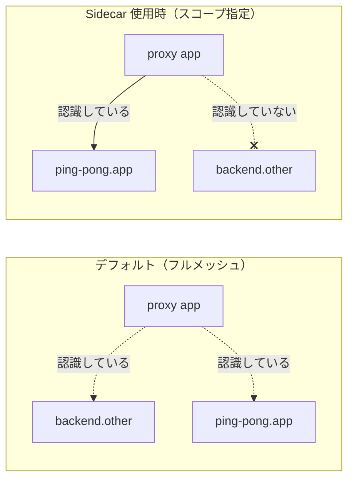

[Русская версия](README_RU.MD) · [Eng version](README.MD) · [Versión en español](README_ES.MD) · [Version française](README_FR.MD) · [Deutsche Version](README_DE.MD) · [ქართული ვერსია](README_GE.MD) · [繁體中文版](README_TW.MD)

# Lab 21 - Sidecar スコーピング: プロキシ設定の範囲を制限する

> [リファレンス解答](worker/files/solutions/1_JP.MD)

## 概要

デフォルトでは、Istio は「フルメッシュ」として動作します。各 sidecar は、決して
アクセスしないサービスも含め、mesh **内のすべての**サービスの設定を istiod から受け取ります。
小さなクラスターでは問題になりませんが、数千のサービスがある場合、これは巨大な Envoy 設定、
各 Pod の大きなメモリ使用量、および変更のたびに istiod にかかる高い負荷を意味します。

**`Sidecar`** リソースを使用すると範囲を制限できます。`egress.hosts` で、プロキシが
そもそも認識すべきサービスを指定します。これは Istio をスケールさせるための標準的な方法です。
設定は小さくなり、プッシュは高速化し、control plane の負荷は低下し、egress の境界は明確になります。

このラボでは、2 つの namespace がデプロイされています。
- `app`：`ping-pong` サービス（sidecar あり）。
- `other`：`backend` サービス（sidecar あり）。

現在、`app` のプロキシには、一度もアクセスしないにもかかわらず `backend.other` の cluster が含まれています。



## インフラストラクチャ

| コンポーネント | タイプ | 数 | 役割 |
|---|---|---|---|
| control-plane | `t3.medium` | 1 | master + istiod |
| worker | `t3.small` | 1 | 2 つの namespace のサービス用キャパシティ |
| worker PC | `t3.small` | 1 | 作業環境：`kubectl`、`istioctl`、`check_result` |

リージョン：`eu-central-1`（AZ：`eu-central-1a` / `eu-central-1b`）。

## デプロイ

```bash
TASK=21 make run_ica_task
```

## 課題

1. デフォルトで `app` のプロキシに `backend.other` の cluster が含まれていることを確認する。
2. `app` namespace に `Sidecar` リソースを適用し、`egress.hosts` を自身の
   namespace（`./*`）と `istio-system/*` のみに制限する。
3. その後、以下を確認する。
   - プロキシ設定に `backend.other` の cluster がなくなっている。
   - 自身のサービス `ping-pong.app` の cluster は残っている。

## ステップ 1. デフォルト設定（制限なし）

```bash
POD=$(kubectl get pod -n app -l app=ping-pong -o jsonpath='{.items[0].metadata.name}')
istioctl proxy-config clusters "$POD" -n app | grep backend.other
# cluster for backend.other.svc.cluster.local が存在する
```

## ステップ 2. egress を制限する Sidecar を適用する

```bash
kubectl apply -f - <<'EOF'
apiVersion: networking.istio.io/v1
kind: Sidecar
metadata:
  name: default
  namespace: app
spec:
  egress:
    - hosts:
        - "./*"
        - "istio-system/*"
EOF
```

- `./*`：**ローカル** namespace（`app`）のすべてのサービス。
- `istio-system/*`：control plane の namespace（テレメトリーなどに必要）。

`workloadSelector` なしで `default` という名前を持つ `Sidecar` は、当該 namespace の
すべてのワークロードに適用されます。

## ステップ 3. 設定が縮小されたことを確認する

```bash
POD=$(kubectl get pod -n app -l app=ping-pong -o jsonpath='{.items[0].metadata.name}')

# namespace other の clusters が消えた
istioctl proxy-config clusters "$POD" -n app | grep backend.other || echo "pruned ✅"

# 自分の namespace の clusters は残っている
istioctl proxy-config clusters "$POD" -n app | grep ping-pong.app
```

## 仕組みと必要な理由

- **`Sidecar`** リソースは、istiod がプロキシにプッシュする設定を制御します。
  `egress.hosts` は、プロキシが認識するサービスの許可リストです。
- デフォルトのフルメッシュはスケールしません。各プロキシがすべてを認識するためです。
  `Sidecar` によるスコーピングは、より小さな設定、より高速なプッシュ、istiod の負荷軽減、
  およびより厳密な egress 境界を実現します。
- `Sidecar` 内ではさらに `outboundTrafficPolicy: REGISTRY_ONLY` を指定でき、namespace レベルで
  宣言されていない egress をブロックできます。

> 重要：スコーピングは*設定の配布*に関するものであり、認可に関するものではありません。
> 実際に呼び出しを禁止するには、`AuthorizationPolicy`（Lab 04）または
> `outboundTrafficPolicy: REGISTRY_ONLY` を使用してください。

## 結果の確認

worker PC で以下を実行します。

```bash
check_result
```

## まとめ

`Sidecar` リソースを通じてプロキシ設定の範囲を制限し、不要なサービスが Envoy 設定から
消えることを確認しました。スコーピングの管理は、大規模クラスターで Istio を運用するための重要な
シニアスキルです。これがない場合、サービス数の増加に伴い istiod と sidecar はメモリと CPU の限界に達します。