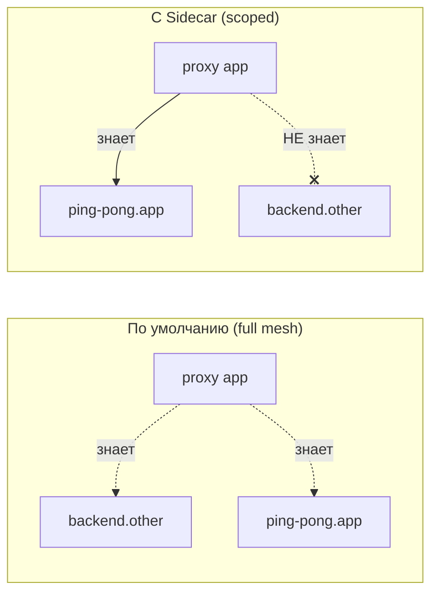

[Eng version](README.MD)

# Lab 21 — Sidecar scoping: ограничение области конфигурации прокси

## Обзор

По умолчанию Istio работает как «full mesh»: каждый sidecar получает от istiod
конфигурацию **всех** сервисов mesh — даже тех, к которым он никогда не обращается. В
маленьком кластере это незаметно, но при тысячах сервисов это означает огромные конфиги
Envoy, много памяти на каждый под и высокую нагрузку на istiod при любом изменении.

Ресурс **`Sidecar`** позволяет ограничить область: через `egress.hosts` вы указываете,
о каких сервисах прокси вообще должен знать. Это стандартный способ масштабирования
Istio: меньше конфиг, быстрее пуши, ниже нагрузка на control plane, чётче границы egress.

В лабе развёрнуты два namespace:
- `app` с сервисом `ping-pong` (с sidecar);
- `other` с сервисом `backend` (с sidecar).

Сейчас прокси в `app` содержит cluster для `backend.other`, хотя никогда к нему не ходит.



## Задание

1. Посмотреть, что по умолчанию прокси в `app` содержит cluster для `backend.other`.
2. Применить ресурс `Sidecar` в namespace `app`, ограничив `egress.hosts` только своим
   namespace (`./*`) и `istio-system/*`.
3. Убедиться, что после этого:
   - в конфиге прокси больше нет cluster для `backend.other`;
   - cluster для собственного сервиса `ping-pong.app` остался.

## Шаг 1. Конфиг по умолчанию (без ограничения)

```bash
POD=$(kubectl get pod -n app -l app=ping-pong -o jsonpath='{.items[0].metadata.name}')
istioctl proxy-config clusters "$POD" -n app | grep backend.other
# cluster для backend.other.svc.cluster.local присутствует
```

## Шаг 2. Применить Sidecar для ограничения egress

```bash
kubectl apply -f - <<'EOF'
apiVersion: networking.istio.io/v1
kind: Sidecar
metadata:
  name: default
  namespace: app
spec:
  egress:
    - hosts:
        - "./*"
        - "istio-system/*"
EOF
```

- `./*` — все сервисы **локального** namespace (`app`);
- `istio-system/*` — namespace control plane (нужен для телеметрии и т.п.).

`Sidecar` с именем `default` без `workloadSelector` применяется ко всем ворклоадам
namespace.

## Шаг 3. Проверить, что конфиг сократился

```bash
POD=$(kubectl get pod -n app -l app=ping-pong -o jsonpath='{.items[0].metadata.name}')

# clusters из namespace other исчезли
istioctl proxy-config clusters "$POD" -n app | grep backend.other || echo "pruned ✅"

# clusters своего namespace остались
istioctl proxy-config clusters "$POD" -n app | grep ping-pong.app
```

## Как это работает и зачем нужно

- Ресурс **`Sidecar`** управляет тем, какую конфигурацию istiod пушит в прокси.
  `egress.hosts` — белый список сервисов, о которых прокси узнаёт.
- Полный mesh по умолчанию не масштабируется: каждый прокси знает про всех. Scoping
  через `Sidecar` даёт меньшие конфиги, быстрые пуши, меньшую нагрузку на istiod и более
  строгие границы egress.
- Внутри `Sidecar` можно дополнительно задать `outboundTrafficPolicy: REGISTRY_ONLY`,
  чтобы на уровне namespace блокировать необъявленный egress.

> Важно: scoping — это про *распространение конфигурации*, а не про авторизацию. Чтобы
> реально запретить вызовы, используйте `AuthorizationPolicy` (Lab 04) или
> `outboundTrafficPolicy: REGISTRY_ONLY`.

## Проверка результата

Запустите на worker PC:

```bash
check_result
```

## Итог

Вы ограничили область конфигурации прокси через ресурс `Sidecar` и увидели, как из
конфига Envoy исчезли лишние сервисы. Управление scoping — ключевой senior-навык для
эксплуатации Istio в больших кластерах: без него istiod и sidecar'ы упираются в память и
CPU по мере роста числа сервисов.

## Инфраструктура

| Компонент | Тип | Кол-во | Роль |
|---|---|---|---|
| control-plane | `t3.medium` | 1 | master + istiod |
| worker | `t3.small` | 1 | ёмкость для сервисов двух namespace |
| worker PC | `t3.small` | 1 | рабочее место: `kubectl`, `istioctl`, `check_result` |

Регион: `eu-central-1` (AZ `eu-central-1a` / `eu-central-1b`).
