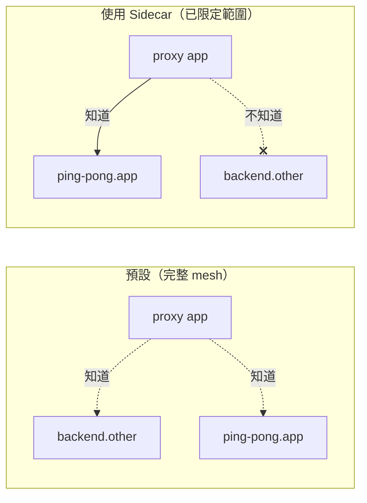

[Русская версия](README_RU.MD) · [Eng version](README.MD) · [Versión en español](README_ES.MD) · [Version française](README_FR.MD) · [Deutsche Version](README_DE.MD) · [ქართული ვერსია](README_GE.MD) · [日本語版](README_JP.MD)

# Lab 21 - Sidecar 範圍界定：限制 Proxy 設定範圍

> [參考解答](worker/files/solutions/1_TW.MD)

## 概述

預設情況下，Istio 以「完整 mesh」方式運作：每個 sidecar 都會從 istiod 取得
**所有** mesh 服務的設定--即使是它永遠不會存取的服務。在小型叢集中這不明顯，
但當有數千個服務時，這意味著龐大的 Envoy 設定、每個 Pod 佔用大量記憶體，以及
每次變更時 istiod 的高負載。

**`Sidecar`** 資源可讓您限制範圍：透過 `egress.hosts` 指定 Proxy 應該知道哪些
服務。這是擴展 Istio 的標準方法：設定更小、推送更快、control plane 負載更低，
egress 邊界也更清晰。

此 Lab 部署了兩個 namespace：
- `app`，內含服務 `ping-pong`（有 sidecar）；
- `other`，內含服務 `backend`（有 sidecar）。

目前，`app` 中的 Proxy 包含 `backend.other` 的 cluster，但它從未存取過該服務。



## 基礎設施

| 元件 | 類型 | 數量 | 角色 |
|---|---|---|---|
| control-plane | `t3.medium` | 1 | master + istiod |
| worker | `t3.small` | 1 | 供兩個 namespace 的服務使用的容量 |
| worker PC | `t3.small` | 1 | 工作站：`kubectl`、`istioctl`、`check_result` |

區域：`eu-central-1`（AZ `eu-central-1a` / `eu-central-1b`）。

## 部署

```bash
TASK=21 make run_ica_task
```

## 任務

1. 查看預設情況下 `app` 中的 Proxy 包含 `backend.other` 的 cluster。
2. 在 namespace `app` 中套用 `Sidecar` 資源，將 `egress.hosts` 限制為僅包含其自身
   namespace（`./*`）和 `istio-system/*`。
3. 確認之後：
   - Proxy 設定中不再有 `backend.other` 的 cluster；
   - 自有服務 `ping-pong.app` 的 cluster 仍然存在。

## 步驟 1：預設設定（無限制）

```bash
POD=$(kubectl get pod -n app -l app=ping-pong -o jsonpath='{.items[0].metadata.name}')
istioctl proxy-config clusters "$POD" -n app | grep backend.other
# backend.other.svc.cluster.local 的 cluster 存在
```

## 步驟 2：套用 Sidecar 以限制 egress

```bash
kubectl apply -f - <<'EOF'
apiVersion: networking.istio.io/v1
kind: Sidecar
metadata:
  name: default
  namespace: app
spec:
  egress:
    - hosts:
        - "./*"
        - "istio-system/*"
EOF
```

- `./*`：**本機** namespace（`app`）中的所有服務；
- `istio-system/*`：control plane namespace（遙測等功能需要）。

名稱為 `default` 且沒有 `workloadSelector` 的 `Sidecar` 會套用至該 namespace 的
所有 workload。

## 步驟 3：確認設定已縮減

```bash
POD=$(kubectl get pod -n app -l app=ping-pong -o jsonpath='{.items[0].metadata.name}')

# 來自 namespace other 的 clusters 已消失
istioctl proxy-config clusters "$POD" -n app | grep backend.other || echo "pruned ✅"

# 自身 namespace 的 clusters 仍保留
istioctl proxy-config clusters "$POD" -n app | grep ping-pong.app
```

## 運作原理與必要性

- **`Sidecar`** 資源控制 istiod 推送到 Proxy 的設定內容。
  `egress.hosts` 是 Proxy 可得知服務的允許清單。
- 預設的完整 mesh 無法擴展：每個 Proxy 都知道所有服務。透過 `Sidecar` 進行範圍
  界定可帶來更小的設定、更快的推送、更低的 istiod 負載，以及更嚴格的 egress 邊界。
- 您還可以在 `Sidecar` 內額外設定 `outboundTrafficPolicy: REGISTRY_ONLY`，
  以便在 namespace 層級封鎖未宣告的 egress。

> 重要：範圍界定關乎*設定傳播*，而非授權。若要實際禁止呼叫，請使用
> `AuthorizationPolicy`（Lab 04）或 `outboundTrafficPolicy: REGISTRY_ONLY`。

## 驗證結果

在 worker PC 上執行：

```bash
check_result
```

## 總結

您已透過 `Sidecar` 資源限制 Proxy 設定範圍，並看到多餘服務如何從 Envoy 設定中
消失。管理範圍界定是在大型叢集中操作 Istio 的關鍵資深技能：沒有它，隨著服務數量
增加，istiod 和 sidecar 都會受到記憶體與 CPU 的限制。
