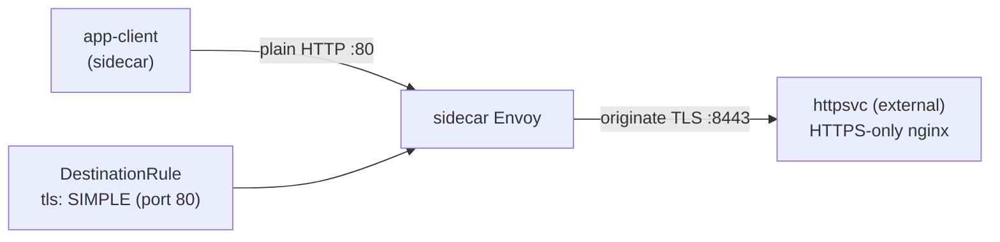

[RU version](README_RU.MD) · [Versión en español](README_ES.MD)

# Lab 22 - TLS origination: initiate TLS from the mesh

## Overview

**TLS origination** is when an application speaks plain HTTP and its sidecar establishes
the TLS connection to the destination. The app stays simple (no certificate handling),
and all TLS to external/legacy services is handled uniformly by the mesh.

This lab deploys an "external", **TLS-only** backend: nginx terminates TLS on port `8443`
(namespace `external`, no sidecar), and the Service `httpsvc` exposes it on plaintext
port `80` (`targetPort: 8443`). An in-mesh client `app-client` runs in namespace `app`.



## Task

1. Confirm that without origination the request to `httpsvc.external` fails (`400` -
   plaintext hit the TLS port).
2. Create a `DestinationRule` for `httpsvc.external.svc.cluster.local` enabling TLS
   origination (`tls.mode: SIMPLE`) on port `80`.
3. Confirm the client gets `200` with body `secure-ok`.

## Step 1. Failure without origination

```bash
kubectl exec -n app deploy/app-client -c curl -- \
  curl -s -o /dev/null -w "%{http_code}\n" http://httpsvc.external.svc.cluster.local/
# -> 400 : plaintext hit the TLS-only port
```

## Step 2. Configure TLS origination with a DestinationRule

The backend uses a self-signed certificate, so we skip upstream verification with
`insecureSkipVerify: true`. In production you would set `caCertificates` to the CA that
signed the upstream instead.

```bash
kubectl apply -f - <<'EOF'
apiVersion: networking.istio.io/v1
kind: DestinationRule
metadata:
  name: httpsvc-tls-origination
  namespace: app
spec:
  host: httpsvc.external.svc.cluster.local
  trafficPolicy:
    portLevelSettings:
    - port:
        number: 80
      tls:
        mode: SIMPLE
        insecureSkipVerify: true
EOF
```

## Step 3. Verify

```bash
kubectl exec -n app deploy/app-client -c curl -- \
  curl -s -w "\nHTTP %{http_code}\n" http://httpsvc.external.svc.cluster.local/
# -> secure-ok
#    HTTP 200
```

## How it works

- The client sends plain **HTTP** to `httpsvc.external:80`. No app code changes, no
  certificates to manage in the app.
- The `DestinationRule` with `tls.mode: SIMPLE` on port 80 tells the client-side Envoy to
  **originate TLS** to the upstream endpoints (the backend's `targetPort: 8443`).
- The backend receives a proper TLS connection and returns `200`.
- In Istio, `SIMPLE` **verifies** the upstream certificate by default. Our backend uses a
  self-signed cert, so we set `insecureSkipVerify: true`. In production you would instead
  set `caCertificates` (and optionally `subjectAltNames`) to verify the upstream, or use
  `MUTUAL` for client-certificate authentication.

## Why originate TLS in the mesh

- Applications stay simple (plain HTTP) while all TLS to external/legacy services is
  handled uniformly by the mesh.
- Combined with an **egress gateway** (Lab 05), origination can be centralized on a
  dedicated node so all outbound TLS leaves the cluster through one audited,
  policy-controlled hop.

## Check the result

Run on the worker PC:

```bash
check_result
```

## Summary

You configured mesh-side TLS origination: the app speaks HTTP while the sidecar
establishes TLS to a TLS-only service. This is a common pattern for integrating with
external and legacy HTTPS services without changing application code - a key Traffic
Management skill.

## Infrastructure

| Component | Type | Count | Role |
|---|---|---|---|
| control-plane | `t3.medium` | 1 | master + istiod |
| worker | `t3.small` | 1 | capacity for the client and the "external" backend |
| worker PC | `t3.small` | 1 | workstation: `kubectl`, `check_result` |

Region: `eu-central-1` (AZ `eu-central-1a` / `eu-central-1b`).
