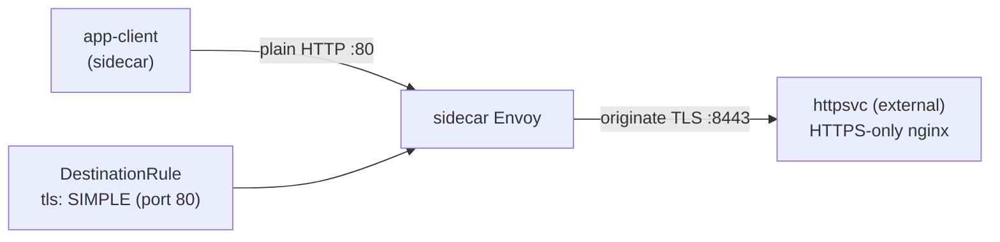

[RU version](README_RU.MD) · [Eng version](README.MD) · [Versión en español](README_ES.MD) · [Version française](README_FR.MD)

# Lab 22 - TLS origination: Initiierung von TLS auf der Mesh-Seite

## Überblick

**TLS origination** liegt vor, wenn die Anwendung über normales HTTP kommuniziert und der
Sidecar selbst die TLS-Verbindung zum Zielservice aufbaut. So bleibt der Anwendungscode
einfach (keine Arbeit mit Zertifikaten), und das gesamte TLS zu externen/Legacy-Services
übernimmt einheitlich das Mesh.

Im Lab ist ein „externes" Backend deployt, das **nur TLS** akzeptiert: nginx terminiert
TLS auf Port `8443` (Namespace `external`, ohne Sidecar), und der Service `httpsvc`
veröffentlicht es auf dem Plaintext-Port `80` (`targetPort: 8443`). Im Mesh gibt es einen
Client `app-client` (Namespace `app`, mit Sidecar).



## Aufgabe

1. Sicherstellen, dass ohne origination eine Anfrage an `httpsvc.external` fehlschlägt
   (`400` - Plaintext landet auf einem TLS-Port).
2. Eine `DestinationRule` für `httpsvc.external.svc.cluster.local` erstellen, die TLS
   origination (`tls.mode: SIMPLE`) auf Port `80` aktiviert.
3. Prüfen, dass der Client `200` und den Body `secure-ok` erhält.

## Schritt 1. Verhalten ohne origination

```bash
kubectl exec -n app deploy/app-client -c curl -- \
  curl -s -o /dev/null -w "%{http_code}\n" http://httpsvc.external.svc.cluster.local/
# -> 400 : plaintext landete auf einem TLS-only Port
```

## Schritt 2. TLS origination über eine DestinationRule konfigurieren

Das Backend verwendet ein self-signed Zertifikat, daher deaktivieren wir die
Upstream-Prüfung über `insecureSkipVerify: true`. In der Produktion setzt man stattdessen
`caCertificates` mit der CA, die den Upstream signiert hat.

```bash
kubectl apply -f - <<'EOF'
apiVersion: networking.istio.io/v1
kind: DestinationRule
metadata:
  name: httpsvc-tls-origination
  namespace: app
spec:
  host: httpsvc.external.svc.cluster.local
  trafficPolicy:
    portLevelSettings:
    - port:
        number: 80
      tls:
        mode: SIMPLE
        insecureSkipVerify: true
EOF
```

## Schritt 3. Prüfung

```bash
kubectl exec -n app deploy/app-client -c curl -- \
  curl -s -w "\nHTTP %{http_code}\n" http://httpsvc.external.svc.cluster.local/
# -> secure-ok
#    HTTP 200
```

## Wie es funktioniert

- Der Client sendet normales **HTTP** an `httpsvc.external:80`. Weder Codeänderungen noch
  Zertifikate in der Anwendung.
- Die `DestinationRule` mit `tls.mode: SIMPLE` auf Port 80 weist den client-side Envoy an,
  **TLS zu initiieren** zum Upstream (das Backend lauscht auf `targetPort: 8443`).
- Das Backend erhält eine korrekte TLS-Verbindung und gibt `200` zurück.
- In Istio **prüft** `SIMPLE` standardmäßig das Serverzertifikat. Unser Backend verwendet
  ein self-signed cert, daher setzen wir `insecureSkipVerify: true`. In der Produktion
  setzt man stattdessen `caCertificates` (und bei Bedarf `subjectAltNames`) zur Prüfung
  des Upstream oder nutzt `MUTUAL` für die Client-Authentifizierung per Zertifikat.

## Warum TLS im Mesh initiieren

- Anwendungen bleiben einfach (plain HTTP), und das gesamte TLS zu externen/Legacy-Services
  behandelt einheitlich das Mesh.
- In Kombination mit einem **egress gateway** (Lab 05) lässt sich origination auf einem
  dedizierten Knoten zentralisieren, sodass das gesamte ausgehende TLS den Cluster über
  einen auditierbaren, per Policy gesteuerten Hop verlässt.

## Ergebnisprüfung

Führen Sie auf dem worker PC aus:

```bash
check_result
```

## Fazit

Sie haben die Initiierung von TLS auf der Mesh-Seite konfiguriert: die Anwendung
kommuniziert über HTTP, und der Sidecar baut TLS zu einem Service auf, der nur TLS
akzeptiert. Das ist ein häufiges Integrationsmuster für externe und Legacy-HTTPS-Services
ohne Änderung des Anwendungscodes - eine wichtige Fähigkeit der Domäne Traffic Management.

## Infrastruktur

| Komponente | Typ | Anzahl | Rolle |
|---|---|---|---|
| control-plane | `t3.medium` | 1 | master + istiod |
| worker | `t3.small` | 1 | Kapazität für Client und „externes" Backend |
| worker PC | `t3.small` | 1 | Arbeitsplatz: `kubectl`, `check_result` |

Region: `eu-central-1` (AZ `eu-central-1a` / `eu-central-1b`).
