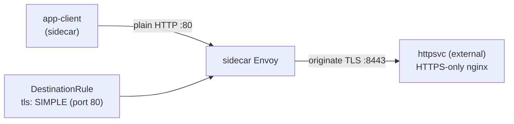

[RU version](README_RU.MD) · [Eng version](README.MD) · [Version française](README_FR.MD) · [Deutsche Version](README_DE.MD)

# Lab 22 - TLS origination: iniciación de TLS del lado de la malla

## Resumen

El **TLS origination** consiste en que la aplicación se comunica por HTTP normal y es el
propio sidecar quien establece la conexión TLS hacia el servicio de destino. Así el código
de la aplicación se mantiene sencillo (sin manejar certificados) y todo el TLS hacia
servicios externos o legacy lo asume la malla de forma uniforme.

En el lab se despliega un backend «externo» que acepta **solo TLS**: nginx termina TLS en
el puerto `8443` (namespace `external`, sin sidecar), y el Service `httpsvc` lo publica en
el puerto plaintext `80` (`targetPort: 8443`). En la malla hay un cliente `app-client`
(namespace `app`, con sidecar).



## Infraestructura

| Componente | Tipo | Cantidad | Rol |
|---|---|---|---|
| control-plane | `t3.medium` | 1 | master + istiod |
| worker | `t3.small` | 1 | capacidad para el cliente y el backend «externo» |
| worker PC | `t3.small` | 1 | puesto de trabajo: `kubectl`, `check_result` |

Región: `eu-central-1` (AZ `eu-central-1a` / `eu-central-1b`).

## Despliegue

```bash
TASK=22 make run_ica_task
```

## Tarea

1. Comprobar que sin origination la petición a `httpsvc.external` falla (`400` - el
   plaintext llegó al puerto TLS).
2. Crear un `DestinationRule` para `httpsvc.external.svc.cluster.local` que active el TLS
   origination (`tls.mode: SIMPLE`) en el puerto `80`.
3. Comprobar que el cliente recibe `200` y el cuerpo `secure-ok`.

## Paso 1. Comportamiento sin origination

```bash
kubectl exec -n app deploy/app-client -c curl -- \
  curl -s -o /dev/null -w "%{http_code}\n" http://httpsvc.external.svc.cluster.local/
# -> 400 : el plaintext llegó a un puerto solo-TLS
```

## Paso 2. Configurar el TLS origination mediante DestinationRule

El backend usa un certificado self-signed, por eso desactivamos la verificación del
upstream con `insecureSkipVerify: true`. En producción, en su lugar, se define
`caCertificates` con la CA que firma el upstream.

```bash
kubectl apply -f - <<'EOF'
apiVersion: networking.istio.io/v1
kind: DestinationRule
metadata:
  name: httpsvc-tls-origination
  namespace: app
spec:
  host: httpsvc.external.svc.cluster.local
  trafficPolicy:
    portLevelSettings:
    - port:
        number: 80
      tls:
        mode: SIMPLE
        insecureSkipVerify: true
EOF
```

## Paso 3. Comprobación

```bash
kubectl exec -n app deploy/app-client -c curl -- \
  curl -s -w "\nHTTP %{http_code}\n" http://httpsvc.external.svc.cluster.local/
# -> secure-ok
#    HTTP 200
```

## Cómo funciona

- El cliente envía HTTP normal a `httpsvc.external:80`. Sin cambios de código ni
  certificados en la aplicación.
- El `DestinationRule` con `tls.mode: SIMPLE` en el puerto 80 le indica al Envoy del lado
  del cliente que **inicie TLS** hacia el upstream (el backend escucha en
  `targetPort: 8443`).
- El backend recibe una conexión TLS correcta y devuelve `200`.
- En Istio, `SIMPLE` por defecto **verifica** el certificado del servidor. Nuestro backend
  usa un cert self-signed, por eso ponemos `insecureSkipVerify: true`. En producción, en
  su lugar, se define `caCertificates` (y si hace falta `subjectAltNames`) para verificar
  el upstream, o se usa `MUTUAL` para la autenticación del cliente por certificado.

## Por qué iniciar TLS en la malla

- Las aplicaciones se mantienen sencillas (plain HTTP) y todo el TLS hacia servicios
  externos o legacy lo maneja la malla de forma uniforme.
- En combinación con un **egress gateway** (Lab 05), el origination se puede centralizar
  en un nodo dedicado, para que todo el TLS saliente abandone el clúster a través de un
  único salto auditable y gobernado por políticas.

## Verificación del resultado

Ejecuta en el worker PC:

```bash
check_result
```

## Conclusión

Has configurado la iniciación de TLS del lado de la malla: la aplicación se comunica por
HTTP y el sidecar establece TLS hacia un servicio que acepta solo TLS. Es un patrón
frecuente de integración con servicios externos y HTTPS legacy sin modificar el código de
la aplicación, una habilidad importante del dominio Traffic Management.
