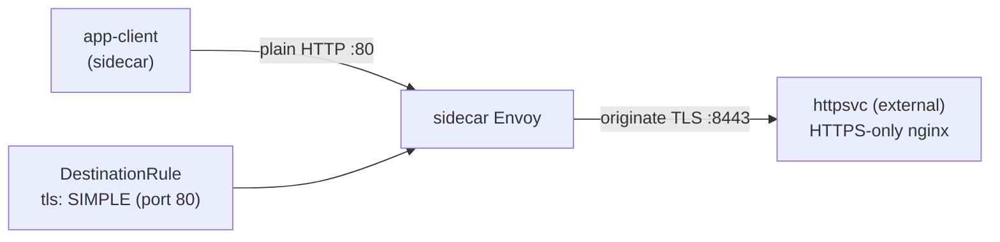

[RU version](README_RU.MD) · [Eng version](README.MD) · [Versión en español](README_ES.MD) · [Deutsche Version](README_DE.MD)

# Lab 22 - TLS origination : initiation du TLS côté maillage

## Aperçu

Le **TLS origination**, c'est quand l'application communique en HTTP simple, et que le
sidecar établit lui-même la connexion TLS vers le service cible. Ainsi le code de
l'application reste simple (aucune manipulation de certificats), et tout le TLS vers les
services externes/legacy est pris en charge de façon uniforme par le maillage.

Dans ce lab, un backend « externe » est déployé et n'accepte **que le TLS** : nginx
termine le TLS sur le port `8443` (namespace `external`, sans sidecar), tandis que le
Service `httpsvc` le publie sur le port plaintext `80` (`targetPort: 8443`). Le maillage
contient un client `app-client` (namespace `app`, avec sidecar).



## Infrastructure

| Composant | Type | Qté | Rôle |
|---|---|---|---|
| control-plane | `t3.medium` | 1 | master + istiod |
| worker | `t3.small` | 1 | capacité pour le client et le backend « externe » |
| worker PC | `t3.small` | 1 | poste de travail : `kubectl`, `check_result` |

Région : `eu-central-1` (AZ `eu-central-1a` / `eu-central-1b`).

## Déploiement

```bash
TASK=22 make run_ica_task
```

## Exercice

1. Vérifier que sans origination, la requête vers `httpsvc.external` échoue (`400` - du
   plaintext arrive sur un port TLS).
2. Créer une `DestinationRule` pour `httpsvc.external.svc.cluster.local` activant le TLS
   origination (`tls.mode: SIMPLE`) sur le port `80`.
3. Vérifier que le client obtient un `200` et le corps `secure-ok`.

## Étape 1. Comportement sans origination

```bash
kubectl exec -n app deploy/app-client -c curl -- \
  curl -s -o /dev/null -w "%{http_code}\n" http://httpsvc.external.svc.cluster.local/
# -> 400 : le plaintext est parti vers un port TLS-only
```

## Étape 2. Configurer le TLS origination via DestinationRule

Le backend utilise un certificat auto-signé, donc on désactive la vérification de
l'upstream via `insecureSkipVerify: true`. En production, on définit à la place
`caCertificates` avec le CA qui a signé l'upstream.

```bash
kubectl apply -f - <<'EOF'
apiVersion: networking.istio.io/v1
kind: DestinationRule
metadata:
  name: httpsvc-tls-origination
  namespace: app
spec:
  host: httpsvc.external.svc.cluster.local
  trafficPolicy:
    portLevelSettings:
    - port:
        number: 80
      tls:
        mode: SIMPLE
        insecureSkipVerify: true
EOF
```

## Étape 3. Vérification

```bash
kubectl exec -n app deploy/app-client -c curl -- \
  curl -s -w "\nHTTP %{http_code}\n" http://httpsvc.external.svc.cluster.local/
# -> secure-ok
#    HTTP 200
```

## Comment ça marche

- Le client envoie du **HTTP** ordinaire vers `httpsvc.external:80`. Aucune modification
  de code, aucun certificat dans l'application.
- La `DestinationRule` avec `tls.mode: SIMPLE` sur le port 80 indique à l'Envoy côté
  client d'**initier le TLS** vers l'upstream (le backend écoute sur `targetPort: 8443`).
- Le backend reçoit une connexion TLS correcte et renvoie un `200`.
- Dans Istio, `SIMPLE` **vérifie** par défaut le certificat du serveur. Notre backend
  utilise un cert auto-signé, on met donc `insecureSkipVerify: true`. En production, on
  définit à la place `caCertificates` (et si besoin `subjectAltNames`) pour vérifier
  l'upstream, ou on utilise `MUTUAL` pour l'authentification client par certificat.

## Pourquoi initier le TLS dans le maillage

- Les applications restent simples (plain HTTP), et tout le TLS vers les services
  externes/legacy est traité de façon uniforme par le maillage.
- Combiné à un **egress gateway** (Lab 05), l'origination peut être centralisée sur un
  nœud dédié, pour que tout le TLS sortant quitte le cluster par un unique hop auditable
  et contrôlé par des politiques.

## Vérification du résultat

Lancez sur le worker PC :

```bash
check_result
```

## Bilan

Vous avez configuré l'initiation du TLS côté maillage : l'application communique en HTTP,
et le sidecar établit le TLS vers un service qui n'accepte que le TLS. C'est un pattern
d'intégration fréquent avec des services HTTPS externes et legacy sans modifier le code de
l'application - une compétence importante du domaine Traffic Management.
