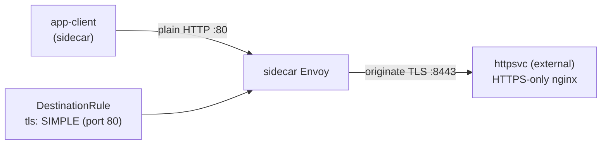

[Русская версия](README_RU.MD) · [Eng version](README.MD) · [Versión en español](README_ES.MD) · [Version française](README_FR.MD) · [Deutsche Version](README_DE.MD) · [繁體中文版](README_TW.MD) · [日本語版](README_JP.MD)

# Lab 22 - TLS origination: TLS-ის ინიციაცია mesh-ის მხარეს

> [საცნობარო გადაწყვეტა](worker/files/solutions/1_GE.MD)

## მიმოხილვა

**TLS origination** არის შემთხვევა, როდესაც აპლიკაცია ჩვეულებრივი HTTP-ით ურთიერთობს, ხოლო sidecar თავად
ამყარებს TLS-კავშირს სამიზნე სერვისთან. ამგვარად, აპლიკაციის კოდი მარტივი რჩება (სერტიფიკატებთან
მუშაობის გარეშე), ხოლო გარე/legacy-სერვისებთან მთელ TLS-ს ერთგვაროვნად
mesh უზრუნველყოფს.

ლაბორატორიაში გაშვებულია „გარე“ ბეკენდი, რომელიც **მხოლოდ TLS-ს** იღებს: nginx TLS-ს
`8443` პორტზე ასრულებს (namespace `external`, sidecar-ის გარეშე), ხოლო Service `httpsvc` მას
plaintext-პორტზე `80` აქვეყნებს (`targetPort: 8443`). mesh-ში არის კლიენტი `app-client` (namespace
`app`, sidecar-ით).



## ინფრასტრუქტურა

| კომპონენტი | ტიპი | რაოდენობა | როლი |
|---|---|---|---|
| control-plane | `t3.medium` | 1 | master + istiod |
| worker | `t3.small` | 1 | რესურსები კლიენტისა და „გარე“ ბეკენდისთვის |
| worker PC | `t3.small` | 1 | სამუშაო ადგილი: `kubectl`, `check_result` |

რეგიონი: `eu-central-1` (AZ `eu-central-1a` / `eu-central-1b`).

## გაშლა

```bash
TASK=22 make run_ica_task
```

## დავალება

1. დარწმუნდით, რომ origination-ის გარეშე `httpsvc.external`-ისადმი მოთხოვნა წარუმატებელია (`400` - plaintext
   TLS-პორტზე მოხვდა).
2. შექმენით `DestinationRule` `httpsvc.external.svc.cluster.local`-ისთვის, რომელიც `80` პორტზე
   TLS origination-ს (`tls.mode: SIMPLE`) ჩართავს.
3. შეამოწმეთ, რომ კლიენტი იღებს `200`-ს და პასუხის სხეულს `secure-ok`.

## ნაბიჯი 1. ქცევა origination-ის გარეშე

```bash
kubectl exec -n app deploy/app-client -c curl -- \
  curl -s -o /dev/null -w "%{http_code}\n" http://httpsvc.external.svc.cluster.local/
# -> 400 : plaintext წავიდა TLS-only პორტზე
```

## ნაბიჯი 2. TLS origination-ის კონფიგურაცია DestinationRule-ის საშუალებით

ბეკენდი self-signed სერტიფიკატს იყენებს, ამიტომ upstream-ის შემოწმებას
`insecureSkipVerify: true`-ით ვთიშავთ. production-ში ამის ნაცვლად უთითებენ `caCertificates`-ს იმ CA-ით, რომლითაც
upstream არის ხელმოწერილი.

```bash
kubectl apply -f - <<'EOF'
apiVersion: networking.istio.io/v1
kind: DestinationRule
metadata:
  name: httpsvc-tls-origination
  namespace: app
spec:
  host: httpsvc.external.svc.cluster.local
  trafficPolicy:
    portLevelSettings:
    - port:
        number: 80
      tls:
        mode: SIMPLE
        insecureSkipVerify: true
EOF
```

## ნაბიჯი 3. შემოწმება

```bash
kubectl exec -n app deploy/app-client -c curl -- \
  curl -s -w "\nHTTP %{http_code}\n" http://httpsvc.external.svc.cluster.local/
# -> secure-ok
#    HTTP 200
```

## როგორ მუშაობს

- კლიენტი ჩვეულებრივ **HTTP**-მოთხოვნას აგზავნის `httpsvc.external:80`-ზე. არც კოდის ცვლილებებია საჭირო და არც
  სერტიფიკატები აპლიკაციაში.
- `DestinationRule`, რომელშიც `80` პორტზე მითითებულია `tls.mode: SIMPLE`, client-side Envoy-ს
  upstream-თან **TLS-ის ინიციაციას** ავალებს (ბეკენდი `targetPort: 8443`-ზე უსმენს).
- ბეკენდი სწორ TLS-კავშირს იღებს და `200`-ს აბრუნებს.
- Istio-ში `SIMPLE` ნაგულისხმევად სერვერის სერტიფიკატს **ამოწმებს**. ჩვენი ბეკენდი
  self-signed cert-ს იყენებს, ამიტომ ვაყენებთ `insecureSkipVerify: true`-ს. production-ში ამის ნაცვლად
  upstream-ის შესამოწმებლად უთითებენ `caCertificates`-ს (და საჭიროების შემთხვევაში `subjectAltNames`-ს),
  ან სერტიფიკატით კლიენტის ავთენტიფიკაციისთვის `MUTUAL`-ს იყენებენ.

## რატომ უნდა მოხდეს TLS-ის ინიციაცია mesh-ში

- აპლიკაციები მარტივი რჩება (plain HTTP), ხოლო გარე/legacy-სერვისებთან მთელ TLS-ს
  mesh ერთგვაროვნად ამუშავებს.
- **egress gateway**-სთან (Lab 05) ერთად origination შეიძლება გამოყოფილ
  კვანძზე ცენტრალიზდეს, რათა მთელი გამავალი TLS კლასტერს ერთი აუდიტირებადი, პოლიტიკებით მართული
  ჰოპის გავლით ტოვებდეს.

## შედეგის შემოწმება

worker PC-ზე გაუშვით:

```bash
check_result
```

## შედეგი

თქვენ mesh-ის მხარეს TLS-ის ინიციაცია დააკონფიგურირეთ: აპლიკაცია HTTP-ით უკავშირდება, ხოლო sidecar
TLS-კავშირს ამყარებს სერვისთან, რომელიც მხოლოდ TLS-ს იღებს. ეს გარე და legacy HTTPS-სერვისებთან
აპლიკაციის კოდის ცვლილების გარეშე ინტეგრაციის გავრცელებული პატერნია - Traffic Management დომენის
მნიშვნელოვანი უნარი.
