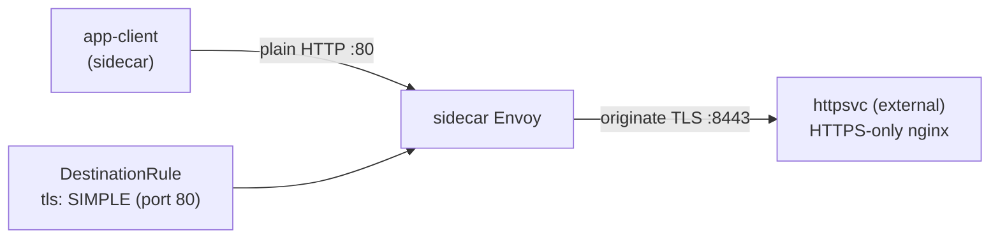

[Русская версия](README_RU.MD) · [Eng version](README.MD) · [Versión en español](README_ES.MD) · [Version française](README_FR.MD) · [Deutsche Version](README_DE.MD) · [ქართული ვერსია](README_GE.MD) · [繁體中文版](README_TW.MD)

# Lab 22 - TLS origination: mesh 側での TLS 開始

> [リファレンス解答](worker/files/solutions/1_JP.MD)

## 概要

**TLS origination** とは、アプリケーションは通常の HTTP で通信し、sidecar が自ら
宛先サービスへの TLS 接続を確立することです。これにより、アプリケーションコードはシンプルなまま（証明書を
扱わずに済み）、外部/legacy サービスへのすべての TLS を mesh が一貫して担います。

このラボでは、**TLS のみ**を受け付ける「外部」バックエンドがデプロイされています。nginx は
ポート `8443` で TLS を終端し（namespace `external`、sidecar なし）、Service `httpsvc` は
これを plaintext ポート `80`（`targetPort: 8443`）で公開します。mesh にはクライアント `app-client`（namespace
`app`、sidecar あり）が存在します。



## インフラストラクチャ

| コンポーネント | タイプ | 数 | 役割 |
|---|---|---|---|
| control-plane | `t3.medium` | 1 | master + istiod |
| worker | `t3.small` | 1 | クライアントおよび「外部」バックエンド用の容量 |
| worker PC | `t3.small` | 1 | ワークステーション: `kubectl`、`check_result` |

リージョン: `eu-central-1` (AZ `eu-central-1a` / `eu-central-1b`)。

## デプロイ

```bash
TASK=22 make run_ica_task
```

## 課題

1. origination なしでは `httpsvc.external` へのリクエストが失敗することを確認する（`400` - plaintext が
   TLS ポートに送られた）。
2. `httpsvc.external.svc.cluster.local` 向けに、ポート `80` で TLS
   origination（`tls.mode: SIMPLE`）を有効化する `DestinationRule` を作成する。
3. クライアントが `200` と本文 `secure-ok` を受け取ることを確認する。

## ステップ 1. origination なしの動作

```bash
kubectl exec -n app deploy/app-client -c curl -- \
  curl -s -o /dev/null -w "%{http_code}\n" http://httpsvc.external.svc.cluster.local/
# -> 400 : plaintext が TLS 専用ポートに届いた
```

## ステップ 2. DestinationRule による TLS origination の設定

バックエンドは self-signed 証明書を使用するため、`insecureSkipVerify: true` により upstream の検証を
無効にします。本番環境では、代わりに upstream に署名した CA を指定する `caCertificates` を設定します。

```bash
kubectl apply -f - <<'EOF'
apiVersion: networking.istio.io/v1
kind: DestinationRule
metadata:
  name: httpsvc-tls-origination
  namespace: app
spec:
  host: httpsvc.external.svc.cluster.local
  trafficPolicy:
    portLevelSettings:
    - port:
        number: 80
      tls:
        mode: SIMPLE
        insecureSkipVerify: true
EOF
```

## ステップ 3. 検証

```bash
kubectl exec -n app deploy/app-client -c curl -- \
  curl -s -w "\nHTTP %{http_code}\n" http://httpsvc.external.svc.cluster.local/
# -> secure-ok
#    HTTP 200
```

## 仕組み

- クライアントは `httpsvc.external:80` に通常の **HTTP** を送信します。アプリケーション側のコード変更も
  証明書も必要ありません。
- ポート 80 の `tls.mode: SIMPLE` を持つ `DestinationRule` は、client-side Envoy に
  upstream への **TLS を開始する** よう指示します（バックエンドは `targetPort: 8443` を listen しています）。
- バックエンドは正しい TLS 接続を受け取り、`200` を返します。
- Istio の `SIMPLE` はデフォルトでサーバー証明書を**検証**します。このバックエンドは
  self-signed cert を使用するため、`insecureSkipVerify: true` を設定します。本番環境では、代わりに
  upstream 検証用の `caCertificates`（必要に応じて `subjectAltNames`）を設定するか、証明書によるクライアント認証には
  `MUTUAL` を使用します。

## mesh で TLS を開始する理由

- アプリケーションはシンプルなまま（plain HTTP）であり、外部/legacy サービスへのすべての TLS を
  mesh が一貫して処理します。
- **egress gateway**（Lab 05）と組み合わせると、専用ノード上で origination を集中管理でき、すべての発信 TLS を
  単一の、監査可能でポリシー管理された hop 経由でクラスター外へ送ることができます。

## 結果の確認

worker PC で次を実行します:

```bash
check_result
```

## まとめ

mesh 側での TLS 開始を設定しました。アプリケーションは HTTP で通信し、sidecar が TLS のみを受け付ける
サービスへの TLS を確立します。これはアプリケーションコードを変更せずに外部および legacy HTTPS サービスと統合するための
一般的なパターンであり、Traffic Management ドメインにおける重要なスキルです。
