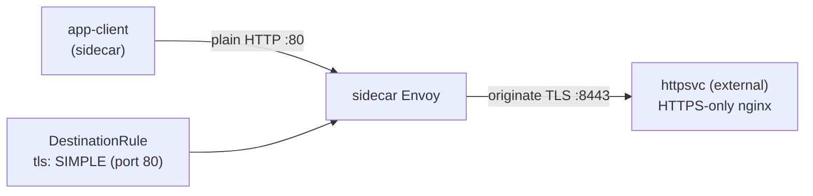

# Lab 22 — TLS origination: инициация TLS на стороне mesh

## Обзор

**TLS origination** — это когда приложение общается по обычному HTTP, а sidecar сам
устанавливает TLS-соединение к целевому сервису. Так код приложения остаётся простым (без
работы с сертификатами), а весь TLS к внешним/legacy-сервисам единообразно берёт на себя
mesh.

В лабе развёрнут «внешний» бэкенд, принимающий **только TLS**: nginx терминирует TLS на
порту `8443` (namespace `external`, без sidecar), а Service `httpsvc` публикует его на
plaintext-порту `80` (`targetPort: 8443`). В mesh есть клиент `app-client` (namespace
`app`, с sidecar).



## Задание

1. Убедиться, что без origination запрос к `httpsvc.external` падает (`400` — plaintext
   попал на TLS-порт).
2. Создать `DestinationRule` для `httpsvc.external.svc.cluster.local`, включающий TLS
   origination (`tls.mode: SIMPLE`) на порту `80`.
3. Проверить, что клиент получает `200` и тело `secure-ok`.

## Шаг 1. Поведение без origination

```bash
kubectl exec -n app deploy/app-client -c curl -- \
  curl -s -o /dev/null -w "%{http_code}\n" http://httpsvc.external.svc.cluster.local/
# -> 400 : plaintext ушёл на TLS-only порт
```

## Шаг 2. Настроить TLS origination через DestinationRule

Бэкенд использует self-signed сертификат, поэтому проверку upstream отключаем через
`insecureSkipVerify: true`. В проде вместо этого задают `caCertificates` с CA, которым
подписан upstream.

```bash
kubectl apply -f - <<'EOF'
apiVersion: networking.istio.io/v1
kind: DestinationRule
metadata:
  name: httpsvc-tls-origination
  namespace: app
spec:
  host: httpsvc.external.svc.cluster.local
  trafficPolicy:
    portLevelSettings:
    - port:
        number: 80
      tls:
        mode: SIMPLE
        insecureSkipVerify: true
EOF
```

## Шаг 3. Проверка

```bash
kubectl exec -n app deploy/app-client -c curl -- \
  curl -s -w "\nHTTP %{http_code}\n" http://httpsvc.external.svc.cluster.local/
# -> secure-ok
#    HTTP 200
```

## Как это работает

- Клиент шлёт обычный **HTTP** на `httpsvc.external:80`. Ни изменений кода, ни
  сертификатов в приложении.
- `DestinationRule` с `tls.mode: SIMPLE` на порту 80 говорит client-side Envoy
  **инициировать TLS** к upstream (бэкенд слушает `targetPort: 8443`).
- Бэкенд получает корректное TLS-соединение и возвращает `200`.
- В Istio `SIMPLE` по умолчанию **проверяет** сертификат сервера. Наш бэкенд использует
  self-signed cert, поэтому мы ставим `insecureSkipVerify: true`. В проде вместо этого
  задают `caCertificates` (и при необходимости `subjectAltNames`) для проверки upstream,
  либо используют `MUTUAL` для клиентской аутентификации по сертификату.

## Зачем инициировать TLS в mesh

- Приложения остаются простыми (plain HTTP), а весь TLS к внешним/legacy-сервисам
  единообразно обрабатывает mesh.
- В связке с **egress gateway** (Lab 05) origination можно централизовать на выделенном
  узле, чтобы весь исходящий TLS покидал кластер через один аудируемый, управляемый
  политиками хоп.

## Проверка результата

Запустите на worker PC:

```bash
check_result
```

## Итог

Вы настроили инициацию TLS на стороне mesh: приложение ходит по HTTP, а sidecar
устанавливает TLS к сервису, принимающему только TLS. Это частый паттерн интеграции с
внешними и legacy HTTPS-сервисами без изменения кода приложения — важный навык домена
Traffic Management.

## Инфраструктура

| Компонент | Тип | Кол-во | Роль |
|---|---|---|---|
| control-plane | `t3.medium` | 1 | master + istiod |
| worker | `t3.small` | 1 | ёмкость для клиента и «внешнего» бэкенда |
| worker PC | `t3.small` | 1 | рабочее место: `kubectl`, `check_result` |

Регион: `eu-central-1` (AZ `eu-central-1a` / `eu-central-1b`).
