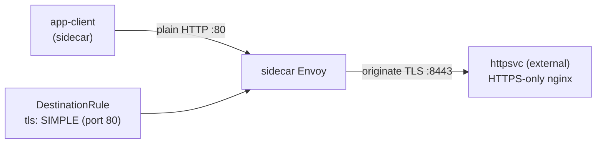

[Русская версия](README_RU.MD) · [Eng version](README.MD) · [Versión en español](README_ES.MD) · [Version française](README_FR.MD) · [Deutsche Version](README_DE.MD) · [ქართული ვერსია](README_GE.MD) · [日本語版](README_JP.MD)

# Lab 22 - TLS origination：在 mesh 端發起 TLS

> [參考解答](worker/files/solutions/1_TW.MD)

## 概覽

**TLS origination** 是指應用程式使用一般 HTTP 通訊，而 sidecar 自行與目標服務建立
TLS 連線。如此一來，應用程式碼能保持簡單（無須處理憑證），並由 mesh 一致負責所有對外部／
legacy 服務的 TLS。

本 lab 部署了一個僅接受 **TLS** 的「外部」後端：nginx 在連接埠 `8443` 終止 TLS（namespace
`external`，沒有 sidecar），而 Service `httpsvc` 將它發布於明文連接埠 `80`（`targetPort: 8443`）。
mesh 中有一個客戶端 `app-client`（namespace `app`，帶有 sidecar）。



## 基礎架構

| 元件 | 類型 | 數量 | 角色 |
|---|---|---|---|
| control-plane | `t3.medium` | 1 | master + istiod |
| worker | `t3.small` | 1 | 為客戶端與「外部」後端提供容量 |
| worker PC | `t3.small` | 1 | 工作站：`kubectl`、`check_result` |

區域：`eu-central-1`（AZ `eu-central-1a` / `eu-central-1b`）。

## 部署

```bash
TASK=22 make run_ica_task
```

## 任務

1. 確認未啟用 origination 時，對 `httpsvc.external` 的請求會失敗（`400`--明文流量
   傳到了 TLS 連接埠）。
2. 為 `httpsvc.external.svc.cluster.local` 建立 `DestinationRule`，在連接埠 `80` 啟用 TLS
   origination（`tls.mode: SIMPLE`）。
3. 確認客戶端取得 `200` 與回應本文 `secure-ok`。

## 步驟 1. 未啟用 origination 時的行為

```bash
kubectl exec -n app deploy/app-client -c curl -- \
  curl -s -o /dev/null -w "%{http_code}\n" http://httpsvc.external.svc.cluster.local/
# -> 400 : plaintext 被送到僅限 TLS 的連接埠
```

## 步驟 2. 透過 DestinationRule 設定 TLS origination

後端使用 self-signed 憑證，因此我們以 `insecureSkipVerify: true` 停用 upstream 驗證。
在生產環境中，應改為設定 `caCertificates`，指定簽署 upstream 的 CA。

```bash
kubectl apply -f - <<'EOF'
apiVersion: networking.istio.io/v1
kind: DestinationRule
metadata:
  name: httpsvc-tls-origination
  namespace: app
spec:
  host: httpsvc.external.svc.cluster.local
  trafficPolicy:
    portLevelSettings:
    - port:
        number: 80
      tls:
        mode: SIMPLE
        insecureSkipVerify: true
EOF
```

## 步驟 3. 驗證

```bash
kubectl exec -n app deploy/app-client -c curl -- \
  curl -s -w "\nHTTP %{http_code}\n" http://httpsvc.external.svc.cluster.local/
# -> secure-ok
#    HTTP 200
```

## 運作原理

- 客戶端會向 `httpsvc.external:80` 傳送一般 **HTTP**。應用程式無須修改程式碼或處理
  憑證。
- 連接埠 80 上帶有 `tls.mode: SIMPLE` 的 `DestinationRule` 指示 client-side Envoy 對
  upstream **發起 TLS**（後端監聽 `targetPort: 8443`）。
- 後端收到正確的 TLS 連線並回傳 `200`。
- 在 Istio 中，`SIMPLE` 預設會**驗證**伺服器憑證。我們的後端使用 self-signed cert，
  因此設定 `insecureSkipVerify: true`。在生產環境中，應改為設定 `caCertificates`
  （並視需要設定 `subjectAltNames`）以驗證 upstream，或者使用 `MUTUAL` 進行基於憑證的
  客戶端驗證。

## 為何要在 mesh 中發起 TLS

- 應用程式保持簡單（plain HTTP），而所有連往外部／legacy 服務的 TLS 都由 mesh
  一致處理。
- 搭配 **egress gateway**（Lab 05）時，可將 origination 集中於專用節點，讓所有出站 TLS
  經由單一可稽核、受政策控管的 hop 離開叢集。

## 結果驗證

在 worker PC 上執行：

```bash
check_result
```

## 總結

您已設定在 mesh 端發起 TLS：應用程式透過 HTTP 存取服務，而 sidecar 對僅接受 TLS 的服務
建立 TLS。這是在不修改應用程式碼的情況下，整合外部與 legacy HTTPS 服務的常見模式，
也是 Traffic Management 領域的重要技能。
