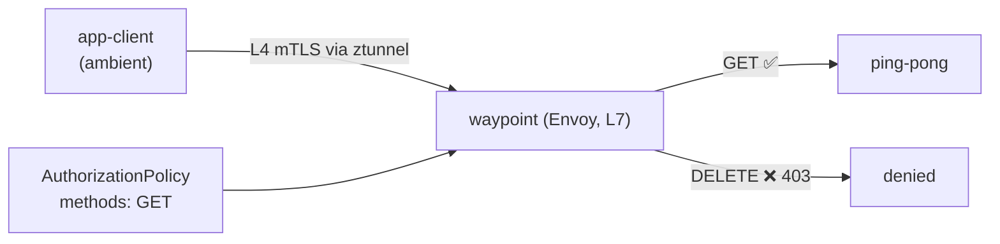

# Lab 24 — Ambient: waypoint proxy and L7 authorization

## Overview

In Istio's ambient mode (see Lab 09) each pod's traffic flows through **ztunnel** — a
per-node proxy that provides L4 mTLS and identity **without sidecars**. But ztunnel does
not parse HTTP: L4 policies (by identity/port) work, while L7 rules (HTTP methods, paths,
headers) do not.

To enforce **L7** policy in ambient you add a **waypoint proxy** — a per-namespace (or
per-service) Envoy that ambient traffic is routed through for L7 processing. This is the
core idea of ambient: cheap L4 everywhere (ztunnel) plus L7 only where you need it
(waypoint).

Namespace `app` is enrolled in ambient and runs `ping-pong` and an `app-client` — both
**without** sidecars. `istioctl` is available on the worker PC.



## Task

1. Add a waypoint to namespace `app`.
2. Apply an L7 `AuthorizationPolicy` that allows only the `GET` method to services in
   `app` (everything else → `403`).
3. Verify: `GET` → `200`, `DELETE` → `403`.

## Step 1. Provision a waypoint

```bash
istioctl waypoint apply -n app --enroll-namespace
kubectl get gtw waypoint -n app
kubectl rollout status deploy/waypoint -n app
```

`--enroll-namespace` labels the namespace (`istio.io/use-waypoint: waypoint`) so traffic
to services in `app` is routed through the waypoint.

## Step 2. Apply an L7 AuthorizationPolicy

```bash
kubectl apply -f - <<'EOF'
apiVersion: security.istio.io/v1
kind: AuthorizationPolicy
metadata:
  name: allow-get-only
  namespace: app
spec:
  targetRefs:
    - group: gateway.networking.k8s.io
      kind: Gateway
      name: waypoint
  action: ALLOW
  rules:
    - to:
        - operation:
            methods: ["GET"]
EOF
```

An `ALLOW` policy is deny-by-default for anything it does not match, so only `GET`
survives; other methods get `403`.

## Step 3. Verify

```bash
# GET -> allowed
kubectl exec -n app deploy/app-client -c curl -- \
  curl -s -o /dev/null -w "%{http_code}\n" -X GET http://ping-pong.app.svc.cluster.local:8080/
# -> 200

# DELETE -> denied by the waypoint
kubectl exec -n app deploy/app-client -c curl -- \
  curl -s -o /dev/null -w "%{http_code}\n" -X DELETE http://ping-pong.app.svc.cluster.local:8080/
# -> 403
```

## How it works

- **Sidecar-less L4 (ztunnel)** handles mTLS and identity for the whole namespace with no
  per-pod proxy. It is cheap and always on in ambient.
- **Waypoint (L7)** is added only where you need HTTP-level features: L7 authorization,
  routing, retries, traffic splitting. You pay for an Envoy only for those services.
- The `AuthorizationPolicy` `targetRefs` the waypoint `Gateway`, so it is enforced at the
  L7 hop. The same policy in the sidecar model works too — ambient just moves the L7
  enforcement point to the waypoint.
- This layered model (ztunnel for L4 everywhere, waypoint for L7 where needed) is the key
  idea of ambient: lower baseline cost than sidecars, opt-in L7.

## Related

Lab 09 covers ambient basics (ztunnel, L4). Lab 04 covers the same `AuthorizationPolicy`
in the sidecar model.

## Check the result

Run on the worker PC:

```bash
check_result
```

## Summary

You added a waypoint proxy to an ambient namespace and enforced L7 authorization by HTTP
method. Understanding the "ztunnel (L4) + waypoint (L7)" split is the key to ambient, the
direction Istio is heading: minimal overhead by default and L7 features only where they
are actually needed.

## Infrastructure

| Component | Type | Count | Role |
|---|---|---|---|
| control-plane | `t3.medium` | 1 | master + istiod + istio-cni + ztunnel |
| worker | `t3.small` | 1 | capacity for the app and the waypoint |
| worker PC | `t3.small` | 1 | workstation: `kubectl`, `istioctl`, `check_result` |

Region: `eu-central-1` (AZ `eu-central-1a` / `eu-central-1b`).
