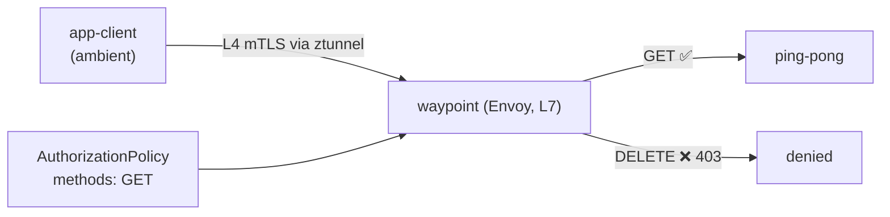

[RU version](README_RU.MD) · [Eng version](README.MD) · [Versión en español](README_ES.MD) · [Version française](README_FR.MD)

# Lab 24 - Ambient: waypoint proxy und L7-Autorisierung

## Überblick

Im ambient-Modus von Istio (siehe Lab 09) läuft der Verkehr jedes Pods durch **ztunnel** -
einen Pro-Node-Proxy, der L4 mTLS und Identity **ohne Sidecars** liefert. Aber ztunnel
zerlegt kein HTTP: L4-Policies (nach Identity/Port) funktionieren, L7-Regeln
(HTTP-Methoden, Pfade, Header) jedoch nicht.

Um **L7**-Policies in ambient anzuwenden, fügt man einen **waypoint proxy** hinzu - einen
Envoy auf Namespace-Ebene (oder Service-Ebene), durch den ambient-Verkehr zur
L7-Verarbeitung läuft. Das ist die Kernidee von ambient: günstiges L4 überall (ztunnel) +
L7 nur dort, wo es nötig ist (waypoint).

Im Lab ist der Namespace `app` in ambient einbezogen, darin laufen `ping-pong` und der
Client `app-client` - **ohne Sidecars**. Auf dem worker PC ist `istioctl` vorhanden.



## Infrastruktur

| Komponente | Typ | Anzahl | Rolle |
|---|---|---|---|
| control-plane | `t3.medium` | 1 | master + istiod + istio-cni + ztunnel |
| worker | `t3.small` | 1 | Kapazität für die Anwendung und waypoint |
| worker PC | `t3.small` | 1 | Arbeitsplatz: `kubectl`, `istioctl`, `check_result` |

Region: `eu-central-1` (AZ `eu-central-1a` / `eu-central-1b`).

## Deployment

```bash
TASK=24 make run_ica_task
```

## Aufgabe

1. Einen waypoint zum Namespace `app` hinzufügen.
2. Eine L7 `AuthorizationPolicy` anwenden, die nur die Methode `GET` zu den Services von
   `app` erlaubt (übrige Methoden → `403`).
3. Prüfen: `GET` → `200`, `DELETE` → `403`.

## Schritt 1. waypoint deployen

```bash
istioctl waypoint apply -n app --enroll-namespace
kubectl get gtw waypoint -n app
kubectl rollout status deploy/waypoint -n app
```

`--enroll-namespace` versieht den Namespace mit dem Label
`istio.io/use-waypoint: waypoint`, damit der Verkehr zu den Services von `app` durch den
waypoint läuft.

## Schritt 2. L7 AuthorizationPolicy anwenden

```bash
kubectl apply -f - <<'EOF'
apiVersion: security.istio.io/v1
kind: AuthorizationPolicy
metadata:
  name: allow-get-only
  namespace: app
spec:
  targetRefs:
    - group: gateway.networking.k8s.io
      kind: Gateway
      name: waypoint
  action: ALLOW
  rules:
    - to:
        - operation:
            methods: ["GET"]
EOF
```

Die `ALLOW`-Policy arbeitet nach dem Prinzip „was nicht erlaubt ist, ist verboten", daher
kommt nur `GET` durch, die übrigen Methoden erhalten `403`.

## Schritt 3. Prüfung

```bash
# GET -> erlaubt
kubectl exec -n app deploy/app-client -c curl -- \
  curl -s -o /dev/null -w "%{http_code}\n" -X GET http://ping-pong.app.svc.cluster.local:8080/
# -> 200

# DELETE -> vom waypoint verboten
kubectl exec -n app deploy/app-client -c curl -- \
  curl -s -o /dev/null -w "%{http_code}\n" -X DELETE http://ping-pong.app.svc.cluster.local:8080/
# -> 403
```

## Wie es funktioniert

- **L4 ohne Sidecar (ztunnel)** bedient mTLS und Identity für den gesamten Namespace ohne
  Proxy in jedem Pod - günstig und in ambient immer aktiv.
- **Waypoint (L7)** wird nur dort hinzugefügt, wo HTTP-Fähigkeiten nötig sind:
  L7-Autorisierung, Routing, Retries, traffic splitting. Für Envoy zahlen Sie nur für
  diese Services.
- Die `AuthorizationPolicy` ist über `targetRefs` an das `Gateway` waypoint gebunden, daher
  wird sie am L7-Hop angewendet. Dieselbe Policy funktioniert auch im Sidecar-Modell -
  ambient verlagert lediglich den Punkt der L7-Durchsetzung in den waypoint.
- Das Schichtmodell (ztunnel für L4 überall, waypoint für L7 nach Bedarf) ist das Wesen
  von ambient: niedrigere Grundkosten als bei Sidecars, und L7 ist opt-in.

## Verbindung zu anderen Labs

Lab 09 - Grundlagen von ambient (ztunnel, L4). Lab 04 - dieselbe `AuthorizationPolicy` im
Sidecar-Modell.

## Ergebnisprüfung

Führen Sie auf dem worker PC aus:

```bash
check_result
```

## Fazit

Sie haben einen waypoint-Proxy in einen ambient-Namespace eingefügt und L7-Autorisierung
nach HTTP-Methode angewendet. Das Verständnis der Kombination „ztunnel (L4) + waypoint
(L7)" ist der Schlüssel zu ambient, in dessen Richtung sich Istio bewegt: minimaler
Overhead standardmäßig und L7-Funktionen nur dort, wo sie wirklich gebraucht werden.
