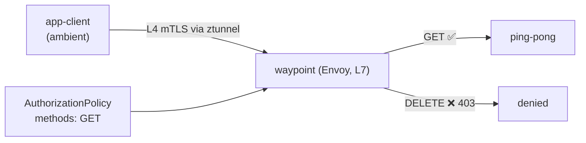

[RU version](README_RU.MD) · [Eng version](README.MD) · [Version française](README_FR.MD) · [Deutsche Version](README_DE.MD)

# Lab 24 - Ambient: waypoint proxy y autorización L7

## Resumen

En el modo ambient de Istio (ver Lab 09), el tráfico de cada pod pasa por **ztunnel**, un
proxy por nodo que aporta mTLS e identity en L4 **sin sidecars**. Pero ztunnel no analiza
HTTP: las políticas L4 (por identity/puerto) funcionan, mientras que las reglas L7
(métodos HTTP, rutas, cabeceras) no.

Para aplicar políticas **L7** en ambient se añade un **waypoint proxy**, un Envoy a nivel
de namespace (o de servicio) por el que pasa el tráfico ambient para el procesamiento L7.
Esta es la idea clave de ambient: L4 barato en todas partes (ztunnel) + L7 solo donde hace
falta (waypoint).

En el lab, el namespace `app` está incluido en ambient; en él funcionan `ping-pong` y el
cliente `app-client`, **sin sidecars**. En el worker PC está `istioctl`.



## Tarea

1. Añadir un waypoint en el namespace `app`.
2. Aplicar una `AuthorizationPolicy` L7 que permita solo el método `GET` hacia los
   servicios de `app` (el resto de métodos → `403`).
3. Comprobar: `GET` → `200`, `DELETE` → `403`.

## Paso 1. Desplegar el waypoint

```bash
istioctl waypoint apply -n app --enroll-namespace
kubectl get gtw waypoint -n app
kubectl rollout status deploy/waypoint -n app
```

`--enroll-namespace` coloca en el namespace el label `istio.io/use-waypoint: waypoint`,
para que el tráfico hacia los servicios de `app` pase por el waypoint.

## Paso 2. Aplicar la AuthorizationPolicy L7

```bash
kubectl apply -f - <<'EOF'
apiVersion: security.istio.io/v1
kind: AuthorizationPolicy
metadata:
  name: allow-get-only
  namespace: app
spec:
  targetRefs:
    - group: gateway.networking.k8s.io
      kind: Gateway
      name: waypoint
  action: ALLOW
  rules:
    - to:
        - operation:
            methods: ["GET"]
EOF
```

La política `ALLOW` funciona según el principio «lo que no está permitido, está
prohibido», por eso solo pasa `GET` y el resto de métodos reciben `403`.

## Paso 3. Comprobación

```bash
# GET -> permitido
kubectl exec -n app deploy/app-client -c curl -- \
  curl -s -o /dev/null -w "%{http_code}\n" -X GET http://ping-pong.app.svc.cluster.local:8080/
# -> 200

# DELETE -> denegado por el waypoint
kubectl exec -n app deploy/app-client -c curl -- \
  curl -s -o /dev/null -w "%{http_code}\n" -X DELETE http://ping-pong.app.svc.cluster.local:8080/
# -> 403
```

## Cómo funciona

- **L4 sin sidecar (ztunnel)** se encarga del mTLS y el identity de todo el namespace sin
  un proxy en cada pod: barato y siempre activo en ambient.
- **Waypoint (L7)** se añade solo donde se necesitan capacidades HTTP: autorización L7,
  routing, reintentos, traffic splitting. Solo pagas el coste de Envoy para esos servicios.
- La `AuthorizationPolicy` está vinculada mediante `targetRefs` al `Gateway` waypoint, por
  eso se aplica en el salto L7. La misma política funciona también en el modelo sidecar;
  ambient solo traslada el punto de enforcement L7 al waypoint.
- El modelo por capas (ztunnel para L4 en todas partes, waypoint para L7 cuando hace falta)
  es la esencia de ambient: coste base menor que con sidecars y L7 opt-in.

## Relación con otros labs

Lab 09 - fundamentos de ambient (ztunnel, L4). Lab 04 - la misma `AuthorizationPolicy` en
el modelo sidecar.

## Verificación del resultado

Ejecuta en el worker PC:

```bash
check_result
```

## Conclusión

Has añadido un waypoint proxy en un namespace ambient y has aplicado autorización L7 por
método HTTP. Entender la combinación «ztunnel (L4) + waypoint (L7)» es la clave de ambient,
hacia donde se mueve Istio: sobrecarga mínima por defecto y funciones L7 solo donde
realmente se necesitan.

## Infraestructura

| Componente | Tipo | Cantidad | Rol |
|---|---|---|---|
| control-plane | `t3.medium` | 1 | master + istiod + istio-cni + ztunnel |
| worker | `t3.small` | 1 | capacidad para la aplicación y el waypoint |
| worker PC | `t3.small` | 1 | puesto de trabajo: `kubectl`, `istioctl`, `check_result` |

Región: `eu-central-1` (AZ `eu-central-1a` / `eu-central-1b`).
