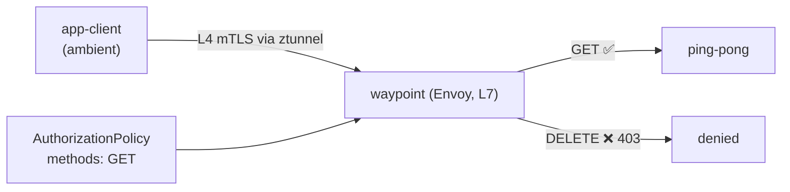

[RU version](README_RU.MD) · [Eng version](README.MD) · [Versión en español](README_ES.MD) · [Deutsche Version](README_DE.MD)

# Lab 24 - Ambient : waypoint proxy et autorisation L7

## Aperçu

En mode ambient d'Istio (voir Lab 09), le trafic de chaque pod passe par **ztunnel** - un
proxy par nœud qui fournit le mTLS L4 et l'identity **sans sidecars**. Mais ztunnel ne
comprend pas le HTTP : les politiques L4 (par identity/port) fonctionnent, mais les règles
L7 (méthodes HTTP, chemins, en-têtes) non.

Pour appliquer des politiques **L7** en ambient, on ajoute un **waypoint proxy** - un
Envoy au niveau du namespace (ou du service), par lequel le trafic ambient passe pour le
traitement L7. C'est l'idée clé d'ambient : du L4 bon marché partout (ztunnel) + du L7
uniquement là où il faut (waypoint).

Dans ce lab, le namespace `app` est intégré à ambient ; y tournent `ping-pong` et le
client `app-client` - **sans sidecars**. Le worker PC dispose de `istioctl`.



## Exercice

1. Ajouter un waypoint dans le namespace `app`.
2. Appliquer une `AuthorizationPolicy` L7 autorisant seulement la méthode `GET` vers les
   services `app` (les autres méthodes → `403`).
3. Vérifier : `GET` → `200`, `DELETE` → `403`.

## Étape 1. Déployer le waypoint

```bash
istioctl waypoint apply -n app --enroll-namespace
kubectl get gtw waypoint -n app
kubectl rollout status deploy/waypoint -n app
```

`--enroll-namespace` pose sur le namespace le label `istio.io/use-waypoint: waypoint`,
pour que le trafic vers les services `app` passe par le waypoint.

## Étape 2. Appliquer l'AuthorizationPolicy L7

```bash
kubectl apply -f - <<'EOF'
apiVersion: security.istio.io/v1
kind: AuthorizationPolicy
metadata:
  name: allow-get-only
  namespace: app
spec:
  targetRefs:
    - group: gateway.networking.k8s.io
      kind: Gateway
      name: waypoint
  action: ALLOW
  rules:
    - to:
        - operation:
            methods: ["GET"]
EOF
```

La politique `ALLOW` fonctionne selon le principe « ce qui n'est pas autorisé est
interdit », donc seul `GET` passe ; les autres méthodes reçoivent un `403`.

## Étape 3. Vérification

```bash
# GET -> autorisé
kubectl exec -n app deploy/app-client -c curl -- \
  curl -s -o /dev/null -w "%{http_code}\n" -X GET http://ping-pong.app.svc.cluster.local:8080/
# -> 200

# DELETE -> interdit par le waypoint
kubectl exec -n app deploy/app-client -c curl -- \
  curl -s -o /dev/null -w "%{http_code}\n" -X DELETE http://ping-pong.app.svc.cluster.local:8080/
# -> 403
```

## Comment ça marche

- **Le L4 sans sidecar (ztunnel)** assure le mTLS et l'identity pour tout le namespace
  sans proxy dans chaque pod - bon marché et toujours actif en ambient.
- **Le waypoint (L7)** n'est ajouté que là où les capacités HTTP sont nécessaires :
  autorisation L7, routage, tentatives, traffic splitting. Vous ne payez l'Envoy que pour
  ces services.
- La `AuthorizationPolicy` est liée via `targetRefs` au `Gateway` waypoint, donc elle
  s'applique sur le hop L7. La même politique fonctionne aussi en modèle sidecar - ambient
  déplace simplement le point d'enforcement L7 dans le waypoint.
- Le modèle en couches (ztunnel pour le L4 partout, waypoint pour le L7 au besoin) est
  l'essence d'ambient : un coût de base plus faible qu'avec des sidecars, et le L7 en
  opt-in.

## Lien avec d'autres labs

Lab 09 - les bases d'ambient (ztunnel, L4). Lab 04 - la même `AuthorizationPolicy` en
modèle sidecar.

## Vérification du résultat

Lancez sur le worker PC :

```bash
check_result
```

## Bilan

Vous avez ajouté un waypoint proxy dans un namespace ambient et appliqué une autorisation
L7 par méthode HTTP. Comprendre le couple « ztunnel (L4) + waypoint (L7) » est la clé
d'ambient, vers lequel Istio évolue : un surcoût minimal par défaut et des fonctions L7
uniquement là où elles sont réellement nécessaires.

## Infrastructure

| Composant | Type | Qté | Rôle |
|---|---|---|---|
| control-plane | `t3.medium` | 1 | master + istiod + istio-cni + ztunnel |
| worker | `t3.small` | 1 | capacité pour l'application et le waypoint |
| worker PC | `t3.small` | 1 | poste de travail : `kubectl`, `istioctl`, `check_result` |

Région : `eu-central-1` (AZ `eu-central-1a` / `eu-central-1b`).
