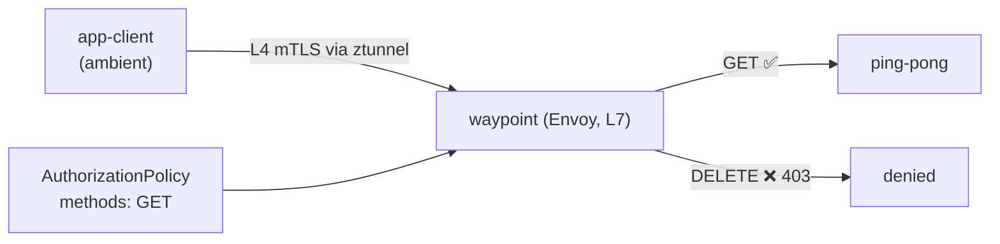

[Русская версия](README_RU.MD) · [Eng version](README.MD) · [Versión en español](README_ES.MD) · [Version française](README_FR.MD) · [Deutsche Version](README_DE.MD) · [繁體中文版](README_TW.MD) · [日本語版](README_JP.MD)

# ლაბორატორია 24 - Ambient: waypoint proxy და L7-ავტორიზაცია

> [საცნობარო გადაწყვეტა](worker/files/solutions/1_GE.MD)

## მიმოხილვა

Istio-ს ambient-რეჟიმში (იხ. Lab 09) თითოეული პოდის ტრაფიკი გადის **ztunnel**-ის გავლით -
ეს არის თითოეულ ნოდზე გაშვებული პროქსი, რომელიც უზრუნველყოფს L4 mTLS-სა და identity-ს
**sidecar-ების გარეშე**. თუმცა ztunnel HTTP-ს არ აანალიზებს: L4-პოლიტიკები
(identity/პორტის მიხედვით) მუშაობს, L7-წესები კი (HTTP-მეთოდები, გზები, სათაურები) - არა.

ambient-ში **L7**-პოლიტიკების გამოსაყენებლად ამატებენ **waypoint proxy**-ს - Envoy-ს
namespace-ის (ან სერვისის) დონეზე, რომლის გავლითაც ambient-ტრაფიკი გადის L7-დამუშავებისთვის.
ეს ambient-ის საკვანძო იდეაა: იაფი L4 ყველგან (ztunnel) + L7 მხოლოდ იქ, სადაც საჭიროა
(waypoint).

ლაბორატორიაში namespace `app` ჩართულია ambient-ში; მასში მუშაობს `ping-pong` და კლიენტი
`app-client` - **sidecar-ების გარეშე**. worker PC-ზე ხელმისაწვდომია `istioctl`.



## ინფრასტრუქტურა

| კომპონენტი | ტიპი | რაოდენობა | როლი |
|---|---|---|---|
| control-plane | `t3.medium` | 1 | master + istiod + istio-cni + ztunnel |
| worker | `t3.small` | 1 | რესურსები აპლიკაციისა და waypoint-ისთვის |
| worker PC | `t3.small` | 1 | სამუშაო გარემო: `kubectl`, `istioctl`, `check_result` |

რეგიონი: `eu-central-1` (AZ `eu-central-1a` / `eu-central-1b`).

## გაშლა

```bash
TASK=24 make run_ica_task
```

## დავალება

1. დაამატეთ waypoint namespace `app`-ში.
2. გამოიყენეთ L7 `AuthorizationPolicy`, რომელიც `app` სერვისებისთვის მხოლოდ `GET` მეთოდს
   დაუშვებს (დანარჩენი მეთოდები → `403`).
3. შეამოწმეთ: `GET` → `200`, `DELETE` → `403`.

## ნაბიჯი 1. განათავსეთ waypoint

```bash
istioctl waypoint apply -n app --enroll-namespace
kubectl get gtw waypoint -n app
kubectl rollout status deploy/waypoint -n app
```

`--enroll-namespace` namespace-ს ანიჭებს ლეიბლს `istio.io/use-waypoint: waypoint`, რათა
`app` სერვისებისკენ მიმავალმა ტრაფიკმა waypoint-ის გავლით გაიაროს.

## ნაბიჯი 2. გამოიყენეთ L7 AuthorizationPolicy

```bash
kubectl apply -f - <<'EOF'
apiVersion: security.istio.io/v1
kind: AuthorizationPolicy
metadata:
  name: allow-get-only
  namespace: app
spec:
  targetRefs:
    - group: gateway.networking.k8s.io
      kind: Gateway
      name: waypoint
  action: ALLOW
  rules:
    - to:
        - operation:
            methods: ["GET"]
EOF
```

`ALLOW` პოლიტიკა მუშაობს პრინციპით „რაც დაშვებული არ არის, აკრძალულია“, ამიტომ გადის
მხოლოდ `GET`, ხოლო დანარჩენი მეთოდები იღებს `403`-ს.

## ნაბიჯი 3. შემოწმება

```bash
# GET -> ნებადართულია
kubectl exec -n app deploy/app-client -c curl -- \
  curl -s -o /dev/null -w "%{http_code}\n" -X GET http://ping-pong.app.svc.cluster.local:8080/
# -> 200

# DELETE -> აკრძალულია waypoint-ის მიერ
kubectl exec -n app deploy/app-client -c curl -- \
  curl -s -o /dev/null -w "%{http_code}\n" -X DELETE http://ping-pong.app.svc.cluster.local:8080/
# -> 403
```

## როგორ მუშაობს ეს

- **L4 sidecar-ის გარეშე (ztunnel)** უზრუნველყოფს mTLS-სა და identity-ს მთელი namespace-ისთვის,
  თითოეულ პოდში პროქსის გარეშე - იაფად და ambient-ში ყოველთვის ჩართულად.
- **Waypoint (L7)** ემატება მხოლოდ იქ, სადაც HTTP-შესაძლებლობებია საჭირო: L7-ავტორიზაცია,
  მარშრუტიზაცია, განმეორებითი მცდელობები, ტრაფიკის განაწილება. Envoy-ის რესურსების საფასურს
  მხოლოდ ამ სერვისებისთვის იხდით.
- `AuthorizationPolicy` `targetRefs`-ის მეშვეობით მიბმულია waypoint-ის `Gateway`-ზე, ამიტომ
  L7-ჰოპზე გამოიყენება. იგივე პოლიტიკა sidecar-მოდელშიც მუშაობს - ambient მხოლოდ
  L7-აღსრულების წერტილს გადაიტანს waypoint-ში.
- შრეებად დაყოფილი მოდელი (ztunnel ყველგან L4-ისთვის, waypoint საჭიროებისამებრ L7-ისთვის) -
  ambient-ის არსია: sidecar-ებთან შედარებით ნაკლები საბაზისო დანახარჯი, ხოლო L7 - სურვილისამებრ.

## კავშირი სხვა ლაბორატორიებთან

Lab 09 - ambient-ის საფუძვლები (ztunnel, L4). Lab 04 - იგივე `AuthorizationPolicy`
sidecar-მოდელში.

## შედეგის შემოწმება

worker PC-ზე გაუშვით:

```bash
check_result
```

## შეჯამება

თქვენ ambient-namespace-ში დაამატეთ waypoint-პროქსი და HTTP-მეთოდის მიხედვით
L7-ავტორიზაცია გამოიყენეთ. „ztunnel (L4) + waypoint (L7)“ კავშირის გაგება საკვანძოა
ambient-ისთვის, რომლისკენაც Istio ვითარდება: ნაგულისხმევად მინიმალური ზედნადები ხარჯები და
L7-ფუნქციები მხოლოდ იქ, სადაც ისინი ნამდვილად საჭიროა.
