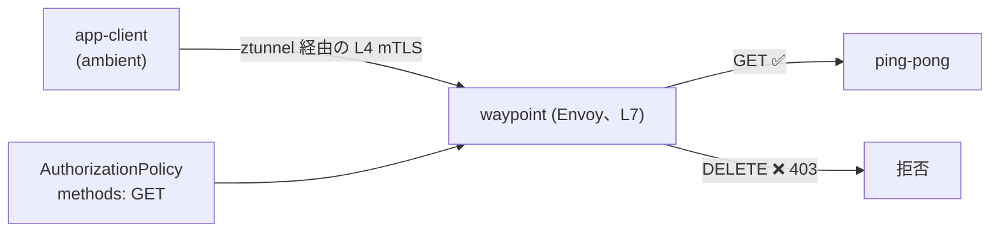

[Русская версия](README_RU.MD) · [Eng version](README.MD) · [Versión en español](README_ES.MD) · [Version française](README_FR.MD) · [Deutsche Version](README_DE.MD) · [ქართული ვერსია](README_GE.MD) · [繁體中文版](README_TW.MD)

# Lab 24 - Ambient: waypoint プロキシと L7 認可

> [リファレンス解答](worker/files/solutions/1_JP.MD)

## 概要

Istio の ambient モード（Lab 09 を参照）では、各 Pod のトラフィックは **ztunnel** を通過します。ztunnel はノードごとのプロキシであり、**sidecar なしで** L4 mTLS と identity を提供します。しかし、ztunnel は HTTP を解析しません。L4 ポリシー（identity／ポートごと）は機能しますが、L7 ルール（HTTP メソッド、パス、ヘッダー）は機能しません。

ambient で **L7** ポリシーを適用するには、namespace（またはサービス）レベルの Envoy である **waypoint proxy** を追加します。ambient トラフィックは L7 処理のためにこれを通過します。これが ambient の重要な考え方です。L4 はどこでも低コスト（ztunnel）、L7 は必要な箇所だけ（waypoint）です。

このラボでは、namespace `app` が ambient に含まれ、`ping-pong` とクライアント `app-client` が **sidecar なしで** 実行されています。worker PC には `istioctl` があります。



## インフラストラクチャ

| コンポーネント | タイプ | 数 | 役割 |
|---|---|---|---|
| control-plane | `t3.medium` | 1 | master + istiod + istio-cni + ztunnel |
| worker | `t3.small` | 1 | アプリケーションと waypoint の容量 |
| worker PC | `t3.small` | 1 | ワークステーション: `kubectl`、`istioctl`、`check_result` |

リージョン: `eu-central-1`（AZ `eu-central-1a` / `eu-central-1b`）。

## デプロイ

```bash
TASK=24 make run_ica_task
```

## 課題

1. namespace `app` に waypoint を追加する。
2. `app` サービスへの `GET` メソッドのみを許可する L7 `AuthorizationPolicy` を適用する（その他のメソッド → `403`）。
3. 確認する: `GET` → `200`、`DELETE` → `403`。

## ステップ 1. waypoint をデプロイする

```bash
istioctl waypoint apply -n app --enroll-namespace
kubectl get gtw waypoint -n app
kubectl rollout status deploy/waypoint -n app
```

`--enroll-namespace` は namespace にラベル `istio.io/use-waypoint: waypoint` を付与し、`app` サービスへのトラフィックが waypoint を通過するようにします。

## ステップ 2. L7 AuthorizationPolicy を適用する

```bash
kubectl apply -f - <<'EOF'
apiVersion: security.istio.io/v1
kind: AuthorizationPolicy
metadata:
  name: allow-get-only
  namespace: app
spec:
  targetRefs:
    - group: gateway.networking.k8s.io
      kind: Gateway
      name: waypoint
  action: ALLOW
  rules:
    - to:
        - operation:
            methods: ["GET"]
EOF
```

`ALLOW` ポリシーは「許可されていないものは拒否する」という原則で機能するため、`GET` のみが通過し、その他のメソッドは `403` を受け取ります。

## ステップ 3. 確認

```bash
# GET -> 許可
kubectl exec -n app deploy/app-client -c curl -- \
  curl -s -o /dev/null -w "%{http_code}\n" -X GET http://ping-pong.app.svc.cluster.local:8080/
# -> 200

# DELETE -> waypoint により拒否
kubectl exec -n app deploy/app-client -c curl -- \
  curl -s -o /dev/null -w "%{http_code}\n" -X DELETE http://ping-pong.app.svc.cluster.local:8080/
# -> 403
```

## 仕組み

- **sidecar なしの L4（ztunnel）** は、各 Pod にプロキシを配置せずに namespace 全体の mTLS と identity を処理します。低コストで、ambient では常に有効です。
- **Waypoint（L7）** は、L7 認可、ルーティング、リトライ、traffic splitting など HTTP 機能が必要な場合にのみ追加します。Envoy のコストはこれらのサービスに対してのみ発生します。
- `targetRefs` を介した `AuthorizationPolicy` は waypoint `Gateway` にバインドされるため、L7 ホップで適用されます。同じポリシーは sidecar モデルでも機能します。ambient は L7 エンフォースメントポイントを waypoint に移すだけです。
- レイヤー型モデル（どこでも L4 は ztunnel、必要に応じて L7 は waypoint）が ambient の本質です。sidecar より基本コストが低く、L7 は opt-in です。

## 他のラボとの関連

Lab 09 - ambient の基礎（ztunnel、L4）。Lab 04 - sidecar モデルでの同じ `AuthorizationPolicy`。

## 結果の確認

worker PC で実行します:

```bash
check_result
```

## まとめ

ambient namespace に waypoint プロキシを追加し、HTTP メソッドによる L7 認可を適用しました。「ztunnel（L4）+ waypoint（L7）」の組み合わせを理解することは、Istio が進んでいる ambient の鍵です。デフォルトのオーバーヘッドを最小限にし、L7 機能は実際に必要な箇所でのみ利用します。
