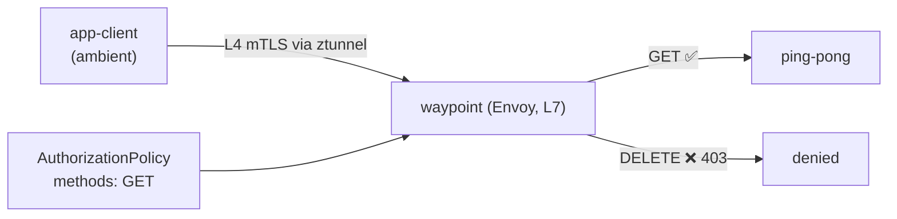

[Eng version](README.MD) · [Versión en español](README_ES.MD) · [Version française](README_FR.MD) · [Deutsche Version](README_DE.MD)

# Lab 24 - Ambient: waypoint proxy и L7-авторизация

## Обзор

В ambient-режиме Istio (см. Lab 09) трафик каждого пода идёт через **ztunnel** -
пер-нодовый прокси, который даёт L4 mTLS и identity **без sidecar'ов**. Но ztunnel не
разбирает HTTP: L4-политики (по identity/порту) работают, а L7-правила (HTTP-методы,
пути, заголовки) - нет.

Чтобы применять **L7**-политики в ambient, добавляют **waypoint proxy** - Envoy на уровне
namespace (или сервиса), через который ambient-трафик проходит для L7-обработки. Это
ключевая идея ambient: дешёвый L4 везде (ztunnel) + L7 только там, где нужно (waypoint).

В лабе namespace `app` включён в ambient, в нём работают `ping-pong` и клиент
`app-client` - **без sidecar'ов**. На worker PC есть `istioctl`.



## Задание

1. Добавить waypoint в namespace `app`.
2. Применить L7 `AuthorizationPolicy`, разрешающий только метод `GET` к сервисам `app`
   (остальные методы → `403`).
3. Проверить: `GET` → `200`, `DELETE` → `403`.

## Шаг 1. Развернуть waypoint

```bash
istioctl waypoint apply -n app --enroll-namespace
kubectl get gtw waypoint -n app
kubectl rollout status deploy/waypoint -n app
```

`--enroll-namespace` вешает на namespace лейбл `istio.io/use-waypoint: waypoint`, чтобы
трафик к сервисам `app` шёл через waypoint.

## Шаг 2. Применить L7 AuthorizationPolicy

```bash
kubectl apply -f - <<'EOF'
apiVersion: security.istio.io/v1
kind: AuthorizationPolicy
metadata:
  name: allow-get-only
  namespace: app
spec:
  targetRefs:
    - group: gateway.networking.k8s.io
      kind: Gateway
      name: waypoint
  action: ALLOW
  rules:
    - to:
        - operation:
            methods: ["GET"]
EOF
```

Политика `ALLOW` работает по принципу «что не разрешено - запрещено», поэтому проходит
только `GET`, остальные методы получают `403`.

## Шаг 3. Проверка

```bash
# GET -> разрешён
kubectl exec -n app deploy/app-client -c curl -- \
  curl -s -o /dev/null -w "%{http_code}\n" -X GET http://ping-pong.app.svc.cluster.local:8080/
# -> 200

# DELETE -> запрещён waypoint'ом
kubectl exec -n app deploy/app-client -c curl -- \
  curl -s -o /dev/null -w "%{http_code}\n" -X DELETE http://ping-pong.app.svc.cluster.local:8080/
# -> 403
```

## Как это работает

- **L4 без sidecar (ztunnel)** обслуживает mTLS и identity для всего namespace без
  прокси в каждом поде - дёшево и всегда включено в ambient.
- **Waypoint (L7)** добавляется только там, где нужны HTTP-возможности: L7-авторизация,
  роутинг, ретраи, traffic splitting. За Envoy платите только для этих сервисов.
- `AuthorizationPolicy` через `targetRefs` привязан к `Gateway` waypoint, поэтому
  применяется на L7-хопе. Та же политика в sidecar-модели тоже работает - ambient лишь
  переносит точку L7-энфорсмента в waypoint.
- Слоистая модель (ztunnel для L4 везде, waypoint для L7 по необходимости) - суть
  ambient: ниже базовая стоимость, чем у sidecar'ов, а L7 - opt-in.

## Связь с другими лабами

Lab 09 - основы ambient (ztunnel, L4). Lab 04 - та же `AuthorizationPolicy` в
sidecar-модели.

## Проверка результата

Запустите на worker PC:

```bash
check_result
```

## Итог

Вы добавили waypoint-прокси в ambient-namespace и применили L7-авторизацию по
HTTP-методу. Понимание связки «ztunnel (L4) + waypoint (L7)» - ключ к ambient, на который
двигается Istio: минимальные накладные расходы по умолчанию и L7-функции только там, где
они реально нужны.

## Инфраструктура

| Компонент | Тип | Кол-во | Роль |
|---|---|---|---|
| control-plane | `t3.medium` | 1 | master + istiod + istio-cni + ztunnel |
| worker | `t3.small` | 1 | ёмкость для приложения и waypoint |
| worker PC | `t3.small` | 1 | рабочее место: `kubectl`, `istioctl`, `check_result` |

Регион: `eu-central-1` (AZ `eu-central-1a` / `eu-central-1b`).
