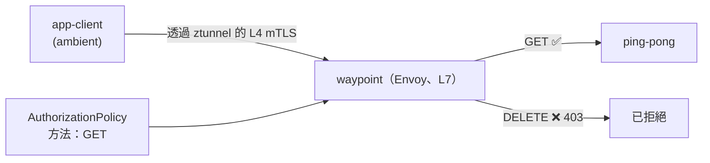

[Русская версия](README_RU.MD) · [Eng version](README.MD) · [Versión en español](README_ES.MD) · [Version française](README_FR.MD) · [Deutsche Version](README_DE.MD) · [ქართული ვერსია](README_GE.MD) · [日本語版](README_JP.MD)

# Lab 24 - Ambient：waypoint proxy 與 L7 授權

> [參考解答](worker/files/solutions/1_TW.MD)

## 概覽

在 Istio 的 ambient 模式中（見 Lab 09），每個 Pod 的流量皆會經過 **ztunnel**--
這是每節點的 proxy，能提供 L4 mTLS 與 identity，且**無須 sidecar**。但 ztunnel 不會
解析 HTTP：L4 政策（依 identity/連接埠）可運作，但 L7 規則（HTTP 方法、
路徑、標頭）則無法運作。

若要在 ambient 中套用 **L7** 政策，需加入 **waypoint proxy**--位於 namespace（或
服務）層級的 Envoy，ambient 流量會透過它進行 L7 處理。這是 ambient 的核心理念：
到處使用低成本的 L4（ztunnel）+ 僅在需要之處使用 L7（waypoint）。

在本實驗中，namespace `app` 已啟用 ambient，並在其中執行 `ping-pong` 與用戶端
`app-client`--**不含 sidecar**。worker PC 上已安裝 `istioctl`。



## 基礎設施

| 元件 | 類型 | 數量 | 角色 |
|---|---|---|---|
| control-plane | `t3.medium` | 1 | master + istiod + istio-cni + ztunnel |
| worker | `t3.small` | 1 | 應用程式與 waypoint 的容量 |
| worker PC | `t3.small` | 1 | 工作站：`kubectl`、`istioctl`、`check_result` |

區域：`eu-central-1`（AZ `eu-central-1a` / `eu-central-1b`）。

## 部署

```bash
TASK=24 make run_ica_task
```

## 任務

1. 在 namespace `app` 中新增 waypoint。
2. 套用 L7 `AuthorizationPolicy`，僅允許對 `app` 服務使用 `GET` 方法
   （其他方法 → `403`）。
3. 驗證：`GET` → `200`，`DELETE` → `403`。

## 步驟 1：部署 waypoint

```bash
istioctl waypoint apply -n app --enroll-namespace
kubectl get gtw waypoint -n app
kubectl rollout status deploy/waypoint -n app
```

`--enroll-namespace` 會為 namespace 加上標籤 `istio.io/use-waypoint: waypoint`，使前往
`app` 服務的流量會經過 waypoint。

## 步驟 2：套用 L7 AuthorizationPolicy

```bash
kubectl apply -f - <<'EOF'
apiVersion: security.istio.io/v1
kind: AuthorizationPolicy
metadata:
  name: allow-get-only
  namespace: app
spec:
  targetRefs:
    - group: gateway.networking.k8s.io
      kind: Gateway
      name: waypoint
  action: ALLOW
  rules:
    - to:
        - operation:
            methods: ["GET"]
EOF
```

`ALLOW` 政策遵循「未獲允許即禁止」原則，因此僅允許 `GET`，其餘方法皆會收到
`403`。

## 步驟 3：驗證

```bash
# GET -> 允許
kubectl exec -n app deploy/app-client -c curl -- \
  curl -s -o /dev/null -w "%{http_code}\n" -X GET http://ping-pong.app.svc.cluster.local:8080/
# -> 200

# DELETE -> 被 waypoint 拒絕
kubectl exec -n app deploy/app-client -c curl -- \
  curl -s -o /dev/null -w "%{http_code}\n" -X DELETE http://ping-pong.app.svc.cluster.local:8080/
# -> 403
```

## 運作方式

- **無 sidecar 的 L4（ztunnel）** 為整個 namespace 提供 mTLS 與 identity，無須在
  每個 Pod 中部署 proxy--成本低，且在 ambient 中始終啟用。
- **Waypoint（L7）** 僅在需要 HTTP 功能之處新增：L7 授權、
  路由、重試、traffic splitting。您只需為這些服務承擔 Envoy 的成本。
- 透過 `targetRefs`，`AuthorizationPolicy` 繫結至 waypoint `Gateway`，因此會在
  L7 hop 套用。在 sidecar 模式中相同的政策同樣可運作--ambient 僅將 L7 enforcement
  點移至 waypoint。
- 分層模型（處處以 ztunnel 提供 L4，按需以 waypoint 提供 L7）即是 ambient 的本質：
  相較於 sidecar，基礎成本更低，而 L7 為 opt-in。

## 與其他實驗的關聯

Lab 09--ambient 基礎（ztunnel、L4）。Lab 04--在 sidecar
模式中使用相同的 `AuthorizationPolicy`。

## 結果驗證

在 worker PC 上執行：

```bash
check_result
```

## 總結

您已將 waypoint proxy 新增至 ambient namespace，並套用了依 HTTP
方法進行的 L7 授權。理解「ztunnel（L4）+ waypoint（L7）」的組合，是掌握 Istio
正邁向的 ambient 的關鍵：預設最低的額外負擔，並僅在實際需要之處提供 L7 功能。