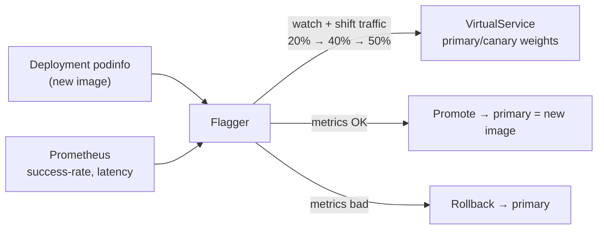

[RU version](README_RU.MD) · [Versión en español](README_ES.MD)

# Lab 25 - Progressive delivery with Flagger

## Overview

A manual canary release (like Lab 06, tweaking `VirtualService` weights by hand) is
laborious and risky: you have to watch metrics yourself and roll back in time.
**Flagger** (a CNCF project) automates this: it takes your `Deployment`, and on every new
image it gradually shifts traffic to the canary, checks metrics from **Prometheus** at
each step, and either promotes it or automatically rolls back.

Istio + Prometheus are installed, **Flagger** runs in `istio-system`, and namespace
`test` (istio-injection) contains the demo app **podinfo** (`6.0.0`), a
**flagger-loadtester** (generates traffic during analysis), and a `public-gateway`.



## Task

1. Create a `Canary` resource for `podinfo` with a progressive analysis (weight steps,
   metrics, a load-test webhook).
2. Wait for Flagger to initialize (a `podinfo-primary` appears).
3. Trigger a release - update the `podinfo` image to `6.0.1`.
4. Wait for the automated promotion (Flagger copies the new image into `podinfo-primary`).

## Step 1. Create the Canary

```bash
kubectl apply -f - <<'EOF'
apiVersion: flagger.app/v1beta1
kind: Canary
metadata:
  name: podinfo
  namespace: test
spec:
  targetRef:
    apiVersion: apps/v1
    kind: Deployment
    name: podinfo
  progressDeadlineSeconds: 300
  autoscalerRef:
    apiVersion: autoscaling/v2
    kind: HorizontalPodAutoscaler
    name: podinfo
  service:
    port: 9898
    targetPort: 9898
    gateways:
    - istio-system/public-gateway
    hosts:
    - app.example.com
  analysis:
    interval: 30s
    threshold: 5
    maxWeight: 50
    stepWeight: 20
    metrics:
    - name: request-success-rate
      thresholdRange:
        min: 99
      interval: 1m
    - name: request-duration
      thresholdRange:
        max: 500
      interval: 30s
    webhooks:
    - name: load-test
      url: http://flagger-loadtester.test/
      timeout: 5s
      metadata:
        cmd: "hey -z 2m -q 10 -c 2 http://podinfo-canary.test:9898/"
EOF
```

## Step 2. Wait for Flagger to initialize

```bash
kubectl -n test get canary podinfo -w    # wait until STATUS = Initialized
kubectl -n test get deploy
# Flagger created: podinfo-primary, services podinfo/podinfo-canary/podinfo-primary,
# destinationrules and a virtualservice.
```

## Step 3. Trigger a canary release

```bash
kubectl -n test set image deployment/podinfo podinfod=ghcr.io/stefanprodan/podinfo:6.0.1
```

Flagger detects the new revision and starts the analysis: it shifts 20% → 40% → 50% of
traffic to the canary, checking `request-success-rate` and `request-duration` each
interval. The loadtester keeps sending traffic so the metrics exist.

## Step 4. Watch the promotion

```bash
kubectl -n test describe canary/podinfo
# ... Advance podinfo.test canary weight 20/40/50
# ... Copying podinfo.test template spec to podinfo-primary.test
# ... Promotion completed!

kubectl -n test get canary podinfo          # STATUS = Succeeded
kubectl -n test get deploy podinfo-primary -o jsonpath='{.spec.template.spec.containers[*].image}'
# -> ghcr.io/stefanprodan/podinfo:6.0.1
```

Promotion takes roughly 2–3 minutes with these settings. Run `check_result` after
`podinfo-primary` has been updated to `6.0.1`.

## Automated rollback (optional)

Trigger another release and inject failures during the analysis:

```bash
kubectl -n test set image deployment/podinfo podinfod=ghcr.io/stefanprodan/podinfo:6.0.2
POD=$(kubectl -n test get pod -l app=flagger-loadtester -o jsonpath='{.items[0].metadata.name}')
kubectl -n test exec -it "$POD" -- hey -z 1m -c 5 -q 10 http://podinfo-canary.test:9898/status/500
```

When failed metric checks reach the threshold, Flagger halts and rolls back - traffic
returns to the primary, the canary scales to zero, and STATUS becomes `Failed`.

## How it works

- Flagger watches the target `Deployment`. On a spec change it creates/updates a
  **canary** deployment and progressively shifts traffic via Istio
  `VirtualService`/`DestinationRule` weights.
- At each step it queries **Prometheus** for the configured metrics; if they stay within
  the thresholds it advances, otherwise it rolls back after `threshold` failures.
- `podinfo-primary` always holds the "known good" version; live traffic is served by the
  primary until the canary fully passes and is promoted.
- This turns a risky manual canary (Lab 06 traffic shifting) into an automated,
  metric-gated release with built-in rollback - the essence of progressive delivery.

## Check the result

Run on the worker PC:

```bash
check_result
```

## Summary

You set up automated progressive delivery with Flagger on top of Istio: releases roll out
step by step, and the promote/rollback decision is made from real metrics with no manual
intervention. Progressive delivery is a key senior skill for safe production releases.

## Infrastructure

| Component | Type | Count | Role |
|---|---|---|---|
| control-plane | `t3.medium` | 1 | master + istiod + Prometheus + Flagger |
| worker | `t3.small` | 1 | capacity for podinfo/canary/loadtester |
| worker PC | `t3.small` | 1 | workstation: `kubectl`, `check_result` |

Region: `eu-central-1` (AZ `eu-central-1a` / `eu-central-1b`).
