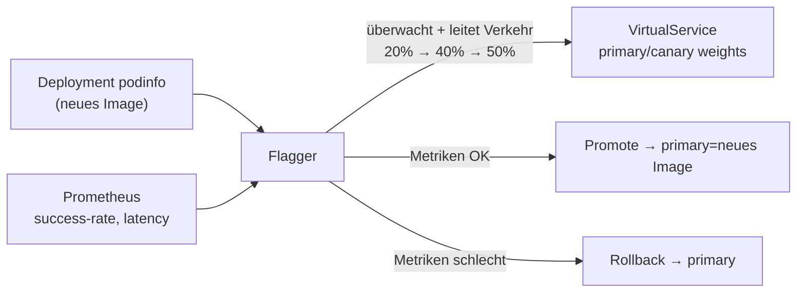

[RU version](README_RU.MD) · [Eng version](README.MD) · [Versión en español](README_ES.MD) · [Version française](README_FR.MD)

# Lab 25 - Progressive delivery mit Flagger

## Überblick

Ein Canary-Release von Hand (wie in Lab 06: manuell die Gewichte in einem
`VirtualService` drehen) ist ein aufwändiger und riskanter Prozess: man muss selbst die
Metriken überwachen und rechtzeitig zurückrollen. **Flagger** (CNCF-Projekt)
automatisiert das: er nimmt Ihr `Deployment`, verlagert bei jedem neuen Image den Verkehr
schrittweise auf den canary, prüft bei jedem Schritt die Metriken aus **Prometheus** und
befördert entweder (promote) oder rollt automatisch zurück (rollback).

Im Lab sind bereits Istio + Prometheus, **Flagger** (in `istio-system`) installiert, und
im Namespace `test` sind die Demo-Anwendung **podinfo** (`6.0.0`), der Lastgenerator
**flagger-loadtester** und das `public-gateway` deployt.



## Aufgabe

1. Eine `Canary`-Ressource für `podinfo` mit progressiver Analyse erstellen
   (Gewichtsschritte, Metriken, Last-Webhook).
2. Die Initialisierung von Flagger abwarten (es erscheint `podinfo-primary`).
3. Ein Release starten - das Image von `podinfo` auf `6.0.1` aktualisieren.
4. Den automatischen promote abwarten (Flagger überträgt das neue Image in
   `podinfo-primary`).

## Schritt 1. Canary erstellen

```bash
kubectl apply -f - <<'EOF'
apiVersion: flagger.app/v1beta1
kind: Canary
metadata:
  name: podinfo
  namespace: test
spec:
  targetRef:
    apiVersion: apps/v1
    kind: Deployment
    name: podinfo
  progressDeadlineSeconds: 300
  autoscalerRef:
    apiVersion: autoscaling/v2
    kind: HorizontalPodAutoscaler
    name: podinfo
  service:
    port: 9898
    targetPort: 9898
    gateways:
    - istio-system/public-gateway
    hosts:
    - app.example.com
  analysis:
    interval: 30s
    threshold: 5
    maxWeight: 50
    stepWeight: 20
    metrics:
    - name: request-success-rate
      thresholdRange:
        min: 99
      interval: 1m
    - name: request-duration
      thresholdRange:
        max: 500
      interval: 30s
    webhooks:
    - name: load-test
      url: http://flagger-loadtester.test/
      timeout: 5s
      metadata:
        cmd: "hey -z 2m -q 10 -c 2 http://podinfo-canary.test:9898/"
EOF
```

## Schritt 2. Initialisierung abwarten

```bash
kubectl -n test get canary podinfo -w    # warten auf STATUS = Initialized
kubectl -n test get deploy
# Flagger erstellt: podinfo-primary, die Services podinfo/podinfo-canary/podinfo-primary,
# destinationrule und virtualservice.
```

## Schritt 3. Canary-Release starten

```bash
kubectl -n test set image deployment/podinfo podinfod=ghcr.io/stefanprodan/podinfo:6.0.1
```

Flagger bemerkt die neue Revision und beginnt die Analyse: er verlagert 20% → 40% → 50%
des Verkehrs auf den canary und prüft in jedem interval `request-success-rate` und
`request-duration`. Der Loadtester sendet Verkehr, damit Metriken existieren.

## Schritt 4. promote beobachten

```bash
kubectl -n test describe canary/podinfo
# ... Advance podinfo.test canary weight 20/40/50
# ... Copying podinfo.test template spec to podinfo-primary.test
# ... Promotion completed!

kubectl -n test get canary podinfo          # STATUS = Succeeded
kubectl -n test get deploy podinfo-primary -o jsonpath='{.spec.template.spec.containers[*].image}'
# -> ghcr.io/stefanprodan/podinfo:6.0.1
```

Der promote dauert mit diesen Einstellungen ~2–3 Minuten. Führen Sie `check_result` aus,
nachdem `podinfo-primary` auf `6.0.1` aktualisiert wurde.

## Automatischer rollback (optional)

Starten Sie ein weiteres Release und schleusen Sie während der Analyse Fehler ein:

```bash
kubectl -n test set image deployment/podinfo podinfod=ghcr.io/stefanprodan/podinfo:6.0.2
POD=$(kubectl -n test get pod -l app=flagger-loadtester -o jsonpath='{.items[0].metadata.name}')
kubectl -n test exec -it "$POD" -- hey -z 1m -c 5 -q 10 http://podinfo-canary.test:9898/status/500
```

Wenn die Anzahl der fehlgeschlagenen Prüfungen den Schwellenwert erreicht, stoppt Flagger
den Rollout und rollt den Verkehr auf primary zurück, der canary skaliert auf null,
STATUS = `Failed`.

## Wie es funktioniert

- Flagger überwacht das Ziel-`Deployment`. Bei einer Änderung der Spec erstellt/aktualisiert
  er ein **canary**-Deployment und verlagert den Verkehr schrittweise über die Gewichte in
  `VirtualService`/`DestinationRule` von Istio.
- Bei jedem Schritt fragt er **Prometheus** nach den festgelegten Metriken ab; liegen sie
  innerhalb der Schwellenwerte - erhöht er das Gewicht, andernfalls rollt er nach
  `threshold` Fehlschlägen zurück.
- `podinfo-primary` hält stets die „bekannt funktionierende" Version; den Live-Verkehr
  bedient primary, bis der canary die Analyse vollständig durchläuft und promotet wird.
- Das verwandelt das manuelle, riskante Canary (Lab 06 traffic shifting) in ein
  automatisches, metrikengesteuertes Release mit eingebautem rollback - das Wesen von
  progressive delivery.

## Ergebnisprüfung

Führen Sie auf dem worker PC aus:

```bash
check_result
```

## Fazit

Sie haben einen automatischen progressiven Rollout über Flagger auf Istio konfiguriert:
das Release läuft schrittweise, die Entscheidung über promote/rollback wird anhand realer
Metriken ohne manuellen Eingriff getroffen. Progressive delivery ist eine wichtige
Senior-Fähigkeit für sichere Releases in der Produktion.

## Infrastruktur

| Komponente | Typ | Anzahl | Rolle |
|---|---|---|---|
| control-plane | `t3.medium` | 1 | master + istiod + Prometheus + Flagger |
| worker | `t3.small` | 1 | Kapazität für podinfo/canary/loadtester |
| worker PC | `t3.small` | 1 | Arbeitsplatz: `kubectl`, `check_result` |

Region: `eu-central-1` (AZ `eu-central-1a` / `eu-central-1b`).
