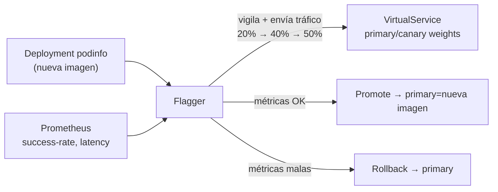

[RU version](README_RU.MD) · [Eng version](README.MD)

# Lab 25 - Progressive delivery con Flagger

## Resumen

Un release canary manual (como en el Lab 06: ajustar a mano los pesos en el
`VirtualService`) es un proceso laborioso y arriesgado: hay que vigilar uno mismo las
métricas y hacer rollback a tiempo. **Flagger** (proyecto de la CNCF) lo automatiza: toma
tu `Deployment` y, con cada nueva imagen, traslada progresivamente el tráfico al canary; en
cada paso comprueba las métricas de **Prometheus** y, o bien promociona (promote), o bien
hace rollback automáticamente.

En el lab ya están instalados Istio + Prometheus, **Flagger** (en `istio-system`), y en el
namespace `test` están desplegados la aplicación demo **podinfo** (`6.0.0`), el generador
de carga **flagger-loadtester** y el `public-gateway`.



## Tarea

1. Crear el recurso `Canary` para `podinfo` con análisis progresivo (pasos de peso,
   métricas, webhook de carga).
2. Esperar a la inicialización de Flagger (aparecerá `podinfo-primary`).
3. Lanzar el release: actualizar la imagen de `podinfo` a `6.0.1`.
4. Esperar el promote automático (Flagger traslada la nueva imagen a `podinfo-primary`).

## Paso 1. Crear el Canary

```bash
kubectl apply -f - <<'EOF'
apiVersion: flagger.app/v1beta1
kind: Canary
metadata:
  name: podinfo
  namespace: test
spec:
  targetRef:
    apiVersion: apps/v1
    kind: Deployment
    name: podinfo
  progressDeadlineSeconds: 300
  autoscalerRef:
    apiVersion: autoscaling/v2
    kind: HorizontalPodAutoscaler
    name: podinfo
  service:
    port: 9898
    targetPort: 9898
    gateways:
    - istio-system/public-gateway
    hosts:
    - app.example.com
  analysis:
    interval: 30s
    threshold: 5
    maxWeight: 50
    stepWeight: 20
    metrics:
    - name: request-success-rate
      thresholdRange:
        min: 99
      interval: 1m
    - name: request-duration
      thresholdRange:
        max: 500
      interval: 30s
    webhooks:
    - name: load-test
      url: http://flagger-loadtester.test/
      timeout: 5s
      metadata:
        cmd: "hey -z 2m -q 10 -c 2 http://podinfo-canary.test:9898/"
EOF
```

## Paso 2. Esperar la inicialización

```bash
kubectl -n test get canary podinfo -w    # esperamos STATUS = Initialized
kubectl -n test get deploy
# Flagger creará: podinfo-primary, los servicios podinfo/podinfo-canary/podinfo-primary,
# destinationrule y virtualservice.
```

## Paso 3. Lanzar el release canary

```bash
kubectl -n test set image deployment/podinfo podinfod=ghcr.io/stefanprodan/podinfo:6.0.1
```

Flagger detectará la nueva revisión e iniciará el análisis: traslada el 20% → 40% → 50% del
tráfico al canary, comprobando en cada interval `request-success-rate` y
`request-duration`. El loadtester envía tráfico para que existan métricas.

## Paso 4. Observar el promote

```bash
kubectl -n test describe canary/podinfo
# ... Advance podinfo.test canary weight 20/40/50
# ... Copying podinfo.test template spec to podinfo-primary.test
# ... Promotion completed!

kubectl -n test get canary podinfo          # STATUS = Succeeded
kubectl -n test get deploy podinfo-primary -o jsonpath='{.spec.template.spec.containers[*].image}'
# -> ghcr.io/stefanprodan/podinfo:6.0.1
```

El promote tarda ~2–3 minutos con estos ajustes. Ejecuta `check_result` después de que
`podinfo-primary` se actualice a `6.0.1`.

## Rollback automático (opcional)

Lanza otro release e inyecta errores durante el análisis:

```bash
kubectl -n test set image deployment/podinfo podinfod=ghcr.io/stefanprodan/podinfo:6.0.2
POD=$(kubectl -n test get pod -l app=flagger-loadtester -o jsonpath='{.items[0].metadata.name}')
kubectl -n test exec -it "$POD" -- hey -z 1m -c 5 -q 10 http://podinfo-canary.test:9898/status/500
```

Cuando el número de comprobaciones fallidas alcance el umbral, Flagger detendrá el
despliegue y devolverá el tráfico al primary, el canary se escalará a cero y STATUS =
`Failed`.

## Cómo funciona

- Flagger vigila el `Deployment` objetivo. Al cambiar la spec, crea/actualiza el deployment
  **canary** y traslada progresivamente el tráfico mediante los pesos en el
  `VirtualService`/`DestinationRule` de Istio.
- En cada paso consulta a **Prometheus** por las métricas indicadas; si están dentro de los
  umbrales, aumenta el peso, de lo contrario, tras `threshold` fallos, hace rollback.
- `podinfo-primary` mantiene siempre la versión «que se sabe que funciona»; el tráfico real
  lo sirve el primary hasta que el canary supere completamente el análisis y se haga
  promote.
- Esto convierte el canary manual y arriesgado (traffic shifting del Lab 06) en un release
  automático, gobernado por métricas y con rollback integrado, la esencia de la progressive
  delivery.

## Verificación del resultado

Ejecuta en el worker PC:

```bash
check_result
```

## Conclusión

Has configurado un despliegue progresivo automático con Flagger sobre Istio: el release
avanza por pasos y la decisión de promote/rollback se toma según métricas reales, sin
intervención manual. La progressive delivery es una habilidad senior importante para
releases seguros en producción.

## Infraestructura

| Componente | Tipo | Cantidad | Rol |
|---|---|---|---|
| control-plane | `t3.medium` | 1 | master + istiod + Prometheus + Flagger |
| worker | `t3.small` | 1 | capacidad para podinfo/canary/loadtester |
| worker PC | `t3.small` | 1 | puesto de trabajo: `kubectl`, `check_result` |

Región: `eu-central-1` (AZ `eu-central-1a` / `eu-central-1b`).
