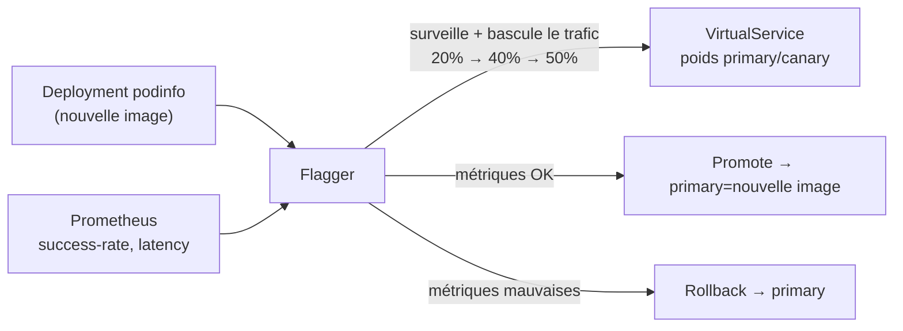

[RU version](README_RU.MD) · [Eng version](README.MD) · [Versión en español](README_ES.MD) · [Deutsche Version](README_DE.MD)

# Lab 25 - Progressive delivery avec Flagger

## Aperçu

Un canary-release manuel (comme au Lab 06 : ajuster les poids à la main dans un
`VirtualService`) est un processus laborieux et risqué : il faut surveiller soi-même les
métriques et revenir en arrière au bon moment. **Flagger** (projet CNCF) automatise cela :
il prend votre `Deployment`, à chaque nouvelle image bascule progressivement le trafic
vers le canary, à chaque étape vérifie les métriques de **Prometheus** et soit promeut
(promote), soit revient automatiquement en arrière (rollback).

Dans ce lab sont déjà installés Istio + Prometheus, **Flagger** (dans `istio-system`), et
dans le namespace `test` sont déployés l'application de démo **podinfo** (`6.0.0`), le
générateur de charge **flagger-loadtester** et `public-gateway`.



## Exercice

1. Créer une ressource `Canary` pour `podinfo` avec analyse progressive (étapes de poids,
   métriques, webhook de charge).
2. Attendre l'initialisation de Flagger (apparition de `podinfo-primary`).
3. Lancer le release - mettre à jour l'image `podinfo` vers `6.0.1`.
4. Attendre le promote automatique (Flagger reporte la nouvelle image dans
   `podinfo-primary`).

## Étape 1. Créer le Canary

```bash
kubectl apply -f - <<'EOF'
apiVersion: flagger.app/v1beta1
kind: Canary
metadata:
  name: podinfo
  namespace: test
spec:
  targetRef:
    apiVersion: apps/v1
    kind: Deployment
    name: podinfo
  progressDeadlineSeconds: 300
  autoscalerRef:
    apiVersion: autoscaling/v2
    kind: HorizontalPodAutoscaler
    name: podinfo
  service:
    port: 9898
    targetPort: 9898
    gateways:
    - istio-system/public-gateway
    hosts:
    - app.example.com
  analysis:
    interval: 30s
    threshold: 5
    maxWeight: 50
    stepWeight: 20
    metrics:
    - name: request-success-rate
      thresholdRange:
        min: 99
      interval: 1m
    - name: request-duration
      thresholdRange:
        max: 500
      interval: 30s
    webhooks:
    - name: load-test
      url: http://flagger-loadtester.test/
      timeout: 5s
      metadata:
        cmd: "hey -z 2m -q 10 -c 2 http://podinfo-canary.test:9898/"
EOF
```

## Étape 2. Attendre l'initialisation

```bash
kubectl -n test get canary podinfo -w    # on attend STATUS = Initialized
kubectl -n test get deploy
# Flagger va créer : podinfo-primary, les services podinfo/podinfo-canary/podinfo-primary,
# une destinationrule et un virtualservice.
```

## Étape 3. Lancer le canary-release

```bash
kubectl -n test set image deployment/podinfo podinfod=ghcr.io/stefanprodan/podinfo:6.0.1
```

Flagger repère la nouvelle révision et démarre l'analyse : il bascule 20% → 40% → 50% du
trafic vers le canary, en vérifiant à chaque interval `request-success-rate` et
`request-duration`. Le loadtester envoie du trafic pour que les métriques existent.

## Étape 4. Observer le promote

```bash
kubectl -n test describe canary/podinfo
# ... Advance podinfo.test canary weight 20/40/50
# ... Copying podinfo.test template spec to podinfo-primary.test
# ... Promotion completed!

kubectl -n test get canary podinfo          # STATUS = Succeeded
kubectl -n test get deploy podinfo-primary -o jsonpath='{.spec.template.spec.containers[*].image}'
# -> ghcr.io/stefanprodan/podinfo:6.0.1
```

Le promote prend ~2–3 minutes avec ces réglages. Lancez `check_result` une fois que
`podinfo-primary` est mis à jour vers `6.0.1`.

## Rollback automatique (optionnel)

Lancez un release de plus et injectez des erreurs pendant l'analyse :

```bash
kubectl -n test set image deployment/podinfo podinfod=ghcr.io/stefanprodan/podinfo:6.0.2
POD=$(kubectl -n test get pod -l app=flagger-loadtester -o jsonpath='{.items[0].metadata.name}')
kubectl -n test exec -it "$POD" -- hey -z 1m -c 5 -q 10 http://podinfo-canary.test:9898/status/500
```

Quand le nombre de vérifications échouées atteint le seuil, Flagger arrête le déploiement
et rebascule le trafic vers primary, le canary se met à l'échelle à zéro, STATUS =
`Failed`.

## Comment ça marche

- Flagger surveille le `Deployment` cible. Lorsque la spec change, il crée/met à jour un
  déploiement **canary** et bascule progressivement le trafic via les poids dans le
  `VirtualService`/`DestinationRule` d'Istio.
- À chaque étape, il interroge **Prometheus** sur les métriques définies ; si elles sont
  dans les seuils - il augmente le poids, sinon après `threshold` échecs il revient en
  arrière.
- `podinfo-primary` conserve toujours une version « connue comme fonctionnelle » ; le
  trafic réel est servi par primary tant que le canary n'a pas complètement passé
  l'analyse et n'est pas promu.
- Cela transforme le canary manuel et risqué (Lab 06 traffic shifting) en un release
  automatique piloté par les métriques avec rollback intégré - c'est l'essence de la
  progressive delivery.

## Vérification du résultat

Lancez sur le worker PC :

```bash
check_result
```

## Bilan

Vous avez configuré un déploiement progressif automatique via Flagger par-dessus Istio :
le release se fait pas à pas, la décision de promote/rollback est prise selon des
métriques réelles sans intervention manuelle. La progressive delivery est une compétence
senior importante pour des releases sûrs en production.

## Infrastructure

| Composant | Type | Qté | Rôle |
|---|---|---|---|
| control-plane | `t3.medium` | 1 | master + istiod + Prometheus + Flagger |
| worker | `t3.small` | 1 | capacité pour podinfo/canary/loadtester |
| worker PC | `t3.small` | 1 | poste de travail : `kubectl`, `check_result` |

Région : `eu-central-1` (AZ `eu-central-1a` / `eu-central-1b`).
