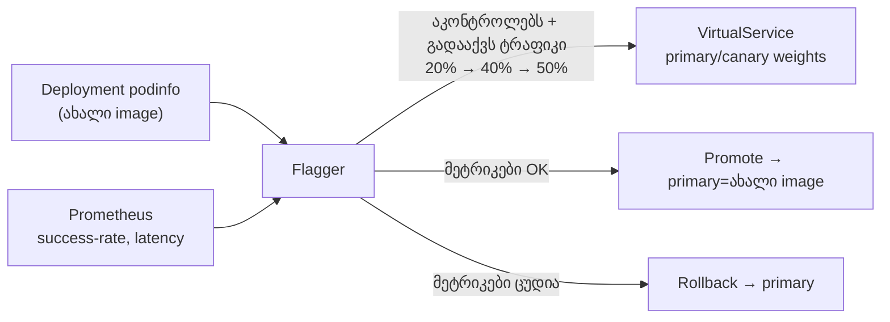

[Русская версия](README_RU.MD) · [Eng version](README.MD) · [Versión en español](README_ES.MD) · [Version française](README_FR.MD) · [Deutsche Version](README_DE.MD) · [繁體中文版](README_TW.MD) · [日本語版](README_JP.MD)

# Lab 25 - პროგრესული მიწოდება Flagger-ით

> [საცნობარო გადაწყვეტა](worker/files/solutions/1_GE.MD)

## მიმოხილვა

Canary-რელიზის ხელით მართვა (როგორც Lab 06-ში: `VirtualService`-ში წონების ხელით შეცვლა) შრომატევადი და სარისკო პროცესია: თავად უნდა აკონტროლოთ მეტრიკები და დროულად შეასრულოთ უკუსვლა. **Flagger** (CNCF-ის პროექტი) ამას ავტომატიზაციას უკეთებს: ის იღებს თქვენს `Deployment`-ს, ყოველი ახალი image-ის გამოჩენისას ტრაფიკი ეტაპობრივად გადააქვს canary-ზე, თითოეულ ნაბიჯზე ამოწმებს **Prometheus**-ის მეტრიკებს და ან დაწინაურებას (promote) ახორციელებს, ან ავტომატურად ასრულებს უკუსვლას (rollback).

ლაბორატორიაში უკვე ინსტალირებულია Istio + Prometheus, **Flagger** (`istio-system`-ში), ხოლო namespace `test`-ში გაშლილია სადემონსტრაციო აპლიკაცია **podinfo** (`6.0.0`), დატვირთვის გენერატორი **flagger-loadtester** და `public-gateway`.



## ინფრასტრუქტურა

| კომპონენტი | ტიპი | რაოდენობა | როლი |
|---|---|---|---|
| control-plane | `t3.medium` | 1 | master + istiod + Prometheus + Flagger |
| worker | `t3.small` | 1 | რესურსები podinfo/canary/loadtester-ისთვის |
| worker PC | `t3.small` | 1 | სამუშაო გარემო: `kubectl`, `check_result` |

რეგიონი: `eu-central-1` (AZ `eu-central-1a` / `eu-central-1b`).

## გაშლა

```bash
TASK=25 make run_ica_task
```

## დავალება

1. შექმენით `Canary` რესურსი `podinfo`-სთვის პროგრესული ანალიზით (წონის ნაბიჯები, მეტრიკები, დატვირთვის webhook).
2. დაელოდეთ Flagger-ის ინიციალიზაციას (გამოჩნდება `podinfo-primary`).
3. გაუშვით რელიზი - განაახლეთ `podinfo`-ს image ვერსიამდე `6.0.1`.
4. დაელოდეთ ავტომატურ promote-ს (Flagger ახალ image-ს `podinfo-primary`-ში გადაიტანს).

## ნაბიჯი 1. Canary-ის შექმნა

```bash
kubectl apply -f - <<'EOF'
apiVersion: flagger.app/v1beta1
kind: Canary
metadata:
  name: podinfo
  namespace: test
spec:
  targetRef:
    apiVersion: apps/v1
    kind: Deployment
    name: podinfo
  progressDeadlineSeconds: 300
  autoscalerRef:
    apiVersion: autoscaling/v2
    kind: HorizontalPodAutoscaler
    name: podinfo
  service:
    port: 9898
    targetPort: 9898
    gateways:
    - istio-system/public-gateway
    hosts:
    - app.example.com
  analysis:
    interval: 30s
    threshold: 5
    maxWeight: 50
    stepWeight: 20
    metrics:
    - name: request-success-rate
      thresholdRange:
        min: 99
      interval: 1m
    - name: request-duration
      thresholdRange:
        max: 500
      interval: 30s
    webhooks:
    - name: load-test
      url: http://flagger-loadtester.test/
      timeout: 5s
      metadata:
        cmd: "hey -z 2m -q 10 -c 2 http://podinfo-canary.test:9898/"
EOF
```

## ნაბიჯი 2. ინიციალიზაციის დალოდება

```bash
kubectl -n test get canary podinfo -w    # ველოდებით STATUS = Initialized
kubectl -n test get deploy
# Flagger შექმნის: podinfo-primary, სერვისებს podinfo/podinfo-canary/podinfo-primary,
# destinationrule-სა და virtualservice-ს.
```

## ნაბიჯი 3. Canary-რელიზის გაშვება

```bash
kubectl -n test set image deployment/podinfo podinfod=ghcr.io/stefanprodan/podinfo:6.0.1
```

Flagger ახალ რევიზიას შეამჩნევს და ანალიზს დაიწყებს: canary-ზე ტრაფიკის 20% → 40% → 50% გადააქვს და ყოველ interval-ში ამოწმებს `request-success-rate`-სა და `request-duration`-ს. Loadtester აგზავნის ტრაფიკს, რათა მეტრიკები წარმოიქმნას.

## ნაბიჯი 4. Promote-ის დაკვირვება

```bash
kubectl -n test describe canary/podinfo
# ... Advance podinfo.test canary weight 20/40/50
# ... Copying podinfo.test template spec to podinfo-primary.test
# ... Promotion completed!

kubectl -n test get canary podinfo          # STATUS = Succeeded
kubectl -n test get deploy podinfo-primary -o jsonpath='{.spec.template.spec.containers[*].image}'
# -> ghcr.io/stefanprodan/podinfo:6.0.1
```

ამ პარამეტრებით promote დაახლოებით 2–3 წუთს საჭიროებს. `check_result` გაუშვით მას შემდეგ, რაც `podinfo-primary` ვერსიამდე `6.0.1` განახლდება.

## ავტომატური rollback (არასავალდებულო)

გაუშვით კიდევ ერთი რელიზი და ანალიზის დროს შეცდომები ხელოვნურად გამოიწვიეთ:

```bash
kubectl -n test set image deployment/podinfo podinfod=ghcr.io/stefanprodan/podinfo:6.0.2
POD=$(kubectl -n test get pod -l app=flagger-loadtester -o jsonpath='{.items[0].metadata.name}')
kubectl -n test exec -it "$POD" -- hey -z 1m -c 5 -q 10 http://podinfo-canary.test:9898/status/500
```

როდესაც წარუმატებელი შემოწმებების რაოდენობა ზღვარს მიაღწევს, Flagger გაშლას შეაჩერებს და ტრაფიკს primary-ზე დააბრუნებს, canary ნულამდე მასშტაბირდება, ხოლო STATUS = `Failed`.

## როგორ მუშაობს

- Flagger სამიზნე `Deployment`-ს აკონტროლებს. სპეციფიკაციის ცვლილებისას ის ქმნის/აახლებს **canary**-deployment-ს და Istio-ს `VirtualService`/`DestinationRule`-ში მითითებული წონების საშუალებით ტრაფიკი ეტაპობრივად გადააქვს.
- თითოეულ ნაბიჯზე ის **Prometheus**-ს მიმართავს მითითებული მეტრიკებისთვის; თუ ისინი ზღვრების ფარგლებშია, წონას ზრდის, წინააღმდეგ შემთხვევაში კი `threshold` წარუმატებლობის შემდეგ უკუსვლას ასრულებს.
- `podinfo-primary` ყოველთვის ინარჩუნებს „დადასტურებულად მუშა“ ვერსიას; რეალურ ტრაფიკს primary ემსახურება მანამ, სანამ canary ანალიზს სრულად არ გაივლის და promote არ შესრულდება.
- ეს Lab 06-ის ხელით სამართავ, სარისკო canary-ს (traffic shifting) გარდაქმნის მეტრიკებით მართულ ავტომატურ რელიზად ჩაშენებული უკუსვლით - სწორედ ეს არის progressive delivery-ის არსი.

## შედეგის შემოწმება

worker PC-ზე გაუშვით:

```bash
check_result
```

## შეჯამება

თქვენ Istio-ს ბაზაზე Flagger-ის საშუალებით ავტომატური პროგრესული გაშლა დააკონფიგურირეთ: რელიზი ეტაპობრივად მიმდინარეობს, ხოლო promote/rollback-ის გადაწყვეტილება რეალური მეტრიკების საფუძველზე, ხელით ჩარევის გარეშე მიიღება. Progressive delivery წარმოებაში უსაფრთხო რელიზებისთვის მნიშვნელოვანი senior-უნარია.
