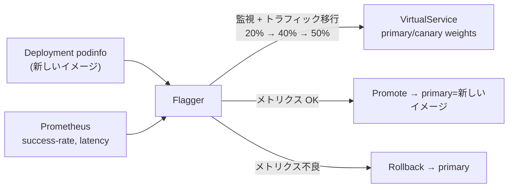

[Русская версия](README_RU.MD) · [Eng version](README.MD) · [Versión en español](README_ES.MD) · [Version française](README_FR.MD) · [Deutsche Version](README_DE.MD) · [ქართული ვერსია](README_GE.MD) · [繁體中文版](README_TW.MD)

# Lab 25 - Flagger によるプログレッシブデリバリー

> [リファレンス解答](worker/files/solutions/1_JP.MD)

## 概要

手動の Canary リリース（Lab 06 のように `VirtualService` の重みを手作業で調整する方法）は、
手間がかかりリスクも伴います。メトリクスを自分で監視し、適切なタイミングでロールバックする必要があります。
**Flagger**（CNCF プロジェクト）はこれを自動化します。対象の `Deployment` を引き継ぎ、新しい
イメージごとにトラフィックを段階的に canary へ移行し、各ステップで **Prometheus** のメトリクスを確認して、
promote するか自動的に rollback します。

このラボにはすでに Istio + Prometheus、**Flagger**（`istio-system` 内）がインストールされており、
namespace `test` にはデモアプリケーション **podinfo**（`6.0.0`）、負荷生成ツール
**flagger-loadtester**、および `public-gateway` がデプロイされています。



## インフラストラクチャ

| コンポーネント | タイプ | 数量 | 役割 |
|---|---|---|---|
| control-plane | `t3.medium` | 1 | master + istiod + Prometheus + Flagger |
| worker | `t3.small` | 1 | podinfo/canary/loadtester 用の容量 |
| worker PC | `t3.small` | 1 | 作業環境: `kubectl`, `check_result` |

リージョン: `eu-central-1`（AZ `eu-central-1a` / `eu-central-1b`）。

## デプロイ

```bash
TASK=25 make run_ica_task
```

## 課題

1. プログレッシブ分析（重みのステップ、メトリクス、負荷 webhook）を含む `podinfo` の `Canary` リソースを作成する。
2. Flagger の初期化を待つ（`podinfo-primary` が作成される）。
3. リリースを開始する - `podinfo` イメージを `6.0.1` に更新する。
4. 自動 promote を待つ（Flagger が新しいイメージを `podinfo-primary` に反映する）。

## ステップ 1. Canary を作成する

```bash
kubectl apply -f - <<'EOF'
apiVersion: flagger.app/v1beta1
kind: Canary
metadata:
  name: podinfo
  namespace: test
spec:
  targetRef:
    apiVersion: apps/v1
    kind: Deployment
    name: podinfo
  progressDeadlineSeconds: 300
  autoscalerRef:
    apiVersion: autoscaling/v2
    kind: HorizontalPodAutoscaler
    name: podinfo
  service:
    port: 9898
    targetPort: 9898
    gateways:
    - istio-system/public-gateway
    hosts:
    - app.example.com
  analysis:
    interval: 30s
    threshold: 5
    maxWeight: 50
    stepWeight: 20
    metrics:
    - name: request-success-rate
      thresholdRange:
        min: 99
      interval: 1m
    - name: request-duration
      thresholdRange:
        max: 500
      interval: 30s
    webhooks:
    - name: load-test
      url: http://flagger-loadtester.test/
      timeout: 5s
      metadata:
        cmd: "hey -z 2m -q 10 -c 2 http://podinfo-canary.test:9898/"
EOF
```

## ステップ 2. 初期化を待つ

```bash
kubectl -n test get canary podinfo -w    # STATUS = Initialized を待つ
kubectl -n test get deploy
# Flagger が作成する: podinfo-primary、サービス podinfo/podinfo-canary/podinfo-primary、
# destinationrule と virtualservice。
```

## ステップ 3. canary リリースを開始する

```bash
kubectl -n test set image deployment/podinfo podinfod=ghcr.io/stefanprodan/podinfo:6.0.1
```

Flagger は新しいリビジョンを検出して分析を開始します。トラフィックの 20% → 40% → 50% を
canary に移行し、各 interval で `request-success-rate` と `request-duration` を確認します。
メトリクスを生成するため、Loadtester がトラフィックを送信します。

## ステップ 4. promote を監視する

```bash
kubectl -n test describe canary/podinfo
# ... Advance podinfo.test canary weight 20/40/50
# ... Copying podinfo.test template spec to podinfo-primary.test
# ... Promotion completed!

kubectl -n test get canary podinfo          # STATUS = Succeeded
kubectl -n test get deploy podinfo-primary -o jsonpath='{.spec.template.spec.containers[*].image}'
# -> ghcr.io/stefanprodan/podinfo:6.0.1
```

この設定では promote に約 2～3 分かかります。`podinfo-primary` が `6.0.1` に更新された後、
`check_result` を実行してください。

## 自動 rollback（任意）

別のリリースを開始し、分析中にエラーを発生させます。

```bash
kubectl -n test set image deployment/podinfo podinfod=ghcr.io/stefanprodan/podinfo:6.0.2
POD=$(kubectl -n test get pod -l app=flagger-loadtester -o jsonpath='{.items[0].metadata.name}')
kubectl -n test exec -it "$POD" -- hey -z 1m -c 5 -q 10 http://podinfo-canary.test:9898/status/500
```

失敗したチェック数がしきい値に達すると、Flagger はロールアウトを停止してトラフィックを primary に
rollback します。canary はゼロにスケールされ、STATUS = `Failed` になります。

## 仕組み

- Flagger は対象の `Deployment` を監視します。spec が変更されると、**canary** Deployment を
  作成または更新し、Istio の `VirtualService`/`DestinationRule` の重みを通じてトラフィックを段階的に移行します。
- 各ステップで、指定したメトリクスを **Prometheus** に問い合わせます。メトリクスがしきい値の範囲内なら
  重みを増やし、そうでなければ `threshold` 回の失敗後に rollback します。
- `podinfo-primary` は常に「動作確認済み」のバージョンを維持します。canary が分析を完全に通過して
  promote されるまで、本番トラフィックは primary が処理します。
- これにより、手動でリスクの高い canary（Lab 06 の traffic shifting）を、組み込みの rollback を備えた
  メトリクス駆動の自動リリースへと変えます。これが progressive delivery の本質です。

## 結果の確認

worker PC で実行します。

```bash
check_result
```

## まとめ

Istio 上の Flagger を使用して、自動プログレッシブロールアウトを構成しました。リリースは段階的に進行し、
promote/rollback の判断は手動操作なしに実際のメトリクスに基づいて行われます。Progressive delivery は、本番環境で安全にリリースするための重要なシニアスキルです。
