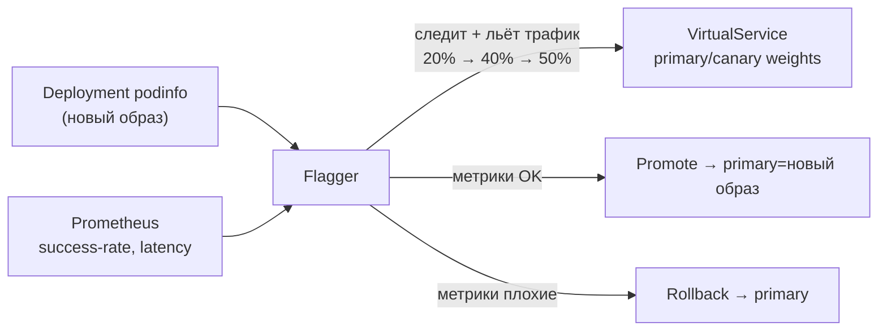

[Eng version](README.MD) · [Versión en español](README_ES.MD)

# Lab 25 - Progressive delivery с Flagger

## Обзор

Canary-релиз вручную (как в Lab 06: руками крутить веса в `VirtualService`) - процесс
трудоёмкий и рискованный: надо самому следить за метриками и вовремя откатываться.
**Flagger** (CNCF-проект) автоматизирует это: он берёт ваш `Deployment`, при каждом
новом образе постепенно переливает трафик на canary, на каждом шаге проверяет метрики из
**Prometheus** и либо повышает (promote), либо автоматически откатывает (rollback).

В лабе уже установлены Istio + Prometheus, **Flagger** (в `istio-system`), а в namespace
`test` развёрнуты демо-приложение **podinfo** (`6.0.0`), генератор нагрузки
**flagger-loadtester** и `public-gateway`.



## Задание

1. Создать ресурс `Canary` для `podinfo` с прогрессивным анализом (шаги веса, метрики,
   webhook нагрузки).
2. Дождаться инициализации Flagger (появится `podinfo-primary`).
3. Запустить релиз - обновить образ `podinfo` на `6.0.1`.
4. Дождаться автоматического promote (Flagger переносит новый образ в `podinfo-primary`).

## Шаг 1. Создать Canary

```bash
kubectl apply -f - <<'EOF'
apiVersion: flagger.app/v1beta1
kind: Canary
metadata:
  name: podinfo
  namespace: test
spec:
  targetRef:
    apiVersion: apps/v1
    kind: Deployment
    name: podinfo
  progressDeadlineSeconds: 300
  autoscalerRef:
    apiVersion: autoscaling/v2
    kind: HorizontalPodAutoscaler
    name: podinfo
  service:
    port: 9898
    targetPort: 9898
    gateways:
    - istio-system/public-gateway
    hosts:
    - app.example.com
  analysis:
    interval: 30s
    threshold: 5
    maxWeight: 50
    stepWeight: 20
    metrics:
    - name: request-success-rate
      thresholdRange:
        min: 99
      interval: 1m
    - name: request-duration
      thresholdRange:
        max: 500
      interval: 30s
    webhooks:
    - name: load-test
      url: http://flagger-loadtester.test/
      timeout: 5s
      metadata:
        cmd: "hey -z 2m -q 10 -c 2 http://podinfo-canary.test:9898/"
EOF
```

## Шаг 2. Дождаться инициализации

```bash
kubectl -n test get canary podinfo -w    # ждём STATUS = Initialized
kubectl -n test get deploy
# Flagger создаст: podinfo-primary, сервисы podinfo/podinfo-canary/podinfo-primary,
# destinationrule и virtualservice.
```

## Шаг 3. Запустить canary-релиз

```bash
kubectl -n test set image deployment/podinfo podinfod=ghcr.io/stefanprodan/podinfo:6.0.1
```

Flagger заметит новую ревизию и начнёт анализ: переливает 20% → 40% → 50% трафика на
canary, каждые interval проверяя `request-success-rate` и `request-duration`.
Loadtester шлёт трафик, чтобы метрики существовали.

## Шаг 4. Наблюдать promote

```bash
kubectl -n test describe canary/podinfo
# ... Advance podinfo.test canary weight 20/40/50
# ... Copying podinfo.test template spec to podinfo-primary.test
# ... Promotion completed!

kubectl -n test get canary podinfo          # STATUS = Succeeded
kubectl -n test get deploy podinfo-primary -o jsonpath='{.spec.template.spec.containers[*].image}'
# -> ghcr.io/stefanprodan/podinfo:6.0.1
```

Promote занимает ~2–3 минуты с этими настройками. Запускайте `check_result` после того,
как `podinfo-primary` обновится до `6.0.1`.

## Автоматический rollback (опционально)

Запустите ещё один релиз и вбросьте ошибки во время анализа:

```bash
kubectl -n test set image deployment/podinfo podinfod=ghcr.io/stefanprodan/podinfo:6.0.2
POD=$(kubectl -n test get pod -l app=flagger-loadtester -o jsonpath='{.items[0].metadata.name}')
kubectl -n test exec -it "$POD" -- hey -z 1m -c 5 -q 10 http://podinfo-canary.test:9898/status/500
```

Когда число проваленных проверок достигнет порога, Flagger остановит выкатку и откатит
трафик на primary, canary масштабируется в ноль, STATUS = `Failed`.

## Как это работает

- Flagger следит за целевым `Deployment`. При изменении спеки он создаёт/обновляет
  **canary**-деплоймент и постепенно переливает трафик через веса в
  `VirtualService`/`DestinationRule` Istio.
- На каждом шаге запрашивает **Prometheus** по заданным метрикам; если они в пределах
  порогов - повышает вес, иначе после `threshold` неудач откатывает.
- `podinfo-primary` всегда держит «заведомо рабочую» версию; живой трафик обслуживает
  primary, пока canary полностью не пройдёт анализ и не будет promote.
- Это превращает ручной рискованный canary (Lab 06 traffic shifting) в автоматический,
  управляемый метриками релиз со встроенным откатом - суть progressive delivery.

## Проверка результата

Запустите на worker PC:

```bash
check_result
```

## Итог

Вы настроили автоматическую прогрессивную выкатку через Flagger поверх Istio: релиз идёт
пошагово, решение о promote/rollback принимается по реальным метрикам без ручного
вмешательства. Progressive delivery - важный senior-навык безопасных релизов в проде.

## Инфраструктура

| Компонент | Тип | Кол-во | Роль |
|---|---|---|---|
| control-plane | `t3.medium` | 1 | master + istiod + Prometheus + Flagger |
| worker | `t3.small` | 1 | ёмкость для podinfo/canary/loadtester |
| worker PC | `t3.small` | 1 | рабочее место: `kubectl`, `check_result` |

Регион: `eu-central-1` (AZ `eu-central-1a` / `eu-central-1b`).
