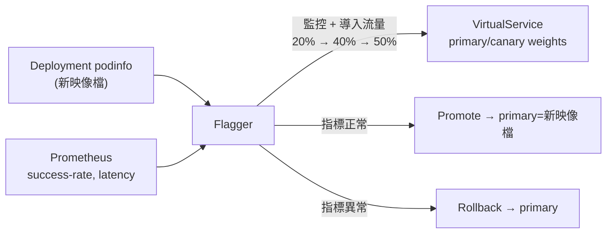

[Русская версия](README_RU.MD) · [Eng version](README.MD) · [Versión en español](README_ES.MD) · [Version française](README_FR.MD) · [Deutsche Version](README_DE.MD) · [ქართული ვერსია](README_GE.MD) · [日本語版](README_JP.MD)

# Lab 25 - 使用 Flagger 進行漸進式交付

> [參考解答](worker/files/solutions/1_TW.MD)

## 概覽

手動進行 Canary 發布（如同 Lab 06：手動調整 `VirtualService` 中的權重）是一個費力且高風險的流程：您必須自行監控指標並及時回滾。**Flagger**（CNCF 專案）將此自動化：它接管您的 `Deployment`，在每次新映像檔發佈時逐步將流量導向 canary，於每一步檢查來自 **Prometheus** 的指標，並自動 promote 或 rollback。

本實驗已安裝 Istio + Prometheus 與 **Flagger**（位於 `istio-system`）；在 namespace `test` 中已部署示範應用程式 **podinfo**（`6.0.0`）、負載產生器 **flagger-loadtester** 及 `public-gateway`。



## 基礎設施

| 元件 | 類型 | 數量 | 角色 |
|---|---|---|---|
| control-plane | `t3.medium` | 1 | master + istiod + Prometheus + Flagger |
| worker | `t3.small` | 1 | podinfo/canary/loadtester 容量 |
| worker PC | `t3.small` | 1 | 工作站：`kubectl`、`check_result` |

區域：`eu-central-1`（AZ `eu-central-1a` / `eu-central-1b`）。

## 部署

```bash
TASK=25 make run_ica_task
```

## 任務

1. 為 `podinfo` 建立 `Canary` 資源，包含漸進式分析（權重步驟、指標、負載 webhook）。
2. 等待 Flagger 初始化（將出現 `podinfo-primary`）。
3. 啟動發布：將 `podinfo` 映像檔更新至 `6.0.1`。
4. 等待自動 promote（Flagger 將新映像檔移至 `podinfo-primary`）。

## 步驟 1：建立 Canary

```bash
kubectl apply -f - <<'EOF'
apiVersion: flagger.app/v1beta1
kind: Canary
metadata:
  name: podinfo
  namespace: test
spec:
  targetRef:
    apiVersion: apps/v1
    kind: Deployment
    name: podinfo
  progressDeadlineSeconds: 300
  autoscalerRef:
    apiVersion: autoscaling/v2
    kind: HorizontalPodAutoscaler
    name: podinfo
  service:
    port: 9898
    targetPort: 9898
    gateways:
    - istio-system/public-gateway
    hosts:
    - app.example.com
  analysis:
    interval: 30s
    threshold: 5
    maxWeight: 50
    stepWeight: 20
    metrics:
    - name: request-success-rate
      thresholdRange:
        min: 99
      interval: 1m
    - name: request-duration
      thresholdRange:
        max: 500
      interval: 30s
    webhooks:
    - name: load-test
      url: http://flagger-loadtester.test/
      timeout: 5s
      metadata:
        cmd: "hey -z 2m -q 10 -c 2 http://podinfo-canary.test:9898/"
EOF
```

## 步驟 2：等待初始化

```bash
kubectl -n test get canary podinfo -w    # 等待 STATUS = Initialized
kubectl -n test get deploy
# Flagger 會建立：podinfo-primary、服務 podinfo/podinfo-canary/podinfo-primary、
# destinationrule 和 virtualservice。
```

## 步驟 3：啟動 canary 發布

```bash
kubectl -n test set image deployment/podinfo podinfod=ghcr.io/stefanprodan/podinfo:6.0.1
```

Flagger 將偵測到新修訂版本並開始分析：把 20% → 40% → 50% 的流量導向 canary，並在每個 interval 檢查 `request-success-rate` 和 `request-duration`。Loadtester 會發送流量，以確保指標存在。

## 步驟 4：觀察 promote

```bash
kubectl -n test describe canary/podinfo
# ... Advance podinfo.test canary weight 20/40/50
# ... Copying podinfo.test template spec to podinfo-primary.test
# ... Promotion completed!

kubectl -n test get canary podinfo          # STATUS = Succeeded
kubectl -n test get deploy podinfo-primary -o jsonpath='{.spec.template.spec.containers[*].image}'
# -> ghcr.io/stefanprodan/podinfo:6.0.1
```

以這些設定，Promote 約需 2–3 分鐘。待 `podinfo-primary` 更新至 `6.0.1` 後再執行 `check_result`。

## 自動 rollback（選用）

啟動另一個發布，並在分析期間注入錯誤：

```bash
kubectl -n test set image deployment/podinfo podinfod=ghcr.io/stefanprodan/podinfo:6.0.2
POD=$(kubectl -n test get pod -l app=flagger-loadtester -o jsonpath='{.items[0].metadata.name}')
kubectl -n test exec -it "$POD" -- hey -z 1m -c 5 -q 10 http://podinfo-canary.test:9898/status/500
```

當失敗檢查次數達到閾值時，Flagger 會停止發布並將流量回滾至 primary，canary 會縮放至零，STATUS = `Failed`。

## 運作方式

- Flagger 會監控目標 `Deployment`。當 spec 變更時，它會建立／更新 **canary** deployment，並透過 Istio `VirtualService`/`DestinationRule` 中的權重逐步導入流量。
- 在每個步驟中，它會依照指定的指標查詢 **Prometheus**；若指標落在閾值範圍內則提高權重，否則在 `threshold` 次失敗後回滾。
- `podinfo-primary` 始終保有「已知可用」的版本；在 canary 完全通過分析並被 promote 前，實際流量由 primary 提供服務。
- 這會將手動、高風險的 canary（Lab 06 traffic shifting）轉換為由指標驅動、具備內建回滾的自動化發布--這正是漸進式交付的核心。

## 驗證結果

在 worker PC 上執行：

```bash
check_result
```

## 總結

您已透過 Flagger 在 Istio 上設定自動化漸進式發布：發布會逐步進行，並依真實指標決定 promote/rollback，無須手動介入。漸進式交付是安全進行正式環境發布的重要資深技能。
