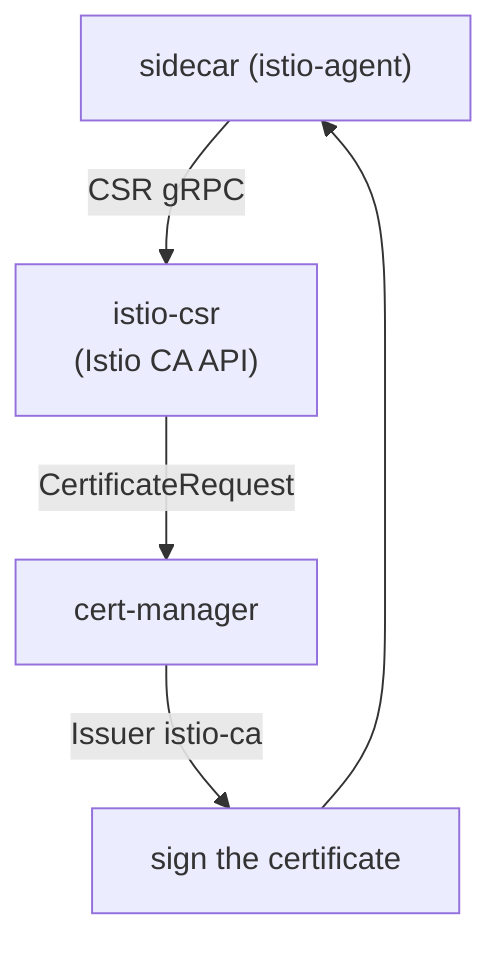

[RU version](README_RU.MD) · [Versión en español](README_ES.MD)

# Lab 26 - Dynamic CA: cert-manager + istio-csr

## Overview

In Lab 19 we plugged in our own CA statically via the `cacerts` secret: the intermediate
key lives in istiod and rotation is manual. Production usually goes further with
**cert-manager + istio-csr**:

- **istiod** no longer signs certificates (`ENABLE_CA_SERVER=false`); it points agents at
  istio-csr via `caAddress`;
- **istio-csr** implements the Istio CA gRPC API: for each workload CSR it creates a
  cert-manager `CertificateRequest`;
- **cert-manager** signs it with the configured `Issuer` (here a self-signed CA, but it
  could be **Vault**, an **ACME** CA, or a corporate PKI).

The signing key stays in cert-manager, CA rotation is automated, and every issued
certificate is a `CertificateRequest` object (auditable).

The platform is already wired: cert-manager, an `istio-ca` Issuer, istio-csr, and Istio
with its built-in CA disabled. `istioctl` is available on the worker PC.



## Task

1. Deploy a workload into an injection-enabled namespace.
2. Confirm cert-manager is issuing certificates (`CertificateRequest`s appear in
   `istio-system`).
3. Verify the workload certificate (`SVID`) is issued by **cert-manager** (issuer includes
   `cert-manager`/`istio-ca`) with the SPIFFE identity intact.

## Step 1. Deploy the app

```bash
kubectl apply -f https://raw.githubusercontent.com/ViktorUJ/cks/refs/heads/master/tasks/ica/labs/26/k8s-1/scripts/1.yaml
kubectl rollout status deploy/ping-pong -n app
```

## Step 2. Watch cert-manager issue the certificate

```bash
kubectl get certificaterequests.cert-manager.io -n istio-system
kubectl logs -n cert-manager deploy/cert-manager-istio-csr --tail=20
```

## Step 3. Verify the workload cert comes from cert-manager

```bash
POD=$(kubectl get pod -n app -l app=ping-pong -o jsonpath='{.items[0].metadata.name}')
istioctl proxy-config secret "$POD" -n app -o json \
  | jq -r '.dynamicActiveSecrets[] | select(.name=="default") | .secret.tlsCertificate.certificateChain.inlineBytes' \
  | base64 -d | openssl x509 -noout -issuer -ext subjectAltName
# issuer=O = cluster.local, O = cert-manager, CN = istio-ca
# X509v3 Subject Alternative Name: URI:spiffe://cluster.local/ns/app/sa/default
```

The issuer contains `cert-manager` / `istio-ca` - the SVID was signed by your cert-manager
CA, and the SPIFFE identity is intact.

## How it works

```
sidecar (istio-agent)
    │  CSR over gRPC
    ▼
istio-csr (cert-manager-istio-csr)      # implements the Istio CA API
    │  creates CertificateRequest
    ▼
cert-manager  ──uses──►  Issuer "istio-ca"  ──►  signs the certificate
    │
    ▼
sidecar receives its SVID (rotated automatically)
```

## Why this beats a static `cacerts` (Lab 19)

| | Lab 19 (`cacerts`) | This lab (cert-manager + istio-csr) |
|---|---|---|
| Signing key location | intermediate key sits in istiod | stays in cert-manager `Issuer` (Vault/PKI) |
| CA rotation | manual (recreate secret + restart) | automated by cert-manager |
| Backends | static PEM only | Vault, ACME, corporate PKI, etc. |
| Auditability | none | every cert is a `CertificateRequest` object |

Both make the mesh chain to a CA you control; istio-csr is the production-grade,
automatable evolution.

## Check the result

Run on the worker PC:

```bash
check_result
```

## Summary

You saw production-grade mesh CA management: istiod delegates signing to cert-manager via
istio-csr, workload certificates are issued from your PKI, rotated automatically, and
fully auditable through `CertificateRequest`s. This is a key senior/security skill for
integrating Istio with a corporate certificate infrastructure.

## Infrastructure

| Component | Type | Count | Role |
|---|---|---|---|
| control-plane | `t3.medium` | 1 | master + istiod + cert-manager + istio-csr |
| worker | `t3.small` | 1 | capacity for the app |
| worker PC | `t3.small` | 1 | workstation: `kubectl`, `istioctl`, `openssl`, `check_result` |

Region: `eu-central-1` (AZ `eu-central-1a` / `eu-central-1b`).
