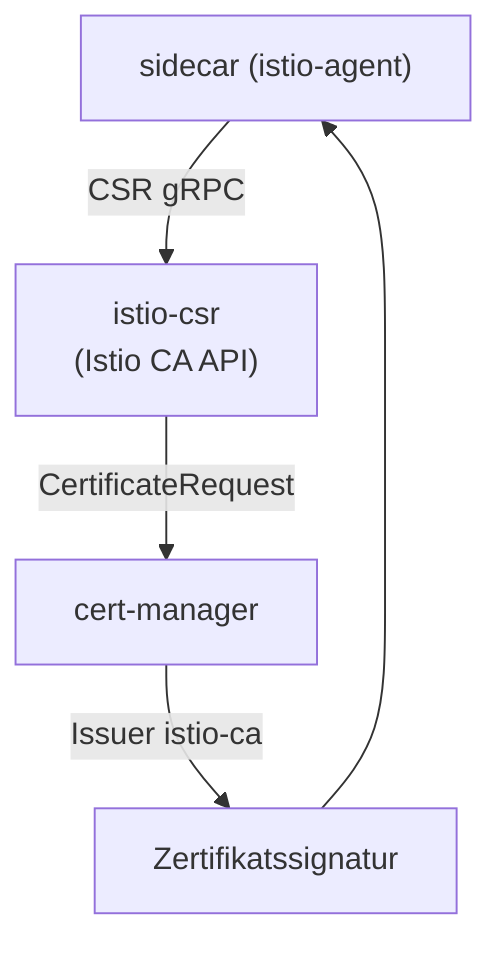

[RU version](README_RU.MD) · [Eng version](README.MD) · [Versión en español](README_ES.MD) · [Version française](README_FR.MD)

# Lab 26 - Dynamische CA: cert-manager + istio-csr

## Überblick

In Lab 19 haben wir unsere CA statisch angebunden - über das Secret `cacerts`: der
Schlüssel der Zwischen-CA liegt in istiod, und die Rotation erfolgt von Hand. In der
Produktion macht man das üblicherweise nicht so. Ein reiferer Ansatz ist
**cert-manager + istio-csr**:

- **istiod** signiert keine Zertifikate mehr (`ENABLE_CA_SERVER=false`), sondern leitet
  die Agenten an istio-csr weiter (`caAddress`);
- **istio-csr** implementiert die gRPC-API der Istio CA: für jeden CSR eines Workloads
  erstellt er einen `CertificateRequest` von cert-manager;
- **cert-manager** signiert diesen über den konfigurierten `Issuer` (hier - eine
  self-signed CA, aber das kann **Vault**, **ACME** oder eine Unternehmens-PKI sein).

Der signierende Schlüssel bleibt in cert-manager, die CA-Rotation ist automatisiert, und
jedes ausgestellte Zertifikat ist ein `CertificateRequest`-Objekt (auditierbar).

Im Lab ist die Plattform bereits aufgebaut: cert-manager, der `Issuer` `istio-ca`,
istio-csr und Istio mit deaktivierter eingebauter CA. Auf dem worker PC ist `istioctl`
vorhanden.



## Infrastruktur

| Komponente | Typ | Anzahl | Rolle |
|---|---|---|---|
| control-plane | `t3.medium` | 1 | master + istiod + cert-manager + istio-csr |
| worker | `t3.small` | 1 | Kapazität für die Anwendung |
| worker PC | `t3.small` | 1 | Arbeitsplatz: `kubectl`, `istioctl`, `openssl`, `check_result` |

Region: `eu-central-1` (AZ `eu-central-1a` / `eu-central-1b`).

## Deployment

```bash
TASK=26 make run_ica_task
```

## Aufgabe

1. Eine Anwendung in einem Namespace mit Sidecar-Injection deployen.
2. Sicherstellen, dass cert-manager Zertifikate ausstellt (es erscheinen
   `CertificateRequest` in `istio-system`).
3. Prüfen, dass das Workload-Zertifikat (`SVID`) von **cert-manager** ausgestellt wurde
   (der issuer enthält `cert-manager`/`istio-ca`) und die SPIFFE-Identity erhalten bleibt.

## Schritt 1. Anwendung deployen

```bash
kubectl apply -f https://raw.githubusercontent.com/ViktorUJ/cks/refs/heads/master/tasks/ica/labs/26/k8s-1/scripts/1.yaml
kubectl rollout status deploy/ping-pong -n app
```

## Schritt 2. Ansehen, wie cert-manager Zertifikate ausstellt

```bash
kubectl get certificaterequests.cert-manager.io -n istio-system
kubectl logs -n cert-manager deploy/cert-manager-istio-csr --tail=20
```

## Schritt 3. Prüfen, dass das Zertifikat von cert-manager stammt

```bash
POD=$(kubectl get pod -n app -l app=ping-pong -o jsonpath='{.items[0].metadata.name}')
istioctl proxy-config secret "$POD" -n app -o json \
  | jq -r '.dynamicActiveSecrets[] | select(.name=="default") | .secret.tlsCertificate.certificateChain.inlineBytes' \
  | base64 -d | openssl x509 -noout -issuer -ext subjectAltName
# issuer=O = cluster.local, O = cert-manager, CN = istio-ca
# X509v3 Subject Alternative Name: URI:spiffe://cluster.local/ns/app/sa/default
```

Der issuer enthält `cert-manager`/`istio-ca` - das Zertifikat ist von Ihrer
cert-manager-CA signiert, und die SPIFFE-Identity ist vorhanden.

## Wie es funktioniert

```
sidecar (istio-agent)
    │  CSR über gRPC
    ▼
istio-csr (cert-manager-istio-csr)      # implementiert Istio CA API
    │  erstellt CertificateRequest
    ▼
cert-manager  ──über──►  Issuer "istio-ca"  ──►  signiert Zertifikat
    │
    ▼
sidecar erhält SVID (Rotation automatisch)
```

## Wodurch das besser ist als statisches `cacerts` (Lab 19)

| | Lab 19 (`cacerts`) | Dieses Lab (cert-manager + istio-csr) |
|---|---|---|
| Wo der Signaturschlüssel liegt | Zwischenschlüssel in istiod | bleibt im `Issuer` von cert-manager (Vault/PKI) |
| CA-Rotation | manuell (Secret neu erstellen + Neustart) | automatisch durch cert-manager |
| Backends | nur statisches PEM | Vault, ACME, Unternehmens-PKI usw. |
| Audit | nein | jedes Zertifikat ist ein `CertificateRequest`-Objekt |

Beide Varianten bringen das Mesh dazu, Ihrer CA zu vertrauen; istio-csr ist die
Produktionsversion mit Automatisierung.

## Ergebnisprüfung

Führen Sie auf dem worker PC aus:

```bash
check_result
```

## Fazit

Sie haben ein production-grade Management der Mesh-CA gesehen: istiod delegiert die
Signatur an cert-manager über istio-csr, Workload-Zertifikate werden aus Ihrer PKI
ausgestellt, automatisch rotiert und sind vollständig über `CertificateRequest`
auditierbar. Das ist eine zentrale Senior-/Security-Fähigkeit für die Integration von
Istio mit einer Unternehmens-Zertifikatsinfrastruktur.
