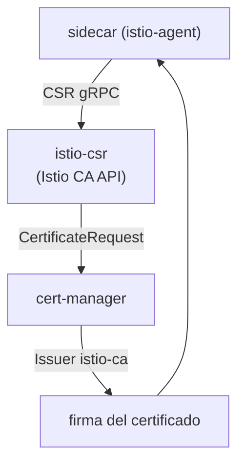

[RU version](README_RU.MD) · [Eng version](README.MD)

# Lab 26 - CA dinámico: cert-manager + istio-csr

## Resumen

En el Lab 19 conectamos nuestro propio CA de forma estática, mediante el secreto `cacerts`:
la clave del CA intermedio reside en istiod y la rotación es manual. En producción esto no
suele hacerse. Un enfoque más maduro es **cert-manager + istio-csr**:

- **istiod** ya no firma certificados (`ENABLE_CA_SERVER=false`), sino que redirige los
  agentes a istio-csr (`caAddress`);
- **istio-csr** implementa la API gRPC del CA de Istio: por cada CSR de un workload crea un
  `CertificateRequest` de cert-manager;
- **cert-manager** lo firma mediante el `Issuer` configurado (aquí, un CA self-signed, pero
  podría ser **Vault**, **ACME** o un PKI corporativo).

La clave de firma permanece en cert-manager, la rotación del CA está automatizada y cada
certificado emitido es un objeto `CertificateRequest` (auditable).

En el lab la plataforma ya está montada: cert-manager, el `Issuer` `istio-ca`, istio-csr e
Istio con el CA integrado deshabilitado. En el worker PC hay `istioctl`.



## Tarea

1. Desplegar la aplicación en un namespace con inyección de sidecar.
2. Comprobar que cert-manager emite certificados (aparecen `CertificateRequest` en
   `istio-system`).
3. Verificar que el certificado del workload (`SVID`) fue emitido por **cert-manager** (el
   issuer contiene `cert-manager`/`istio-ca`) y que la identidad SPIFFE se conserva.

## Paso 1. Desplegar la aplicación

```bash
kubectl apply -f https://raw.githubusercontent.com/ViktorUJ/cks/refs/heads/master/tasks/ica/labs/26/k8s-1/scripts/1.yaml
kubectl rollout status deploy/ping-pong -n app
```

## Paso 2. Ver cómo cert-manager emite certificados

```bash
kubectl get certificaterequests.cert-manager.io -n istio-system
kubectl logs -n cert-manager deploy/cert-manager-istio-csr --tail=20
```

## Paso 3. Comprobar que el certificado proviene de cert-manager

```bash
POD=$(kubectl get pod -n app -l app=ping-pong -o jsonpath='{.items[0].metadata.name}')
istioctl proxy-config secret "$POD" -n app -o json \
  | jq -r '.dynamicActiveSecrets[] | select(.name=="default") | .secret.tlsCertificate.certificateChain.inlineBytes' \
  | base64 -d | openssl x509 -noout -issuer -ext subjectAltName
# issuer=O = cluster.local, O = cert-manager, CN = istio-ca
# X509v3 Subject Alternative Name: URI:spiffe://cluster.local/ns/app/sa/default
```

El issuer contiene `cert-manager`/`istio-ca`: el certificado está firmado por tu CA de
cert-manager y la identidad SPIFFE está presente.

## Cómo funciona

```
sidecar (istio-agent)
    │  CSR por gRPC
    ▼
istio-csr (cert-manager-istio-csr)      # implementa la API del CA de Istio
    │  crea un CertificateRequest
    ▼
cert-manager  ──vía──►  Issuer "istio-ca"  ──►  firma el certificado
    │
    ▼
el sidecar recibe el SVID (rotación automática)
```

## Por qué es mejor que el `cacerts` estático (Lab 19)

| | Lab 19 (`cacerts`) | Este lab (cert-manager + istio-csr) |
|---|---|---|
| Dónde está la clave de firma | clave intermedia en istiod | permanece en el `Issuer` de cert-manager (Vault/PKI) |
| Rotación del CA | manual (recrear el secreto + reiniciar) | automática mediante cert-manager |
| Backends | solo PEM estático | Vault, ACME, PKI corporativo, etc. |
| Auditoría | no | cada certificado es un objeto `CertificateRequest` |

Ambas opciones hacen que la malla confíe en tu CA; istio-csr es la versión de producción con
automatización.

## Verificación del resultado

Ejecuta en el worker PC:

```bash
check_result
```

## Conclusión

Has visto una gestión del CA de la malla de nivel producción: istiod delega la firma en
cert-manager mediante istio-csr, los certificados de los workloads se emiten desde tu PKI, se
rotan automáticamente y son totalmente auditables a través de `CertificateRequest`. Esta es una
habilidad clave senior/seguridad para integrar Istio con la infraestructura de certificados
corporativa.

## Infraestructura

| Componente | Tipo | Cantidad | Rol |
|---|---|---|---|
| control-plane | `t3.medium` | 1 | master + istiod + cert-manager + istio-csr |
| worker | `t3.small` | 1 | capacidad para la aplicación |
| worker PC | `t3.small` | 1 | puesto de trabajo: `kubectl`, `istioctl`, `openssl`, `check_result` |

Región: `eu-central-1` (AZ `eu-central-1a` / `eu-central-1b`).
