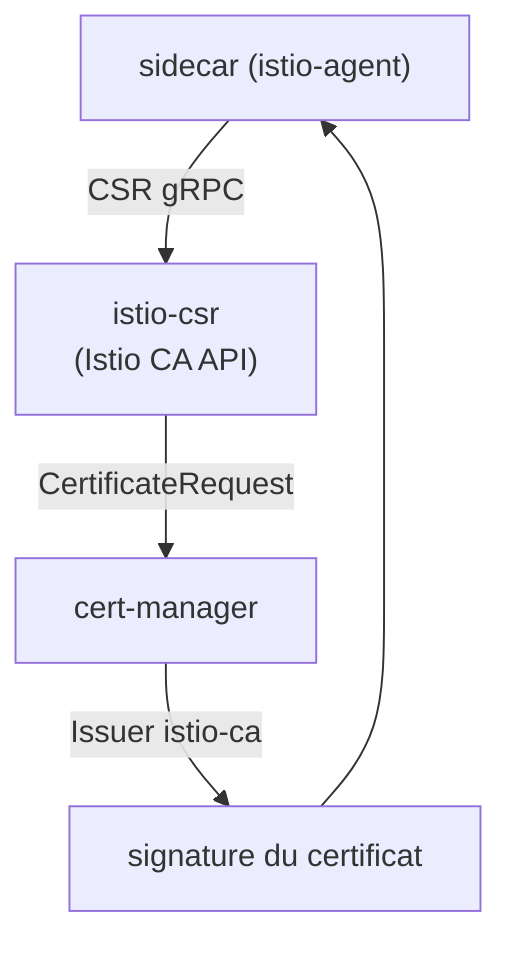

[RU version](README_RU.MD) · [Eng version](README.MD) · [Versión en español](README_ES.MD) · [Deutsche Version](README_DE.MD)

# Lab 26 - CA dynamique : cert-manager + istio-csr

## Aperçu

Au Lab 19, nous avons branché notre propre CA statiquement - via le secret `cacerts` : la
clé du CA intermédiaire se trouve dans istiod, et la rotation se fait à la main. En
production, on ne procède généralement pas ainsi. Une approche plus mature est
**cert-manager + istio-csr** :

- **istiod** ne signe plus les certificats (`ENABLE_CA_SERVER=false`) mais redirige les
  agents vers istio-csr (`caAddress`) ;
- **istio-csr** implémente l'API gRPC d'Istio CA : pour chaque CSR de workload, il crée un
  `CertificateRequest` cert-manager ;
- **cert-manager** le signe via l'`Issuer` configuré (ici - un CA auto-signé, mais cela
  peut être **Vault**, **ACME** ou un PKI d'entreprise).

La clé de signature reste dans cert-manager, la rotation du CA est automatisée, et chaque
certificat émis est un objet `CertificateRequest` (auditable).

Dans ce lab, la plateforme est déjà assemblée : cert-manager, l'`Issuer` `istio-ca`,
istio-csr et Istio avec le CA intégré désactivé. Le worker PC dispose de `istioctl`.



## Exercice

1. Déployer une application dans un namespace avec injection de sidecar.
2. Vérifier que cert-manager émet des certificats (apparition de `CertificateRequest` dans
   `istio-system`).
3. Vérifier que le certificat du workload (`SVID`) est émis par **cert-manager** (l'issuer
   contient `cert-manager`/`istio-ca`), et que l'identity SPIFFE est préservée.

## Étape 1. Déployer l'application

```bash
kubectl apply -f https://raw.githubusercontent.com/ViktorUJ/cks/refs/heads/master/tasks/ica/labs/26/k8s-1/scripts/1.yaml
kubectl rollout status deploy/ping-pong -n app
```

## Étape 2. Observer comment cert-manager émet les certificats

```bash
kubectl get certificaterequests.cert-manager.io -n istio-system
kubectl logs -n cert-manager deploy/cert-manager-istio-csr --tail=20
```

## Étape 3. Vérifier que le certificat vient de cert-manager

```bash
POD=$(kubectl get pod -n app -l app=ping-pong -o jsonpath='{.items[0].metadata.name}')
istioctl proxy-config secret "$POD" -n app -o json \
  | jq -r '.dynamicActiveSecrets[] | select(.name=="default") | .secret.tlsCertificate.certificateChain.inlineBytes' \
  | base64 -d | openssl x509 -noout -issuer -ext subjectAltName
# issuer=O = cluster.local, O = cert-manager, CN = istio-ca
# X509v3 Subject Alternative Name: URI:spiffe://cluster.local/ns/app/sa/default
```

L'issuer contient `cert-manager`/`istio-ca` - le certificat est signé par votre CA
cert-manager, et l'identity SPIFFE est bien présente.

## Comment ça marche

```
sidecar (istio-agent)
    │  CSR par gRPC
    ▼
istio-csr (cert-manager-istio-csr)      # implémente l'API Istio CA
    │  crée un CertificateRequest
    ▼
cert-manager  ──via──►  Issuer "istio-ca"  ──►  signe le certificat
    │
    ▼
le sidecar reçoit le SVID (rotation automatique)
```

## En quoi c'est mieux que le `cacerts` statique (Lab 19)

| | Lab 19 (`cacerts`) | Ce lab (cert-manager + istio-csr) |
|---|---|---|
| Où est la clé de signature | clé intermédiaire dans istiod | reste dans l'`Issuer` cert-manager (Vault/PKI) |
| Rotation du CA | manuelle (recréer le secret + redémarrer) | automatique par cert-manager |
| Backends | seulement du PEM statique | Vault, ACME, PKI d'entreprise, etc. |
| Audit | aucun | chaque certificat est un objet `CertificateRequest` |

Les deux variantes forcent le maillage à faire confiance à votre CA ; istio-csr est la
version production avec automatisation.

## Vérification du résultat

Lancez sur le worker PC :

```bash
check_result
```

## Bilan

Vous avez vu une gestion de niveau production du CA du maillage : istiod délègue la
signature à cert-manager via istio-csr, les certificats des workloads sont émis depuis
votre PKI, tournent automatiquement et sont entièrement auditables via
`CertificateRequest`. C'est une compétence senior/sécurité clé pour intégrer Istio à
l'infrastructure de certificats d'entreprise.

## Infrastructure

| Composant | Type | Qté | Rôle |
|---|---|---|---|
| control-plane | `t3.medium` | 1 | master + istiod + cert-manager + istio-csr |
| worker | `t3.small` | 1 | capacité pour l'application |
| worker PC | `t3.small` | 1 | poste de travail : `kubectl`, `istioctl`, `openssl`, `check_result` |

Région : `eu-central-1` (AZ `eu-central-1a` / `eu-central-1b`).
