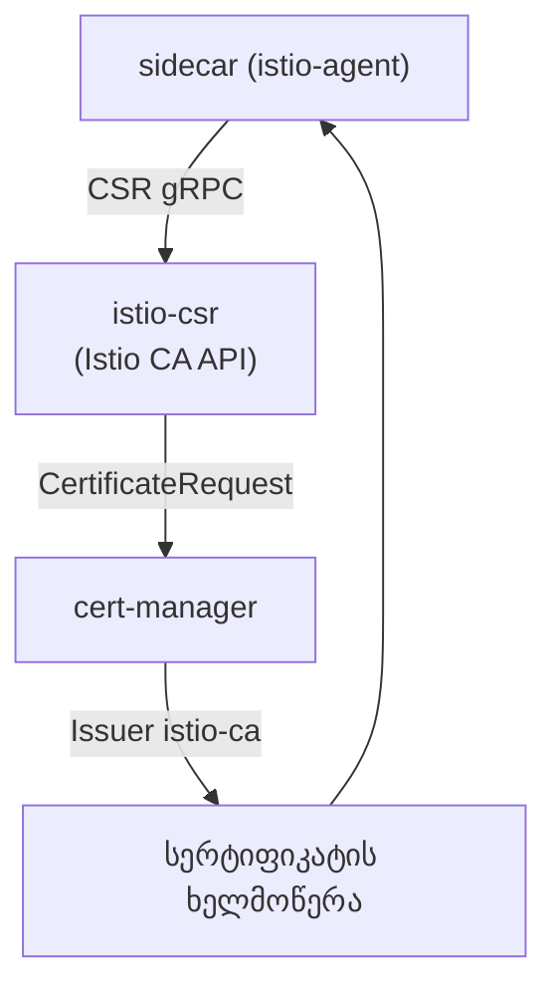

[Русская версия](README_RU.MD) · [Eng version](README.MD) · [Versión en español](README_ES.MD) · [Version française](README_FR.MD) · [Deutsche Version](README_DE.MD) · [繁體中文版](README_TW.MD) · [日本語版](README_JP.MD)

# ლაბორატორია 26 - დინამიკური CA: cert-manager + istio-csr

> [საცნობარო გადაწყვეტა](worker/files/solutions/1_GE.MD)

## მიმოხილვა

მე-19 ლაბორატორიაში საკუთარი CA სტატიკურად, `cacerts` საიდუმლოს მეშვეობით დავაკავშირეთ:
შუალედური CA-ის გასაღები istiod-ში ინახება, ხოლო როტაცია ხელით სრულდება. საწარმოო
გარემოში, ჩვეულებრივ, ასე არ იქცევიან. უფრო სრულყოფილი მიდგომაა
**cert-manager + istio-csr**:

- **istiod** სერტიფიკატებს აღარ აწერს ხელს (`ENABLE_CA_SERVER=false`) და აგენტებს
  istio-csr-ზე გადაამისამართებს (`caAddress`);
- **istio-csr** ახორციელებს Istio CA-ის gRPC API-ს: workload-ის თითოეული CSR-ისთვის ის
  cert-manager-ის `CertificateRequest`-ს ქმნის;
- **cert-manager** მას კონფიგურირებული `Issuer`-ის მეშვეობით აწერს ხელს (აქ გამოყენებულია
  self-signed CA, თუმცა ეს შეიძლება იყოს **Vault**, **ACME** ან კორპორაციული PKI).

ხელმოწერის გასაღები cert-manager-ში რჩება, CA-ის როტაცია ავტომატიზებულია, ხოლო ყოველი
გაცემული სერტიფიკატი `CertificateRequest` ობიექტია (რაც აუდიტის შესაძლებლობას იძლევა).

ლაბორატორიაში პლატფორმა უკვე გამართულია: cert-manager, `Issuer` `istio-ca`, istio-csr და
Istio გამორთული ჩაშენებული CA-ით. worker PC-ზე ხელმისაწვდომია `istioctl`.



## ინფრასტრუქტურა

| კომპონენტი | ტიპი | რაოდენობა | როლი |
|---|---|---|---|
| control-plane | `t3.medium` | 1 | master + istiod + cert-manager + istio-csr |
| worker | `t3.small` | 1 | აპლიკაციისთვის განკუთვნილი რესურსი |
| worker PC | `t3.small` | 1 | სამუშაო ადგილი: `kubectl`, `istioctl`, `openssl`, `check_result` |

რეგიონი: `eu-central-1` (AZ `eu-central-1a` / `eu-central-1b`).

## გაშლა

```bash
TASK=26 make run_ica_task
```

## დავალება

1. განათავსეთ აპლიკაცია namespace-ში sidecar-ის ინექციით.
2. დარწმუნდით, რომ cert-manager სერტიფიკატებს გასცემს (`istio-system`-ში ჩნდება
   `CertificateRequest` ობიექტები).
3. შეამოწმეთ, რომ workload-ის სერტიფიკატი (`SVID`) გაცემულია **cert-manager**-ის მიერ
   (issuer შეიცავს `cert-manager`/`istio-ca`-ს), ხოლო SPIFFE identity შენარჩუნებულია.

## ნაბიჯი 1. აპლიკაციის გაშლა

```bash
kubectl apply -f https://raw.githubusercontent.com/ViktorUJ/cks/refs/heads/master/tasks/ica/labs/26/k8s-1/scripts/1.yaml
kubectl rollout status deploy/ping-pong -n app
```

## ნაბიჯი 2. ნახეთ, როგორ გასცემს cert-manager სერტიფიკატებს

```bash
kubectl get certificaterequests.cert-manager.io -n istio-system
kubectl logs -n cert-manager deploy/cert-manager-istio-csr --tail=20
```

## ნაბიჯი 3. შეამოწმეთ, რომ სერტიფიკატი cert-manager-ისგანაა

```bash
POD=$(kubectl get pod -n app -l app=ping-pong -o jsonpath='{.items[0].metadata.name}')
istioctl proxy-config secret "$POD" -n app -o json \
  | jq -r '.dynamicActiveSecrets[] | select(.name=="default") | .secret.tlsCertificate.certificateChain.inlineBytes' \
  | base64 -d | openssl x509 -noout -issuer -ext subjectAltName
# issuer=O = cluster.local, O = cert-manager, CN = istio-ca
# X509v3 Subject Alternative Name: URI:spiffe://cluster.local/ns/app/sa/default
```

issuer შეიცავს `cert-manager`/`istio-ca`-ს - სერტიფიკატს ხელი მოაწერა თქვენმა
cert-manager CA-მ, ხოლო SPIFFE identity ადგილზეა.

## როგორ მუშაობს ეს

```
sidecar (istio-agent)
    │  CSR gRPC-ით
    ▼
istio-csr (cert-manager-istio-csr)      # ახორციელებს Istio CA API-ს
    │  ქმნის CertificateRequest-ს
    ▼
cert-manager  ──გავლით──►  Issuer "istio-ca"  ──►  აწერს ხელს სერტიფიკატს
    │
    ▼
sidecar იღებს SVID-ს (როტაცია ავტომატურია)
```

## რატომ სჯობს ეს სტატიკურ `cacerts`-ს (ლაბორატორია 19)

| | ლაბორატორია 19 (`cacerts`) | ეს ლაბორატორია (cert-manager + istio-csr) |
|---|---|---|
| სად ინახება ხელმოწერის გასაღები | შუალედური გასაღები istiod-ში | რჩება cert-manager-ის `Issuer`-ში (Vault/PKI) |
| CA-ის როტაცია | ხელით (საიდუმლოს ხელახლა შექმნა + გადატვირთვა) | ავტომატურად, cert-manager-ის მიერ |
| ბეკენდები | მხოლოდ სტატიკური PEM | Vault, ACME, კორპორაციული PKI და ა.შ. |
| აუდიტი | არ არის | თითოეული სერტიფიკატი `CertificateRequest` ობიექტია |

ორივე ვარიანტი აიძულებს mesh-ს, ენდოს თქვენს CA-ს; istio-csr საწარმოო გარემოსთვის
განკუთვნილი, ავტომატიზებული ვარიანტია.

## შედეგის შემოწმება

გაუშვით worker PC-ზე:

```bash
check_result
```

## შეჯამება

თქვენ გაეცანით mesh-CA-ის საწარმოო დონის მართვას: istiod ხელმოწერას istio-csr-ის
მეშვეობით cert-manager-ს გადასცემს, workload-ების სერტიფიკატები თქვენი PKI-დან გაიცემა,
ავტომატურად როტირდება და `CertificateRequest`-ის მეშვეობით სრულად ექვემდებარება აუდიტს.
ეს Istio-ს კორპორაციულ სერტიფიკატების ინფრასტრუქტურასთან ინტეგრაციისთვის აუცილებელი
senior/security უნარია.
