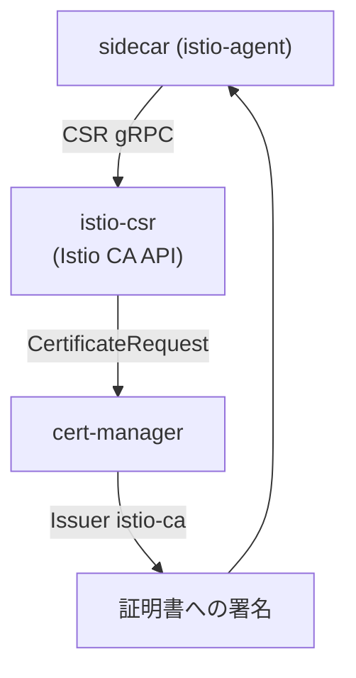

[Русская версия](README_RU.MD) · [Eng version](README.MD) · [Versión en español](README_ES.MD) · [Version française](README_FR.MD) · [Deutsche Version](README_DE.MD) · [ქართული ვერსია](README_GE.MD) · [繁體中文版](README_TW.MD)

# Lab 26 - 動的CA: cert-manager + istio-csr

> [リファレンス解答](worker/files/solutions/1_JP.MD)

## 概要

Lab 19では、独自のCAを`cacerts`シークレットで静的に接続しました。中間CAのキーは
istiodに置かれ、ローテーションは手作業です。本番環境では通常この方法は使いません。より成熟した
アプローチが**cert-manager + istio-csr**です。

- **istiod**は証明書に署名せず（`ENABLE_CA_SERVER=false`）、エージェントを
  istio-csr（`caAddress`）に転送します。
- **istio-csr**はIstio CAのgRPC APIを実装します。ワークロードごとのCSRに対して、
  cert-managerの`CertificateRequest`を作成します。
- **cert-manager**は設定済みの`Issuer`で署名します（ここではself-signed CAですが、
  **Vault**、**ACME**、または企業PKIも利用できます）。

署名キーはcert-managerに保持され、CAのローテーションは自動化されます。また、発行された各
証明書は`CertificateRequest`オブジェクトとなるため、監査可能です。

このラボではプラットフォームがすでに構築されています。cert-manager、`Issuer` `istio-ca`、
istio-csr、および組み込みCAを無効化したIstioが用意されています。worker PCには`istioctl`があります。



## インフラストラクチャ

| コンポーネント | タイプ | 数 | 役割 |
|---|---|---|---|
| control-plane | `t3.medium` | 1 | master + istiod + cert-manager + istio-csr |
| worker | `t3.small` | 1 | アプリケーション用の容量 |
| worker PC | `t3.small` | 1 | 作業環境: `kubectl`, `istioctl`, `openssl`, `check_result` |

リージョン: `eu-central-1` (AZ `eu-central-1a` / `eu-central-1b`)。

## デプロイ

```bash
TASK=26 make run_ica_task
```

## 課題

1. sidecarインジェクションが有効なnamespaceにアプリケーションをデプロイする。
2. cert-managerが証明書を発行することを確認する（`istio-system`に`CertificateRequest`が
   出現する）。
3. ワークロード証明書（`SVID`）が**cert-manager**によって発行されていること（issuerに
   `cert-manager`/`istio-ca`が含まれる）と、SPIFFE identityが維持されていることを確認する。

## ステップ1. アプリケーションをデプロイする

```bash
kubectl apply -f https://raw.githubusercontent.com/ViktorUJ/cks/refs/heads/master/tasks/ica/labs/26/k8s-1/scripts/1.yaml
kubectl rollout status deploy/ping-pong -n app
```

## ステップ2. cert-managerによる証明書発行を確認する

```bash
kubectl get certificaterequests.cert-manager.io -n istio-system
kubectl logs -n cert-manager deploy/cert-manager-istio-csr --tail=20
```

## ステップ3. 証明書がcert-manager発行であることを確認する

```bash
POD=$(kubectl get pod -n app -l app=ping-pong -o jsonpath='{.items[0].metadata.name}')
istioctl proxy-config secret "$POD" -n app -o json \
  | jq -r '.dynamicActiveSecrets[] | select(.name=="default") | .secret.tlsCertificate.certificateChain.inlineBytes' \
  | base64 -d | openssl x509 -noout -issuer -ext subjectAltName
# issuer=O = cluster.local, O = cert-manager, CN = istio-ca
# X509v3 Subject Alternative Name: URI:spiffe://cluster.local/ns/app/sa/default
```

issuerに`cert-manager`/`istio-ca`が含まれていれば、証明書はcert-managerのCAによって署名されており、
SPIFFE identityも維持されています。

## 仕組み

```
sidecar (istio-agent)
    │  gRPC で CSR
    ▼
istio-csr (cert-manager-istio-csr)      # Istio CA API を実装する
    │  CertificateRequest を作成する
    ▼
cert-manager  ──経由──►  Issuer "istio-ca"  ──►  証明書に署名する
    │
    ▼
sidecar が SVID を受け取る (ローテーションは自動)
```

## 静的な`cacerts`より優れている点（Lab 19）

| | Lab 19（`cacerts`） | このラボ（cert-manager + istio-csr） |
|---|---|---|
| 署名キーの配置先 | istiod内の中間キー | cert-managerの`Issuer`（Vault/PKI）に保持 |
| CAのローテーション | 手動（シークレット再作成 + 再起動） | cert-managerにより自動化 |
| バックエンド | 静的PEMのみ | Vault、ACME、企業PKIなど |
| 監査 | なし | 各証明書が`CertificateRequest`オブジェクト |

どちらの方法でも、meshは独自のCAを信頼するようになります。istio-csrは自動化を備えた
本番環境向けのバージョンです。

## 結果の確認

worker PCで実行します。

```bash
check_result
```

## まとめ

本番レベルのmesh CA管理を確認しました。istiodはistio-csrを介してcert-managerに署名を委任し、
ワークロード証明書は独自のPKIから発行され、自動的にローテーションされ、`CertificateRequest`を通じて
完全に監査可能です。これはIstioを企業の証明書インフラストラクチャと統合するための重要な
senior/securityスキルです。
