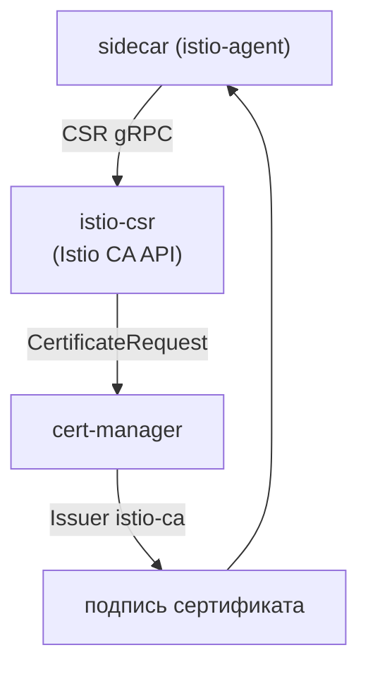

[Eng version](README.MD) · [Versión en español](README_ES.MD) · [Version française](README_FR.MD) · [Deutsche Version](README_DE.MD)

# Lab 26 - Динамический CA: cert-manager + istio-csr

## Обзор

В Lab 19 мы подключили свой CA статически - через секрет `cacerts`: ключ промежуточного
CA лежит в istiod, а ротация - руками. В продакшене так обычно не делают. Более зрелый
подход - **cert-manager + istio-csr**:

- **istiod** больше не подписывает сертификаты (`ENABLE_CA_SERVER=false`), а перенаправляет
  агенты на istio-csr (`caAddress`);
- **istio-csr** реализует gRPC-API Istio CA: на каждый CSR ворклоада он создаёт
  `CertificateRequest` cert-manager;
- **cert-manager** подписывает его через настроенный `Issuer` (здесь - self-signed CA, но
  это может быть **Vault**, **ACME** или корпоративный PKI).

Подписывающий ключ остаётся в cert-manager, ротация CA автоматизирована, а каждый
выпущенный сертификат - это объект `CertificateRequest` (аудируемо).

В лабе платформа уже собрана: cert-manager, `Issuer` `istio-ca`, istio-csr и Istio с
отключённым встроенным CA. На worker PC есть `istioctl`.



## Инфраструктура

| Компонент | Тип | Кол-во | Роль |
|---|---|---|---|
| control-plane | `t3.medium` | 1 | master + istiod + cert-manager + istio-csr |
| worker | `t3.small` | 1 | ёмкость для приложения |
| worker PC | `t3.small` | 1 | рабочее место: `kubectl`, `istioctl`, `openssl`, `check_result` |

Регион: `eu-central-1` (AZ `eu-central-1a` / `eu-central-1b`).

## Развёртывание

```bash
TASK=26 make run_ica_task
```

## Задание

1. Развернуть приложение в namespace с инъекцией sidecar.
2. Убедиться, что cert-manager выпускает сертификаты (появляются `CertificateRequest` в
   `istio-system`).
3. Проверить, что сертификат ворклоада (`SVID`) выпущен **cert-manager** (issuer содержит
   `cert-manager`/`istio-ca`), а SPIFFE-identity сохранён.

## Шаг 1. Развернуть приложение

```bash
kubectl apply -f https://raw.githubusercontent.com/ViktorUJ/cks/refs/heads/master/tasks/ica/labs/26/k8s-1/scripts/1.yaml
kubectl rollout status deploy/ping-pong -n app
```

## Шаг 2. Посмотреть, как cert-manager выпускает сертификаты

```bash
kubectl get certificaterequests.cert-manager.io -n istio-system
kubectl logs -n cert-manager deploy/cert-manager-istio-csr --tail=20
```

## Шаг 3. Проверить, что сертификат от cert-manager

```bash
POD=$(kubectl get pod -n app -l app=ping-pong -o jsonpath='{.items[0].metadata.name}')
istioctl proxy-config secret "$POD" -n app -o json \
  | jq -r '.dynamicActiveSecrets[] | select(.name=="default") | .secret.tlsCertificate.certificateChain.inlineBytes' \
  | base64 -d | openssl x509 -noout -issuer -ext subjectAltName
# issuer=O = cluster.local, O = cert-manager, CN = istio-ca
# X509v3 Subject Alternative Name: URI:spiffe://cluster.local/ns/app/sa/default
```

Issuer содержит `cert-manager`/`istio-ca` - сертификат подписан вашим CA cert-manager, а
SPIFFE-identity на месте.

## Как это работает

```
sidecar (istio-agent)
    │  CSR по gRPC
    ▼
istio-csr (cert-manager-istio-csr)      # реализует Istio CA API
    │  создаёт CertificateRequest
    ▼
cert-manager  ──через──►  Issuer "istio-ca"  ──►  подписывает сертификат
    │
    ▼
sidecar получает SVID (ротация автоматическая)
```

## Чем это лучше статического `cacerts` (Lab 19)

| | Lab 19 (`cacerts`) | Эта лаба (cert-manager + istio-csr) |
|---|---|---|
| Где ключ подписи | промежуточный ключ в istiod | остаётся в `Issuer` cert-manager (Vault/PKI) |
| Ротация CA | вручную (пересоздать секрет + рестарт) | автоматически cert-manager'ом |
| Бэкенды | только статичный PEM | Vault, ACME, корпоративный PKI и т.д. |
| Аудит | нет | каждый сертификат - объект `CertificateRequest` |

Оба варианта заставляют mesh доверять вашему CA; istio-csr - продакшен-версия с
автоматизацией.

## Проверка результата

Запустите на worker PC:

```bash
check_result
```

## Итог

Вы увидели production-grade управление mesh-CA: istiod делегирует подпись cert-manager
через istio-csr, сертификаты ворклоадов выпускаются из вашего PKI, ротируются
автоматически и полностью аудируемы через `CertificateRequest`. Это ключевой
senior/security-навык для интеграции Istio с корпоративной инфраструктурой сертификатов.
