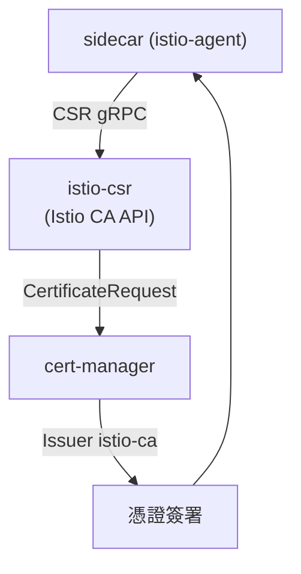

[Русская версия](README_RU.MD) · [Eng version](README.MD) · [Versión en español](README_ES.MD) · [Version française](README_FR.MD) · [Deutsche Version](README_DE.MD) · [ქართული ვერსია](README_GE.MD) · [日本語版](README_JP.MD)

# Lab 26 - 動態 CA：cert-manager + istio-csr

> [參考解答](worker/files/solutions/1_TW.MD)

## 概覽

在 Lab 19 中，我們透過 `cacerts` Secret 靜態連接了自己的 CA：中繼
CA 的金鑰位於 istiod，且輪替需手動進行。生產環境通常不會這樣做。更成熟的
方法是 **cert-manager + istio-csr**：

- **istiod** 不再簽發憑證（`ENABLE_CA_SERVER=false`），而是將
  Agent 重新導向至 istio-csr（`caAddress`）；
- **istio-csr** 實作 Istio CA 的 gRPC API：針對每個工作負載的 CSR，它會建立一個
  cert-manager `CertificateRequest`；
- **cert-manager** 透過已設定的 `Issuer` 為其簽名（此處為 self-signed CA，但也可以是
  **Vault**、**ACME** 或企業 PKI）。

簽署金鑰保留在 cert-manager 中，CA 輪替已自動化，而每張已簽發的憑證都是一個
`CertificateRequest` 物件（可稽核）。

本實驗的平台已經建置完成：cert-manager、`Issuer` `istio-ca`、istio-csr，以及已
停用內建 CA 的 Istio。worker PC 上已有 `istioctl`。



## 基礎設施

| 元件 | 類型 | 數量 | 角色 |
|---|---|---|---|
| control-plane | `t3.medium` | 1 | master + istiod + cert-manager + istio-csr |
| worker | `t3.small` | 1 | 應用程式容量 |
| worker PC | `t3.small` | 1 | 工作站：`kubectl`、`istioctl`、`openssl`、`check_result` |

區域：`eu-central-1`（AZ `eu-central-1a` / `eu-central-1b`）。

## 部署

```bash
TASK=26 make run_ica_task
```

## 任務

1. 在啟用 sidecar 注入的 namespace 中部署應用程式。
2. 確認 cert-manager 會簽發憑證（`istio-system` 中會出現
   `CertificateRequest`）。
3. 確認工作負載憑證（`SVID`）是由 **cert-manager** 簽發
   （issuer 包含 `cert-manager`/`istio-ca`），且 SPIFFE 身分保持不變。

## 步驟 1：部署應用程式

```bash
kubectl apply -f https://raw.githubusercontent.com/ViktorUJ/cks/refs/heads/master/tasks/ica/labs/26/k8s-1/scripts/1.yaml
kubectl rollout status deploy/ping-pong -n app
```

## 步驟 2：查看 cert-manager 如何簽發憑證

```bash
kubectl get certificaterequests.cert-manager.io -n istio-system
kubectl logs -n cert-manager deploy/cert-manager-istio-csr --tail=20
```

## 步驟 3：確認憑證來自 cert-manager

```bash
POD=$(kubectl get pod -n app -l app=ping-pong -o jsonpath='{.items[0].metadata.name}')
istioctl proxy-config secret "$POD" -n app -o json \
  | jq -r '.dynamicActiveSecrets[] | select(.name=="default") | .secret.tlsCertificate.certificateChain.inlineBytes' \
  | base64 -d | openssl x509 -noout -issuer -ext subjectAltName
# issuer=O = cluster.local, O = cert-manager, CN = istio-ca
# X509v3 Subject Alternative Name: URI:spiffe://cluster.local/ns/app/sa/default
```

Issuer 包含 `cert-manager`/`istio-ca`，表示憑證由您的 cert-manager CA 簽署，且
SPIFFE 身分仍然存在。

## 運作方式

```
sidecar (istio-agent)
    │  透過 gRPC 傳送 CSR
    ▼
istio-csr (cert-manager-istio-csr)      # 實作 Istio CA API
    │  建立 CertificateRequest
    ▼
cert-manager  ──透過──►  Issuer "istio-ca"  ──►  簽署憑證
    │
    ▼
sidecar 取得 SVID (自動輪替)
```

## 為何這比靜態 `cacerts` 更好（Lab 19）

| | Lab 19（`cacerts`） | 本實驗（cert-manager + istio-csr） |
|---|---|---|
| 簽署金鑰的位置 | istiod 中的中繼金鑰 | 保留在 cert-manager 的 `Issuer` 中（Vault/PKI） |
| CA 輪替 | 手動（重新建立 Secret + 重啟） | 由 cert-manager 自動處理 |
| 後端 | 僅限靜態 PEM | Vault、ACME、企業 PKI 等 |
| 稽核 | 無 | 每張憑證都是一個 `CertificateRequest` 物件 |

兩種方案都會讓 mesh 信任您的 CA；istio-csr 是具備自動化功能的生產環境版本。

## 驗證結果

在 worker PC 上執行：

```bash
check_result
```

## 總結

您已了解生產等級的 mesh-CA 管理：istiod 透過 istio-csr 將簽署委派給 cert-manager，
工作負載憑證從您的 PKI 簽發、自動輪替，並可透過 `CertificateRequest` 完整稽核。這是
將 Istio 與企業憑證基礎設施整合時的一項關鍵資深／安全技能。
