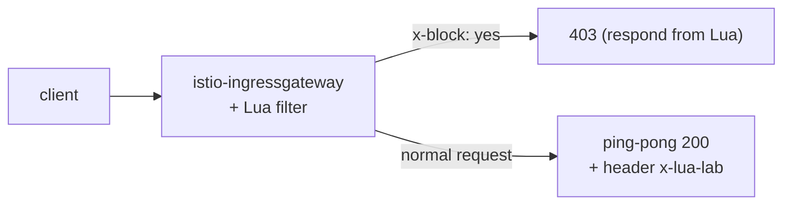

# Lab 27 — EnvoyFilter + Lua: custom logic with an inline script

## Overview

Sometimes you need a bit of custom logic in the data plane but a full Wasm module
(Lab 23) is overkill. Envoy can run **inline Lua scripts** via the
`envoy.filters.http.lua` HTTP filter, and Istio lets you insert that filter with an
`EnvoyFilter`. No image, no build — the logic lives right in the YAML.

In this lab you attach a Lua filter to the ingress gateway that:
- adds a response header `x-lua-lab: hello-from-lua`;
- rejects requests carrying `x-block: yes` with a `403`.

Istio is already installed (ingress gateway on NodePort `32080`), the `ping-pong` app is
exposed at `http://myapp.local:32080/`.



## Task

1. Check the baseline (no header, `x-block` ignored).
2. Apply an `EnvoyFilter` with inline Lua on the ingress gateway
   (`workloadSelector: istio=ingressgateway`, `context: GATEWAY`).
3. Verify: the response carries `x-lua-lab`, and a request with `x-block: yes` → `403`.

## Step 1. Baseline

```bash
curl -sI http://myapp.local:32080/ | grep -i x-lua-lab   # nothing
curl -s -o /dev/null -w "%{http_code}\n" -H "x-block: yes" http://myapp.local:32080/   # 200
```

## Step 2. Apply the Lua EnvoyFilter

```bash
kubectl apply -f - <<'EOF'
apiVersion: networking.istio.io/v1alpha3
kind: EnvoyFilter
metadata:
  name: lua-edge
  namespace: istio-system
spec:
  workloadSelector:
    labels:
      istio: ingressgateway
  configPatches:
    - applyTo: HTTP_FILTER
      match:
        context: GATEWAY
        listener:
          filterChain:
            filter:
              name: envoy.filters.network.http_connection_manager
              subFilter:
                name: envoy.filters.http.router
      patch:
        operation: INSERT_BEFORE
        value:
          name: envoy.filters.http.lua
          typed_config:
            "@type": type.googleapis.com/envoy.extensions.filters.http.lua.v3.Lua
            inlineCode: |
              function envoy_on_request(request_handle)
                if request_handle:headers():get("x-block") == "yes" then
                  request_handle:respond(
                    {[":status"] = "403"},
                    "blocked by lua\n")
                end
              end
              function envoy_on_response(response_handle)
                response_handle:headers():add("x-lua-lab", "hello-from-lua")
              end
EOF
```

## Step 3. Verify

```bash
# response header added by Lua
curl -sI http://myapp.local:32080/ | grep -i x-lua-lab
# x-lua-lab: hello-from-lua

# request blocked by Lua
curl -s -o /dev/null -w "%{http_code}\n" -H "x-block: yes" http://myapp.local:32080/
# 403

# normal request still works
curl -s -o /dev/null -w "%{http_code}\n" http://myapp.local:32080/
# 200
```

## How it works

- **`EnvoyFilter`** patches the raw Envoy config Istio generates. Here it inserts the
  built-in **Lua** HTTP filter (`envoy.filters.http.lua`) into the ingress gateway's
  filter chain, right before the router.
- The Lua script implements two lifecycle callbacks:
  - `envoy_on_request(request_handle)` — runs per request; can read/modify headers, read
    the body, or short-circuit with `request_handle:respond(...)`.
  - `envoy_on_response(response_handle)` — runs per response; here it adds a header.
- `context: GATEWAY` scopes the patch to the ingress gateway. Use `SIDECAR_INBOUND` /
  `SIDECAR_OUTBOUND` to target workload sidecars instead.

## Lua vs Wasm vs built-in CRDs

- **Inline Lua** — the quickest way to add small custom logic: no image, no build, edit
  the script in YAML. Great for header tweaks, simple request gating, quick experiments.
- **Wasm** (Lab 23) — for heavier/reusable logic in a real language (Rust/Go), versioned
  and distributed as an OCI image, running in a sandbox.
- **Built-in CRDs** (`AuthorizationPolicy`, `Telemetry`, ...) — always prefer these
  first; reach for Lua/Wasm only when they cannot express what you need.

> `EnvoyFilter` is a low-level, version-sensitive API — Istio warns that its config can
> change between releases. Keep such patches minimal and test them across upgrades.

## Check the result

Run on the worker PC:

```bash
check_result
```

## Summary

You added custom data-plane logic with inline Lua in an `EnvoyFilter` — no image and no
proxy rebuild. It is a handy senior tool for quick traffic tweaks at the mesh edge when
built-in CRDs fall short and a full Wasm module would be overkill.

## Infrastructure

| Component | Type | Count | Role |
|---|---|---|---|
| control-plane | `t3.medium` | 1 | master + istiod + ingress gateway |
| worker | `t3.small` | 1 | capacity for the app |
| worker PC | `t3.small` | 1 | workstation: `kubectl`, `curl`, `check_result` |

Region: `eu-central-1` (AZ `eu-central-1a` / `eu-central-1b`).
