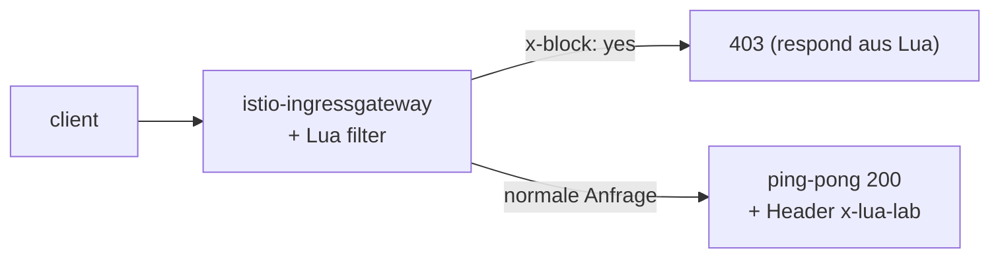

[RU version](README_RU.MD) · [Eng version](README.MD) · [Versión en español](README_ES.MD) · [Version française](README_FR.MD)

# Lab 27 - EnvoyFilter + Lua: eigene Logik als Inline-Skript

## Überblick

Manchmal braucht man ein wenig eigene Logik im data plane, aber ein ganzes Wasm-Modul
(Lab 23) aufzuziehen ist übertrieben. Envoy kann **Inline-Lua-Skripte** über den
HTTP-Filter `envoy.filters.http.lua` ausführen, und Istio erlaubt, diesen Filter über
`EnvoyFilter` einzufügen. Kein Image und kein Build - die Logik steht direkt im YAML.

In diesem Lab fügen Sie am ingress gateway einen Lua-Filter hinzu, der:
- der Antwort den Header `x-lua-lab: hello-from-lua` hinzufügt;
- Anfragen mit dem Header `x-block: yes` mit dem Code `403` abweist.

Istio ist bereits installiert (ingress gateway auf NodePort `32080`), die Anwendung
`ping-pong` ist unter `http://myapp.local:32080/` veröffentlicht.



## Infrastruktur

| Komponente | Typ | Anzahl | Rolle |
|---|---|---|---|
| control-plane | `t3.medium` | 1 | master + istiod + ingress gateway |
| worker | `t3.small` | 1 | Kapazität für die Anwendung |
| worker PC | `t3.small` | 1 | Arbeitsplatz: `kubectl`, `curl`, `check_result` |

Region: `eu-central-1` (AZ `eu-central-1a` / `eu-central-1b`).

## Deployment

```bash
TASK=27 make run_ica_task
```

## Aufgabe

1. Das Basisverhalten prüfen (kein Header, `x-block` wird ignoriert).
2. Einen `EnvoyFilter` mit Inline-Lua am ingress gateway anwenden
   (`workloadSelector: istio=ingressgateway`, `context: GATEWAY`).
3. Prüfen: in der Antwort ist `x-lua-lab` vorhanden, und eine Anfrage mit `x-block: yes` →
   `403`.

## Schritt 1. Basisprüfung

```bash
curl -sI http://myapp.local:32080/ | grep -i x-lua-lab   # leer
curl -s -o /dev/null -w "%{http_code}\n" -H "x-block: yes" http://myapp.local:32080/   # 200
```

## Schritt 2. Lua EnvoyFilter anwenden

```bash
kubectl apply -f - <<'EOF'
apiVersion: networking.istio.io/v1alpha3
kind: EnvoyFilter
metadata:
  name: lua-edge
  namespace: istio-system
spec:
  workloadSelector:
    labels:
      istio: ingressgateway
  configPatches:
    - applyTo: HTTP_FILTER
      match:
        context: GATEWAY
        listener:
          filterChain:
            filter:
              name: envoy.filters.network.http_connection_manager
              subFilter:
                name: envoy.filters.http.router
      patch:
        operation: INSERT_BEFORE
        value:
          name: envoy.filters.http.lua
          typed_config:
            "@type": type.googleapis.com/envoy.extensions.filters.http.lua.v3.Lua
            inlineCode: |
              function envoy_on_request(request_handle)
                if request_handle:headers():get("x-block") == "yes" then
                  request_handle:respond(
                    {[":status"] = "403"},
                    "blocked by lua\n")
                end
              end
              function envoy_on_response(response_handle)
                response_handle:headers():add("x-lua-lab", "hello-from-lua")
              end
EOF
```

## Schritt 3. Prüfung

```bash
# von Lua hinzugefügter Header
curl -sI http://myapp.local:32080/ | grep -i x-lua-lab
# x-lua-lab: hello-from-lua

# Anfrage von Lua blockiert
curl -s -o /dev/null -w "%{http_code}\n" -H "x-block: yes" http://myapp.local:32080/
# 403

# normale Anfrage funktioniert
curl -s -o /dev/null -w "%{http_code}\n" http://myapp.local:32080/
# 200
```

## Wie es funktioniert

- **`EnvoyFilter`** patcht die rohe Envoy-Konfiguration, die Istio generiert. Hier fügt er
  den eingebauten HTTP-**Lua**-Filter (`envoy.filters.http.lua`) in die Filterkette des
  ingress gateway ein, direkt vor dem Router.
- Das Lua-Skript implementiert zwei Callbacks des Lebenszyklus:
  - `envoy_on_request(request_handle)` - bei jeder Anfrage; man kann Header lesen/ändern,
    den Body lesen oder die Anfrage über `request_handle:respond(...)` abbrechen.
  - `envoy_on_response(response_handle)` - bei jeder Antwort; hier fügt es einen Header
    hinzu.
- `context: GATEWAY` beschränkt den Patch auf das ingress gateway. Für Sidecars verwendet
  man `SIDECAR_INBOUND` / `SIDECAR_OUTBOUND`.

## Lua gegen Wasm gegen eingebaute CRDs

- **Inline-Lua** ist die schnellste Möglichkeit, ein wenig Logik hinzuzufügen: kein Image
  und kein Build, das Skript wird direkt im YAML bearbeitet. Gut für das Anpassen von
  Headern, einfaches Gating von Anfragen, schnelle Experimente.
- **Wasm** (Lab 23) - für schwere/wiederverwendbare Logik in einer echten Sprache
  (Rust/Go), wird versioniert und als OCI-Image ausgeliefert, läuft in einer Sandbox.
- **Eingebaute CRDs** (`AuthorizationPolicy`, `Telemetry`, ...) - probieren Sie sie immer
  zuerst; Lua/Wasm - nur wenn das Eingebaute nicht ausreicht.

> `EnvoyFilter` ist eine Low-Level-API und empfindlich gegenüber Versionen; Istio warnt,
> dass sich seine Konfiguration zwischen Releases ändern kann. Halten Sie solche Patches
> minimal und prüfen Sie sie bei Upgrades.

## Ergebnisprüfung

Führen Sie auf dem worker PC aus:

```bash
check_result
```

## Fazit

Sie haben dem data plane über Inline-Lua in einem `EnvoyFilter` eigene Logik hinzugefügt -
ohne Image und Neubau des Proxys. Das ist ein praktisches Senior-Werkzeug für schnelle
Anpassungen des Verkehrs am Rand des Mesh, wenn eingebaute CRDs nicht ausreichen und ein
vollwertiges Wasm-Modul übertrieben ist.
