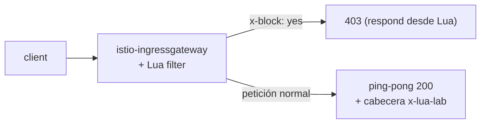

[RU version](README_RU.MD) · [Eng version](README.MD) · [Version française](README_FR.MD) · [Deutsche Version](README_DE.MD)

# Lab 27 - EnvoyFilter + Lua: lógica personalizada con un script inline

## Resumen

A veces hace falta una pequeña lógica personalizada en el data plane, pero montar un módulo
Wasm (Lab 23) resulta excesivo. Envoy sabe ejecutar **scripts Lua inline** mediante el filtro
HTTP `envoy.filters.http.lua`, e Istio permite inyectar ese filtro a través de un
`EnvoyFilter`. Sin imagen ni build: la lógica va directamente en el YAML.

En este lab añadirás un filtro Lua en el ingress gateway que:
- añade a la respuesta la cabecera `x-lua-lab: hello-from-lua`;
- rechaza las peticiones con la cabecera `x-block: yes` con un código `403`.

Istio ya está instalado (ingress gateway en el NodePort `32080`), la aplicación `ping-pong`
está publicada en `http://myapp.local:32080/`.



## Infraestructura

| Componente | Tipo | Cantidad | Rol |
|---|---|---|---|
| control-plane | `t3.medium` | 1 | master + istiod + ingress gateway |
| worker | `t3.small` | 1 | capacidad para la aplicación |
| worker PC | `t3.small` | 1 | puesto de trabajo: `kubectl`, `curl`, `check_result` |

Región: `eu-central-1` (AZ `eu-central-1a` / `eu-central-1b`).

## Despliegue

```bash
TASK=27 make run_ica_task
```

## Tarea

1. Comprobar el comportamiento base (no hay cabecera, `x-block` se ignora).
2. Aplicar un `EnvoyFilter` con Lua inline en el ingress gateway
   (`workloadSelector: istio=ingressgateway`, `context: GATEWAY`).
3. Verificar: la respuesta incluye `x-lua-lab` y una petición con `x-block: yes` → `403`.

## Paso 1. Comprobación base

```bash
curl -sI http://myapp.local:32080/ | grep -i x-lua-lab   # vacío
curl -s -o /dev/null -w "%{http_code}\n" -H "x-block: yes" http://myapp.local:32080/   # 200
```

## Paso 2. Aplicar el EnvoyFilter con Lua

```bash
kubectl apply -f - <<'EOF'
apiVersion: networking.istio.io/v1alpha3
kind: EnvoyFilter
metadata:
  name: lua-edge
  namespace: istio-system
spec:
  workloadSelector:
    labels:
      istio: ingressgateway
  configPatches:
    - applyTo: HTTP_FILTER
      match:
        context: GATEWAY
        listener:
          filterChain:
            filter:
              name: envoy.filters.network.http_connection_manager
              subFilter:
                name: envoy.filters.http.router
      patch:
        operation: INSERT_BEFORE
        value:
          name: envoy.filters.http.lua
          typed_config:
            "@type": type.googleapis.com/envoy.extensions.filters.http.lua.v3.Lua
            inlineCode: |
              function envoy_on_request(request_handle)
                if request_handle:headers():get("x-block") == "yes" then
                  request_handle:respond(
                    {[":status"] = "403"},
                    "blocked by lua\n")
                end
              end
              function envoy_on_response(response_handle)
                response_handle:headers():add("x-lua-lab", "hello-from-lua")
              end
EOF
```

## Paso 3. Verificación

```bash
# cabecera añadida por Lua
curl -sI http://myapp.local:32080/ | grep -i x-lua-lab
# x-lua-lab: hello-from-lua

# petición bloqueada por Lua
curl -s -o /dev/null -w "%{http_code}\n" -H "x-block: yes" http://myapp.local:32080/
# 403

# la petición normal funciona
curl -s -o /dev/null -w "%{http_code}\n" http://myapp.local:32080/
# 200
```

## Cómo funciona

- **`EnvoyFilter`** parchea la configuración cruda de Envoy que genera Istio. Aquí inserta el
  filtro HTTP integrado **Lua** (`envoy.filters.http.lua`) en la cadena de filtros del ingress
  gateway, justo antes del router.
- El script Lua implementa dos callbacks del ciclo de vida:
  - `envoy_on_request(request_handle)` - en cada petición; puedes leer/modificar cabeceras,
    leer el cuerpo o interrumpir la petición con `request_handle:respond(...)`.
  - `envoy_on_response(response_handle)` - en cada respuesta; aquí añade la cabecera.
- `context: GATEWAY` limita el patch al ingress gateway. Para los sidecars se usan
  `SIDECAR_INBOUND` / `SIDECAR_OUTBOUND`.

## Lua frente a Wasm frente a CRD integrados

- **Lua inline** es la forma más rápida de añadir una pequeña lógica: sin imagen ni build, el
  script se edita directamente en el YAML. Bien para modificar cabeceras, gating sencillo de
  peticiones y experimentos rápidos.
- **Wasm** (Lab 23) - para lógica pesada/reutilizable en un lenguaje de verdad (Rust/Go), se
  versiona y se distribuye como imagen OCI, se ejecuta en un sandbox.
- **CRD integrados** (`AuthorizationPolicy`, `Telemetry`, ...) - pruébalos siempre primero;
  Lua/Wasm solo cuando lo integrado no basta.

> `EnvoyFilter` es una API de bajo nivel y sensible a la versión; Istio advierte que su
> configuración puede cambiar entre releases. Mantén estos patches al mínimo y revísalos en los
> upgrades.

## Verificación del resultado

Ejecuta en el worker PC:

```bash
check_result
```

## Conclusión

Has añadido lógica personalizada al data plane mediante Lua inline en un `EnvoyFilter`, sin
imagen ni recompilación del proxy. Es una herramienta senior cómoda para ajustes rápidos del
tráfico en el borde de la malla, cuando los CRD integrados no bastan y un módulo Wasm completo
resulta excesivo.
