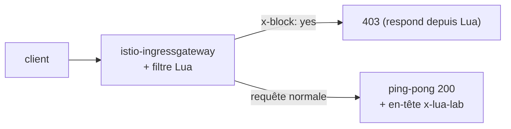

[RU version](README_RU.MD) · [Eng version](README.MD) · [Versión en español](README_ES.MD) · [Deutsche Version](README_DE.MD)

# Lab 27 - EnvoyFilter + Lua : logique personnalisée par script inline

## Aperçu

Parfois on a besoin d'une petite logique personnalisée dans le data plane, mais monter un
module Wasm (Lab 23) est excessif. Envoy sait exécuter des **scripts Lua inline** via le
filtre HTTP `envoy.filters.http.lua`, et Istio permet d'insérer ce filtre via un
`EnvoyFilter`. Aucune image ni build - la logique est directement dans le YAML.

Dans ce lab, vous allez ajouter un filtre Lua sur l'ingress gateway qui :
- ajoute à la réponse l'en-tête `x-lua-lab: hello-from-lua` ;
- rejette les requêtes avec l'en-tête `x-block: yes` avec le code `403`.

Istio est déjà installé (ingress gateway sur le NodePort `32080`), l'application
`ping-pong` est publiée sur `http://myapp.local:32080/`.



## Infrastructure

| Composant | Type | Qté | Rôle |
|---|---|---|---|
| control-plane | `t3.medium` | 1 | master + istiod + ingress gateway |
| worker | `t3.small` | 1 | capacité pour l'application |
| worker PC | `t3.small` | 1 | poste de travail : `kubectl`, `curl`, `check_result` |

Région : `eu-central-1` (AZ `eu-central-1a` / `eu-central-1b`).

## Déploiement

```bash
TASK=27 make run_ica_task
```

## Exercice

1. Vérifier le comportement de base (pas d'en-tête, `x-block` est ignoré).
2. Appliquer un `EnvoyFilter` avec du Lua inline sur l'ingress gateway
   (`workloadSelector: istio=ingressgateway`, `context: GATEWAY`).
3. Vérifier : la réponse contient `x-lua-lab`, et une requête avec `x-block: yes` → `403`.

## Étape 1. Vérification de base

```bash
curl -sI http://myapp.local:32080/ | grep -i x-lua-lab   # vide
curl -s -o /dev/null -w "%{http_code}\n" -H "x-block: yes" http://myapp.local:32080/   # 200
```

## Étape 2. Appliquer l'EnvoyFilter Lua

```bash
kubectl apply -f - <<'EOF'
apiVersion: networking.istio.io/v1alpha3
kind: EnvoyFilter
metadata:
  name: lua-edge
  namespace: istio-system
spec:
  workloadSelector:
    labels:
      istio: ingressgateway
  configPatches:
    - applyTo: HTTP_FILTER
      match:
        context: GATEWAY
        listener:
          filterChain:
            filter:
              name: envoy.filters.network.http_connection_manager
              subFilter:
                name: envoy.filters.http.router
      patch:
        operation: INSERT_BEFORE
        value:
          name: envoy.filters.http.lua
          typed_config:
            "@type": type.googleapis.com/envoy.extensions.filters.http.lua.v3.Lua
            inlineCode: |
              function envoy_on_request(request_handle)
                if request_handle:headers():get("x-block") == "yes" then
                  request_handle:respond(
                    {[":status"] = "403"},
                    "blocked by lua\n")
                end
              end
              function envoy_on_response(response_handle)
                response_handle:headers():add("x-lua-lab", "hello-from-lua")
              end
EOF
```

## Étape 3. Vérification

```bash
# en-tête ajouté par Lua
curl -sI http://myapp.local:32080/ | grep -i x-lua-lab
# x-lua-lab: hello-from-lua

# requête bloquée par Lua
curl -s -o /dev/null -w "%{http_code}\n" -H "x-block: yes" http://myapp.local:32080/
# 403

# requête normale fonctionne
curl -s -o /dev/null -w "%{http_code}\n" http://myapp.local:32080/
# 200
```

## Comment ça marche

- **`EnvoyFilter`** patche la config brute d'Envoy que génère Istio. Ici, il insère le
  filtre HTTP intégré **Lua** (`envoy.filters.http.lua`) dans la chaîne de filtres de
  l'ingress gateway, juste avant le routeur.
- Le script Lua implémente deux callbacks du cycle de vie :
  - `envoy_on_request(request_handle)` - à chaque requête ; on peut lire/modifier les
    en-têtes, lire le corps ou interrompre la requête via `request_handle:respond(...)`.
  - `envoy_on_response(response_handle)` - à chaque réponse ; ici on ajoute un en-tête.
- `context: GATEWAY` limite le patch à l'ingress gateway. Pour les sidecars, on utilise
  `SIDECAR_INBOUND` / `SIDECAR_OUTBOUND`.

## Lua contre Wasm contre CRD intégrés

- **Le Lua inline** est le moyen le plus rapide d'ajouter une petite logique : sans image
  ni build, le script se modifie directement dans le YAML. Bon pour l'édition d'en-têtes,
  le gating simple de requêtes, les expériences rapides.
- **Wasm** (Lab 23) - pour une logique lourde/réutilisable dans un vrai langage (Rust/Go),
  versionnée et livrée comme image OCI, exécutée dans un bac à sable.
- **Les CRD intégrés** (`AuthorizationPolicy`, `Telemetry`, ...) - essayez-les toujours en
  premier ; Lua/Wasm - seulement quand l'intégré ne suffit pas.

> `EnvoyFilter` est de bas niveau et sensible aux versions d'API ; Istio prévient que sa
> config peut changer entre les releases. Gardez ces patches minimaux et vérifiez-les lors
> des mises à niveau.

## Vérification du résultat

Lancez sur le worker PC :

```bash
check_result
```

## Bilan

Vous avez ajouté une logique personnalisée dans le data plane via du Lua inline dans un
`EnvoyFilter` - sans image ni recompilation du proxy. C'est un outil senior pratique pour
des ajustements rapides du trafic à la frontière du maillage, quand les CRD intégrés ne
suffisent pas et qu'un module Wasm complet serait excessif.
