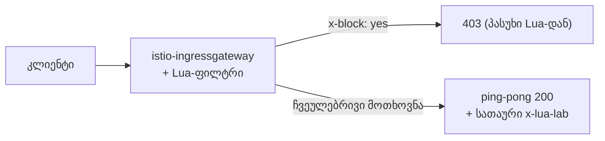

[Русская версия](README_RU.MD) · [Eng version](README.MD) · [Versión en español](README_ES.MD) · [Version française](README_FR.MD) · [Deutsche Version](README_DE.MD) · [繁體中文版](README_TW.MD) · [日本語版](README_JP.MD)

# ლაბორატორია 27 - EnvoyFilter + Lua: მორგებული ლოგიკა ჩაშენებული სკრიპტით

> [საცნობარო გადაწყვეტა](worker/files/solutions/1_GE.MD)

## მიმოხილვა

ზოგჯერ data plane-ში მცირე მორგებული ლოგიკაა საჭირო, მაგრამ Wasm-მოდულის (ლაბორატორია 23)
შექმნა ზედმეტია. Envoy-ს შეუძლია **ჩაშენებული Lua-სკრიპტების** შესრულება HTTP-ფილტრის
`envoy.filters.http.lua` მეშვეობით, ხოლო Istio ამ ფილტრის `EnvoyFilter`-ის საშუალებით
ჩასმის შესაძლებლობას იძლევა. არც image და არც build არ არის საჭირო - ლოგიკა პირდაპირ YAML-შია.

ამ ლაბორატორიაში ingress gateway-ზე დაამატებთ Lua-ფილტრს, რომელიც:
- პასუხს ამატებს სათაურს `x-lua-lab: hello-from-lua`;
- სათაურის `x-block: yes` შემცველ მოთხოვნებს `403` კოდით ბლოკავს.

Istio უკვე დაყენებულია (ingress gateway NodePort-ზე `32080`), აპლიკაცია `ping-pong`
გამოქვეყნებულია მისამართზე `http://myapp.local:32080/`.



## ინფრასტრუქტურა

| კომპონენტი | ტიპი | რაოდენობა | დანიშნულება |
|---|---|---|---|
| control-plane | `t3.medium` | 1 | master + istiod + ingress gateway |
| worker | `t3.small` | 1 | აპლიკაციისთვის განკუთვნილი რესურსები |
| worker PC | `t3.small` | 1 | სამუშაო გარემო: `kubectl`, `curl`, `check_result` |

რეგიონი: `eu-central-1` (AZ `eu-central-1a` / `eu-central-1b`).

## გაშლა

```bash
TASK=27 make run_ica_task
```

## დავალება

1. შეამოწმეთ საწყისი ქცევა (სათაური არ არსებობს, `x-block` იგნორირებულია).
2. ingress gateway-ზე გამოიყენეთ `EnvoyFilter` ჩაშენებული Lua-თი
   (`workloadSelector: istio=ingressgateway`, `context: GATEWAY`).
3. შეამოწმეთ: პასუხში არის `x-lua-lab`, ხოლო მოთხოვნა `x-block: yes` → `403`.

## ნაბიჯი 1. საწყისი შემოწმება

```bash
curl -sI http://myapp.local:32080/ | grep -i x-lua-lab   # ცარიელია
curl -s -o /dev/null -w "%{http_code}\n" -H "x-block: yes" http://myapp.local:32080/   # 200
```

## ნაბიჯი 2. Lua EnvoyFilter-ის გამოყენება

```bash
kubectl apply -f - <<'EOF'
apiVersion: networking.istio.io/v1alpha3
kind: EnvoyFilter
metadata:
  name: lua-edge
  namespace: istio-system
spec:
  workloadSelector:
    labels:
      istio: ingressgateway
  configPatches:
    - applyTo: HTTP_FILTER
      match:
        context: GATEWAY
        listener:
          filterChain:
            filter:
              name: envoy.filters.network.http_connection_manager
              subFilter:
                name: envoy.filters.http.router
      patch:
        operation: INSERT_BEFORE
        value:
          name: envoy.filters.http.lua
          typed_config:
            "@type": type.googleapis.com/envoy.extensions.filters.http.lua.v3.Lua
            inlineCode: |
              function envoy_on_request(request_handle)
                if request_handle:headers():get("x-block") == "yes" then
                  request_handle:respond(
                    {[":status"] = "403"},
                    "blocked by lua\n")
                end
              end
              function envoy_on_response(response_handle)
                response_handle:headers():add("x-lua-lab", "hello-from-lua")
              end
EOF
```

## ნაბიჯი 3. შემოწმება

```bash
# Lua-ს მიერ დამატებული სათაური
curl -sI http://myapp.local:32080/ | grep -i x-lua-lab
# x-lua-lab: hello-from-lua

# მოთხოვნა დაბლოკილია Lua-ს მიერ
curl -s -o /dev/null -w "%{http_code}\n" -H "x-block: yes" http://myapp.local:32080/
# 403

# ჩვეულებრივი მოთხოვნა მუშაობს
curl -s -o /dev/null -w "%{http_code}\n" http://myapp.local:32080/
# 200
```

## როგორ მუშაობს ეს

- **`EnvoyFilter`** ცვლის Envoy-ის დაბალი დონის კონფიგურაციას, რომელსაც Istio აგენერირებს. აქ ის
  ingress gateway-ის ფილტრების ჯაჭვში, უშუალოდ router-ის წინ, ჩაშენებულ HTTP-ფილტრ
  **Lua**-ს (`envoy.filters.http.lua`) ამატებს.
- Lua-სკრიპტი სასიცოცხლო ციკლის ორ callback-ს ახორციელებს:
  - `envoy_on_request(request_handle)` - თითოეული მოთხოვნისთვის; შესაძლებელია სათაურების წაკითხვა/შეცვლა,
    body-ის წაკითხვა ან მოთხოვნის შეწყვეტა `request_handle:respond(...)`-ის მეშვეობით.
  - `envoy_on_response(response_handle)` - თითოეული პასუხისთვის; აქ სათაურს ამატებს.
- `context: GATEWAY` ცვლილებას ingress gateway-ით ზღუდავს. sidecar-ებისთვის გამოიყენება
  `SIDECAR_INBOUND` / `SIDECAR_OUTBOUND`.

## Lua, Wasm და ჩაშენებული CRD-ები

- **ჩაშენებული Lua** მცირე ლოგიკის დამატების ყველაზე სწრაფი გზაა: image-ისა და build-ის გარეშე,
  სკრიპტი პირდაპირ YAML-ში იცვლება. მოსახერხებელია სათაურების შესაცვლელად, მოთხოვნების მარტივი
  კონტროლისა და სწრაფი ექსპერიმენტებისთვის.
- **Wasm** (ლაბორატორია 23) განკუთვნილია რთული/მრავალჯერ გამოსაყენებელი ლოგიკისთვის ნამდვილ პროგრამირების ენაზე (Rust/Go),
  ვერსიონირდება და მიეწოდება OCI image-ის სახით, ხოლო შესრულება sandbox-ში ხდება.
- **ჩაშენებული CRD-ები** (`AuthorizationPolicy`, `Telemetry`, ...) - ყოველთვის ჯერ ისინი
  სცადეთ; Lua/Wasm მხოლოდ მაშინ გამოიყენეთ, როდესაც ჩაშენებული შესაძლებლობები საკმარისი არ არის.

> `EnvoyFilter` დაბალი დონისაა და API-ის ვერსიების მიმართ მგრძნობიარეა; Istio გვაფრთხილებს, რომ
> მისი კონფიგურაცია რელიზებს შორის შეიძლება შეიცვალოს. ასეთი ცვლილებები მინიმალური დატოვეთ და
> განახლებისას შეამოწმეთ.

## შედეგის შემოწმება

worker PC-ზე გაუშვით:

```bash
check_result
```

## შეჯამება

თქვენ `EnvoyFilter`-ში ჩაშენებული Lua-ს მეშვეობით data plane-ს მორგებული ლოგიკა დაამატეთ - image-ისა და
proxy-ის ხელახლა build-ის გარეშე. ეს მოსახერხებელი senior-ინსტრუმენტია mesh-ის საზღვარზე ტრაფიკის
სწრაფად შესაცვლელად, როდესაც ჩაშენებული CRD-ები საკმარისი არ არის, ხოლო სრულფასოვანი Wasm-მოდული ზედმეტია.
