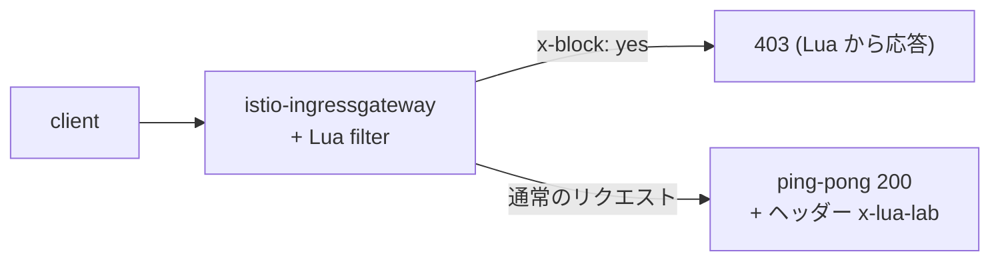

[Русская версия](README_RU.MD) · [Eng version](README.MD) · [Versión en español](README_ES.MD) · [Version française](README_FR.MD) · [Deutsche Version](README_DE.MD) · [ქართული ვერსია](README_GE.MD) · [繁體中文版](README_TW.MD)

# Lab 27 - EnvoyFilter + Lua: インラインスクリプトによるカスタムロジック

> [リファレンス解答](worker/files/solutions/1_JP.MD)

## 概要

data plane に小さなカスタムロジックが必要な場合でも、Wasm モジュール（Lab 23）を
構築するのは過剰なことがあります。Envoy は HTTP フィルター
`envoy.filters.http.lua` を介して **インライン Lua スクリプト**を実行でき、Istio では
`EnvoyFilter` を使ってこのフィルターを挿入できます。イメージもビルドも不要で、ロジックは YAML に直接記述します。

このラボでは、ingress gateway に Lua フィルターを追加し、次を行います。
- レスポンスにヘッダー `x-lua-lab: hello-from-lua` を追加する。
- ヘッダー `x-block: yes` を含むリクエストを `403` で拒否する。

Istio はすでにインストール済みです（ingress gateway は NodePort `32080`）。アプリケーション `ping-pong`
は `http://myapp.local:32080/` で公開されています。



## インフラストラクチャ

| コンポーネント | タイプ | 数 | 役割 |
|---|---|---|---|
| control-plane | `t3.medium` | 1 | master + istiod + ingress gateway |
| worker | `t3.small` | 1 | アプリケーション用のキャパシティ |
| worker PC | `t3.small` | 1 | 作業環境: `kubectl`、`curl`、`check_result` |

リージョン: `eu-central-1`（AZ `eu-central-1a` / `eu-central-1b`）。

## デプロイ

```bash
TASK=27 make run_ica_task
```

## 課題

1. 基本動作を確認する（ヘッダーがなく、`x-block` は無視される）。
2. ingress gateway にインライン Lua を含む `EnvoyFilter` を適用する
   （`workloadSelector: istio=ingressgateway`、`context: GATEWAY`）。
3. 確認する: レスポンスに `x-lua-lab` があり、`x-block: yes` を含むリクエストが `403` になる。

## ステップ 1. 基本確認

```bash
curl -sI http://myapp.local:32080/ | grep -i x-lua-lab   # 空
curl -s -o /dev/null -w "%{http_code}\n" -H "x-block: yes" http://myapp.local:32080/   # 200
```

## ステップ 2. Lua EnvoyFilter を適用する

```bash
kubectl apply -f - <<'EOF'
apiVersion: networking.istio.io/v1alpha3
kind: EnvoyFilter
metadata:
  name: lua-edge
  namespace: istio-system
spec:
  workloadSelector:
    labels:
      istio: ingressgateway
  configPatches:
    - applyTo: HTTP_FILTER
      match:
        context: GATEWAY
        listener:
          filterChain:
            filter:
              name: envoy.filters.network.http_connection_manager
              subFilter:
                name: envoy.filters.http.router
      patch:
        operation: INSERT_BEFORE
        value:
          name: envoy.filters.http.lua
          typed_config:
            "@type": type.googleapis.com/envoy.extensions.filters.http.lua.v3.Lua
            inlineCode: |
              function envoy_on_request(request_handle)
                if request_handle:headers():get("x-block") == "yes" then
                  request_handle:respond(
                    {[":status"] = "403"},
                    "blocked by lua\n")
                end
              end
              function envoy_on_response(response_handle)
                response_handle:headers():add("x-lua-lab", "hello-from-lua")
              end
EOF
```

## ステップ 3. 確認

```bash
# Lua によって追加されたヘッダー
curl -sI http://myapp.local:32080/ | grep -i x-lua-lab
# x-lua-lab: hello-from-lua

# リクエストが Lua によってブロックされた
curl -s -o /dev/null -w "%{http_code}\n" -H "x-block: yes" http://myapp.local:32080/
# 403

# 通常のリクエストは動作する
curl -s -o /dev/null -w "%{http_code}\n" http://myapp.local:32080/
# 200
```

## 仕組み

- **`EnvoyFilter`** は Istio が生成する生の Envoy 設定にパッチを適用します。ここでは、
  組み込み HTTP フィルター **Lua**（`envoy.filters.http.lua`）を ingress gateway の
  フィルターチェーン内で、router の直前に挿入します。
- Lua スクリプトは、ライフサイクルの 2 つのコールバックを実装します。
  - `envoy_on_request(request_handle)` - 各リクエスト時。ヘッダーの読み取り・変更、
    本文の読み取り、または `request_handle:respond(...)` によるリクエストの中断が可能です。
  - `envoy_on_response(response_handle)` - 各レスポンス時。ここでヘッダーを追加します。
- `context: GATEWAY` はパッチの対象を ingress gateway に限定します。sidecar には
  `SIDECAR_INBOUND` / `SIDECAR_OUTBOUND` を使用します。

## Lua と Wasm と組み込み CRD の比較

- **インライン Lua** - 小規模なロジックを追加する最速の方法です。イメージもビルドも不要で、
  スクリプトは YAML で直接編集できます。ヘッダーの変更、単純なリクエストのゲーティング、
  素早い実験に適しています。
- **Wasm**（Lab 23）- 実際の言語（Rust/Go）で書く重量級または再利用可能なロジック向けです。
  OCI イメージとしてバージョン管理・配布され、サンドボックスで実行されます。
- **組み込み CRD**（`AuthorizationPolicy`、`Telemetry`、...）- 常にまずこれらを試してください。
  組み込み機能で不足する場合にのみ Lua/Wasm を使用します。

> `EnvoyFilter` は低レベルで API バージョンの影響を受けやすい機能です。Istio は、その設定が
> リリース間で変わる可能性があると警告しています。このようなパッチは最小限に保ち、アップグレード時に確認してください。

## 結果の確認

worker PC で次を実行します。

```bash
check_result
```

## まとめ

インライン Lua を `EnvoyFilter` で使用して、イメージやプロキシの再ビルドなしに data plane へ
カスタムロジックを追加しました。これは、組み込み CRD では不足する一方で本格的な Wasm モジュールは過剰な場合に、
mesh 境界でトラフィックを素早く変更するための便利な上級者向けツールです。
