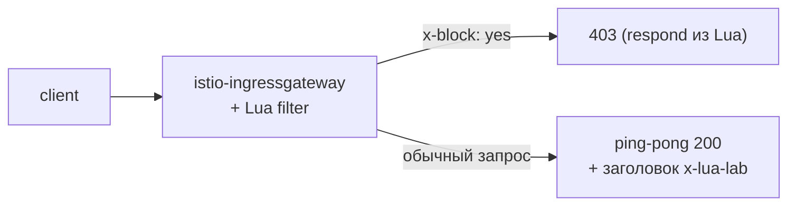

[Eng version](README.MD) · [Versión en español](README_ES.MD) · [Version française](README_FR.MD) · [Deutsche Version](README_DE.MD)

# Lab 27 - EnvoyFilter + Lua: кастомная логика инлайн-скриптом

## Обзор

Иногда нужна маленькая кастомная логика в data plane, но городить Wasm-модуль (Lab 23)
избыточно. Envoy умеет исполнять **инлайн Lua-скрипты** через HTTP-фильтр
`envoy.filters.http.lua`, а Istio позволяет вставить этот фильтр через `EnvoyFilter`.
Никакого образа и сборки - логика прямо в YAML.

В этой лабе вы добавите Lua-фильтр на ingress gateway, который:
- добавляет в ответ заголовок `x-lua-lab: hello-from-lua`;
- отбивает запросы с заголовком `x-block: yes` кодом `403`.

Istio уже установлен (ingress gateway на NodePort `32080`), приложение `ping-pong`
опубликовано на `http://myapp.local:32080/`.



## Инфраструктура

| Компонент | Тип | Кол-во | Роль |
|---|---|---|---|
| control-plane | `t3.medium` | 1 | master + istiod + ingress gateway |
| worker | `t3.small` | 1 | ёмкость для приложения |
| worker PC | `t3.small` | 1 | рабочее место: `kubectl`, `curl`, `check_result` |

Регион: `eu-central-1` (AZ `eu-central-1a` / `eu-central-1b`).

## Развёртывание

```bash
TASK=27 make run_ica_task
```

## Задание

1. Проверить базовое поведение (заголовка нет, `x-block` игнорируется).
2. Применить `EnvoyFilter` с инлайн Lua на ingress gateway
   (`workloadSelector: istio=ingressgateway`, `context: GATEWAY`).
3. Проверить: в ответе есть `x-lua-lab`, а запрос с `x-block: yes` → `403`.

## Шаг 1. Базовая проверка

```bash
curl -sI http://myapp.local:32080/ | grep -i x-lua-lab   # пусто
curl -s -o /dev/null -w "%{http_code}\n" -H "x-block: yes" http://myapp.local:32080/   # 200
```

## Шаг 2. Применить Lua EnvoyFilter

```bash
kubectl apply -f - <<'EOF'
apiVersion: networking.istio.io/v1alpha3
kind: EnvoyFilter
metadata:
  name: lua-edge
  namespace: istio-system
spec:
  workloadSelector:
    labels:
      istio: ingressgateway
  configPatches:
    - applyTo: HTTP_FILTER
      match:
        context: GATEWAY
        listener:
          filterChain:
            filter:
              name: envoy.filters.network.http_connection_manager
              subFilter:
                name: envoy.filters.http.router
      patch:
        operation: INSERT_BEFORE
        value:
          name: envoy.filters.http.lua
          typed_config:
            "@type": type.googleapis.com/envoy.extensions.filters.http.lua.v3.Lua
            inlineCode: |
              function envoy_on_request(request_handle)
                if request_handle:headers():get("x-block") == "yes" then
                  request_handle:respond(
                    {[":status"] = "403"},
                    "blocked by lua\n")
                end
              end
              function envoy_on_response(response_handle)
                response_handle:headers():add("x-lua-lab", "hello-from-lua")
              end
EOF
```

## Шаг 3. Проверка

```bash
# заголовок, добавленный Lua
curl -sI http://myapp.local:32080/ | grep -i x-lua-lab
# x-lua-lab: hello-from-lua

# запрос заблокирован Lua
curl -s -o /dev/null -w "%{http_code}\n" -H "x-block: yes" http://myapp.local:32080/
# 403

# обычный запрос работает
curl -s -o /dev/null -w "%{http_code}\n" http://myapp.local:32080/
# 200
```

## Как это работает

- **`EnvoyFilter`** патчит сырой конфиг Envoy, который генерирует Istio. Здесь он
  вставляет встроенный HTTP-фильтр **Lua** (`envoy.filters.http.lua`) в цепочку фильтров
  ingress gateway, прямо перед роутером.
- Lua-скрипт реализует два колбэка жизненного цикла:
  - `envoy_on_request(request_handle)` - на каждый запрос; можно читать/менять заголовки,
    читать тело или прервать запрос через `request_handle:respond(...)`.
  - `envoy_on_response(response_handle)` - на каждый ответ; здесь добавляет заголовок.
- `context: GATEWAY` ограничивает патч ingress gateway. Для sidecar'ов используют
  `SIDECAR_INBOUND` / `SIDECAR_OUTBOUND`.

## Lua против Wasm против встроенных CRD

- **Инлайн Lua** - самый быстрый способ добавить небольшую логику: без образа и сборки,
  скрипт правится прямо в YAML. Хорошо для правки заголовков, простого гейтинга запросов,
  быстрых экспериментов.
- **Wasm** (Lab 23) - для тяжёлой/переиспользуемой логики на настоящем языке (Rust/Go),
  версионируется и доставляется как OCI-образ, исполняется в песочнице.
- **Встроенные CRD** (`AuthorizationPolicy`, `Telemetry`, ...) - всегда пробуйте их
  первыми; Lua/Wasm - только когда встроенного не хватает.

> `EnvoyFilter` - низкоуровневый и чувствительный к версиям API; Istio предупреждает, что
> его конфиг может меняться между релизами. Держите такие патчи минимальными и проверяйте
> при апгрейдах.

## Проверка результата

Запустите на worker PC:

```bash
check_result
```

## Итог

Вы добавили кастомную логику в data plane через инлайн Lua в `EnvoyFilter` - без образа и
пересборки прокси. Это удобный senior-инструмент для быстрых правок трафика на границе
mesh, когда встроенных CRD не хватает, а полноценный Wasm-модуль избыточен.
