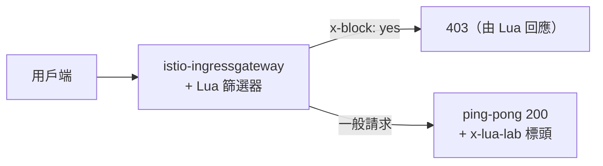

[Русская версия](README_RU.MD) · [Eng version](README.MD) · [Versión en español](README_ES.MD) · [Version française](README_FR.MD) · [Deutsche Version](README_DE.MD) · [ქართული ვერსია](README_GE.MD) · [日本語版](README_JP.MD)

# Lab 27 - EnvoyFilter + Lua：以內嵌指令碼實作自訂邏輯

> [參考解答](worker/files/solutions/1_TW.MD)

## 概述

有時資料平面需要一點自訂邏輯，但建置整個 Wasm 模組（Lab 23）又太過頭。
Envoy 可透過 HTTP 篩選器 `envoy.filters.http.lua` 執行**內嵌 Lua 指令碼**，而 Istio
允許透過 `EnvoyFilter` 插入這個篩選器。不需要映像檔或建置，邏輯直接寫在 YAML 中。

在本 Lab 中，您將在 ingress gateway 新增一個 Lua 篩選器，它會：
- 在回應中新增標頭 `x-lua-lab: hello-from-lua`；
- 以 `403` 拒絕帶有 `x-block: yes` 標頭的請求。

Istio 已安裝完成（ingress gateway 使用 NodePort `32080`），應用程式 `ping-pong`
已發佈於 `http://myapp.local:32080/`。



## 基礎架構

| 元件 | 類型 | 數量 | 角色 |
|---|---|---|---|
| control-plane | `t3.medium` | 1 | master + istiod + ingress gateway |
| worker | `t3.small` | 1 | 應用程式容量 |
| worker PC | `t3.small` | 1 | 工作站：`kubectl`、`curl`、`check_result` |

區域：`eu-central-1`（AZ `eu-central-1a` / `eu-central-1b`）。

## 部署

```bash
TASK=27 make run_ica_task
```

## 任務

1. 檢查基本行為（沒有標頭，`x-block` 會被忽略）。
2. 在 ingress gateway 套用含內嵌 Lua 的 `EnvoyFilter`
   （`workloadSelector: istio=ingressgateway`、`context: GATEWAY`）。
3. 驗證：回應中有 `x-lua-lab`，且帶有 `x-block: yes` 的請求會得到 `403`。

## 步驟 1. 基本檢查

```bash
curl -sI http://myapp.local:32080/ | grep -i x-lua-lab   # 空的
curl -s -o /dev/null -w "%{http_code}\n" -H "x-block: yes" http://myapp.local:32080/   # 200
```

## 步驟 2. 套用 Lua EnvoyFilter

```bash
kubectl apply -f - <<'EOF'
apiVersion: networking.istio.io/v1alpha3
kind: EnvoyFilter
metadata:
  name: lua-edge
  namespace: istio-system
spec:
  workloadSelector:
    labels:
      istio: ingressgateway
  configPatches:
    - applyTo: HTTP_FILTER
      match:
        context: GATEWAY
        listener:
          filterChain:
            filter:
              name: envoy.filters.network.http_connection_manager
              subFilter:
                name: envoy.filters.http.router
      patch:
        operation: INSERT_BEFORE
        value:
          name: envoy.filters.http.lua
          typed_config:
            "@type": type.googleapis.com/envoy.extensions.filters.http.lua.v3.Lua
            inlineCode: |
              function envoy_on_request(request_handle)
                if request_handle:headers():get("x-block") == "yes" then
                  request_handle:respond(
                    {[":status"] = "403"},
                    "blocked by lua\n")
                end
              end
              function envoy_on_response(response_handle)
                response_handle:headers():add("x-lua-lab", "hello-from-lua")
              end
EOF
```

## 步驟 3. 驗證

```bash
# 由 Lua 新增的標頭
curl -sI http://myapp.local:32080/ | grep -i x-lua-lab
# x-lua-lab: hello-from-lua

# 請求被 Lua 封鎖
curl -s -o /dev/null -w "%{http_code}\n" -H "x-block: yes" http://myapp.local:32080/
# 403

# 一般請求可正常運作
curl -s -o /dev/null -w "%{http_code}\n" http://myapp.local:32080/
# 200
```

## 運作方式

- **`EnvoyFilter`** 會修補 Istio 產生的原始 Envoy 設定。此處它會將內建的 HTTP
  篩選器 **Lua**（`envoy.filters.http.lua`）插入 ingress gateway 的篩選器鏈中，位置在
  router 之前。
- Lua 指令碼實作兩個生命週期回呼：
  - `envoy_on_request(request_handle)`：針對每個請求；可讀取／變更標頭、讀取主體，
    或透過 `request_handle:respond(...)` 中止請求。
  - `envoy_on_response(response_handle)`：針對每個回應；此處會新增標頭。
- `context: GATEWAY` 將修補限制於 ingress gateway。sidecar 使用
  `SIDECAR_INBOUND` / `SIDECAR_OUTBOUND`。

## Lua、Wasm 與內建 CRD 的比較

- **內嵌 Lua**：新增小型邏輯最快的方法；不需要映像檔或建置，可直接在 YAML 中編輯
  指令碼。適合標頭調整、簡易請求閘控及快速實驗。
- **Wasm**（Lab 23）：適用於以真正程式語言（Rust/Go）編寫的重量級／可重用邏輯；
  可進行版本控制並以 OCI 映像檔交付，在沙箱中執行。
- **內建 CRD**（`AuthorizationPolicy`、`Telemetry`、...）：請一律優先嘗試使用它們；
  只有在內建功能不足時才使用 Lua/Wasm。

> `EnvoyFilter` 屬於低階功能，且對 API 版本很敏感；Istio 警告其設定可能在版本之間
> 變更。請將此類修補保持在最小範圍，並在升級時進行驗證。

## 結果驗證

在 worker PC 上執行：

```bash
check_result
```

## 總結

您已透過 `EnvoyFilter` 中的內嵌 Lua，在資料平面新增自訂邏輯，無須映像檔或重新建置
proxy。當內建 CRD 不足、而完整 Wasm 模組又過於龐大時，這是在 mesh 邊界快速調整
流量的實用資深工具。
