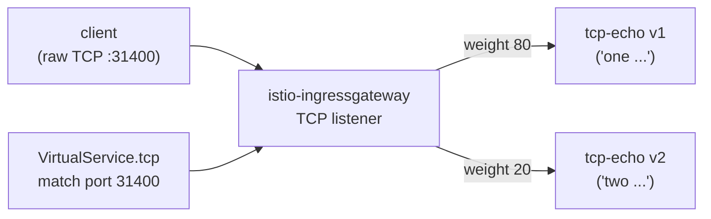

[RU version](README_RU.MD) · [Versión en español](README_ES.MD) · [Version française](README_FR.MD) · [Deutsche Version](README_DE.MD)

# Lab 28 - TCP routing: routing non-HTTP traffic

## Overview

Not all traffic is HTTP. Databases, brokers, and custom protocols run over raw TCP, where
there is no host/path/headers. Istio routes such traffic at Layer 4 via a `Gateway` with
`protocol: TCP` and a `VirtualService.tcp` route that keys off the listener **port**.

This lab deploys a TCP echo service `tcp-echo` in two versions (on raw TCP port `9000`):
- **v1** replies with the `one` prefix;
- **v2** replies with the `two` prefix.

The ingress gateway already listens on TCP NodePort `31400`.



## Infrastructure

| Component | Type | Count | Role |
|---|---|---|---|
| control-plane | `t3.medium` | 1 | master + istiod + ingress gateway |
| worker | `t3.small` | 1 | capacity for tcp-echo v1/v2 |
| worker PC | `t3.small` | 1 | workstation: `kubectl`, `bash /dev/tcp`, `check_result` |

Region: `eu-central-1` (AZ `eu-central-1a` / `eu-central-1b`).

## Provisioning

```bash
TASK=28 make run_ica_task
```

## Task

1. Create a `Gateway` with a `protocol: TCP` server on port `31400`.
2. Create a `DestinationRule` with subsets `v1`/`v2`.
3. Create a `VirtualService` with a `tcp` route (match on port 31400) that splits
   connections between v1 (80%) and v2 (20%).
4. Confirm raw TCP through the gateway reaches the service and is echoed back.

## Step 1. Gateway with a TCP listener

```bash
kubectl apply -f - <<'EOF'
apiVersion: networking.istio.io/v1
kind: Gateway
metadata:
  name: tcp-echo-gateway
  namespace: app
spec:
  selector:
    istio: ingressgateway
  servers:
    - port:
        number: 31400
        name: tcp
        protocol: TCP
      hosts:
        - "*"
EOF
```

## Step 2. DestinationRule with subsets

```bash
kubectl apply -f - <<'EOF'
apiVersion: networking.istio.io/v1
kind: DestinationRule
metadata:
  name: tcp-echo
  namespace: app
spec:
  host: tcp-echo
  subsets:
    - name: v1
      labels:
        version: v1
    - name: v2
      labels:
        version: v2
EOF
```

## Step 3. VirtualService with a TCP route

```bash
kubectl apply -f - <<'EOF'
apiVersion: networking.istio.io/v1
kind: VirtualService
metadata:
  name: tcp-echo
  namespace: app
spec:
  hosts:
    - "*"
  gateways:
    - tcp-echo-gateway
  tcp:
    - match:
        - port: 31400
      route:
        - destination:
            host: tcp-echo
            port:
              number: 9000
            subset: v1
          weight: 80
        - destination:
            host: tcp-echo
            port:
              number: 9000
            subset: v2
          weight: 20
EOF
```

## Step 4. Verify

```bash
for i in $(seq 10); do
  echo "hello" | timeout 3 bash -c 'exec 3<>/dev/tcp/myapp.local/31400; cat >&3; head -n 1 <&3'
done
# ~80% "one hello", ~20% "two hello"
```

(If `nc` is installed: `echo hello | nc myapp.local 31400`.)

## How it works

- **TCP routing** operates at Layer 4: there is no HTTP host/path/header, so routing keys
  off the **listener port** (`match.port`). A `Gateway` server with `protocol: TCP` makes
  Envoy open a plain TCP listener; the `VirtualService.tcp` route forwards the connection
  to the chosen backend subset.
- **Port naming matters**: the service/gateway port must be named `tcp` (or `tcp-*`).
  Istio uses the port-name prefix to detect the protocol; an unprefixed or `http-*` name
  would make Istio treat it as HTTP and the raw protocol would break.
- **Weighted TCP** splits *connections* (not requests) across subsets - each new TCP
  connection is routed by weight.
- L7 features (retries, header routing, fault injection) do **not** apply to TCP routes -
  only connection-level policies (connection pool, timeouts) via `DestinationRule`.

## Related protocols

- **MongoDB/MySQL/Redis** - name the port `mongo-*` / `mysql-*` / `redis-*` so Envoy
  applies the right protocol parser; routing still uses `tcp` routes.
- **WebSocket** - despite being long-lived, it rides on HTTP `Upgrade`, so use normal
  `http` routes and `http-*` port names, not TCP.

## Check the result

Run on the worker PC:

```bash
check_result
```

## Summary

You routed raw TCP through the ingress gateway with weighted splitting between versions.
Understanding L4 routing (by port, mindful of port naming) is a key skill for non-HTTP
workloads (databases, brokers, custom protocols) in the mesh.
