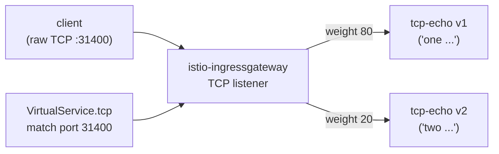

[RU version](README_RU.MD) · [Eng version](README.MD) · [Versión en español](README_ES.MD) · [Version française](README_FR.MD)

# Lab 28 - TCP routing: Routing von Nicht-HTTP-Verkehr

## Überblick

Nicht der gesamte Verkehr ist HTTP. Datenbanken, Broker und eigene Protokolle laufen über
rohes TCP, wo es kein host/path/keine Header gibt. Istio routet solchen Verkehr auf
L4-Ebene: über ein `Gateway` mit `protocol: TCP` und `VirtualService.tcp`, wo die Route
über den **Port** des Listeners gewählt wird.

Im Lab ist ein TCP-Echo-Service `tcp-echo` in zwei Versionen deployt (auf dem rohen
TCP-Port `9000`):
- **v1** antwortet mit dem Präfix `one`;
- **v2** antwortet mit dem Präfix `two`.

Das ingress gateway lauscht bereits auf TCP an NodePort `31400`.



## Infrastruktur

| Komponente | Typ | Anzahl | Rolle |
|---|---|---|---|
| control-plane | `t3.medium` | 1 | master + istiod + ingress gateway |
| worker | `t3.small` | 1 | Kapazität für tcp-echo v1/v2 |
| worker PC | `t3.small` | 1 | Arbeitsplatz: `kubectl`, `bash /dev/tcp`, `check_result` |

Region: `eu-central-1` (AZ `eu-central-1a` / `eu-central-1b`).

## Deployment

```bash
TASK=28 make run_ica_task
```

## Aufgabe

1. Ein `Gateway` mit einem Server `protocol: TCP` auf Port `31400` erstellen.
2. Eine `DestinationRule` mit den Subsets `v1`/`v2` erstellen.
3. Einen `VirtualService` mit einer `tcp`-Route erstellen (match nach Port 31400), die
   Verbindungen gewichtet zwischen v1 (80%) und v2 (20%) verteilt.
4. Prüfen, dass rohes TCP über das gateway den Service erreicht und das Echo
   zurückkommt.

## Schritt 1. Gateway mit TCP-Listener

```bash
kubectl apply -f - <<'EOF'
apiVersion: networking.istio.io/v1
kind: Gateway
metadata:
  name: tcp-echo-gateway
  namespace: app
spec:
  selector:
    istio: ingressgateway
  servers:
    - port:
        number: 31400
        name: tcp
        protocol: TCP
      hosts:
        - "*"
EOF
```

## Schritt 2. DestinationRule mit Subsets

```bash
kubectl apply -f - <<'EOF'
apiVersion: networking.istio.io/v1
kind: DestinationRule
metadata:
  name: tcp-echo
  namespace: app
spec:
  host: tcp-echo
  subsets:
    - name: v1
      labels:
        version: v1
    - name: v2
      labels:
        version: v2
EOF
```

## Schritt 3. VirtualService mit TCP-Route

```bash
kubectl apply -f - <<'EOF'
apiVersion: networking.istio.io/v1
kind: VirtualService
metadata:
  name: tcp-echo
  namespace: app
spec:
  hosts:
    - "*"
  gateways:
    - tcp-echo-gateway
  tcp:
    - match:
        - port: 31400
      route:
        - destination:
            host: tcp-echo
            port:
              number: 9000
            subset: v1
          weight: 80
        - destination:
            host: tcp-echo
            port:
              number: 9000
            subset: v2
          weight: 20
EOF
```

## Schritt 4. Prüfung

```bash
for i in $(seq 10); do
  echo "hello" | timeout 3 bash -c 'exec 3<>/dev/tcp/myapp.local/31400; cat >&3; head -n 1 <&3'
done
# ~80% "one hello", ~20% "two hello"
```

(Falls `nc` installiert ist: `echo hello | nc myapp.local 31400`.)

## Wie es funktioniert

- **TCP-Routing** arbeitet auf L4: es gibt kein HTTP host/path/keine Header, daher wird
  die Route über den **Port des Listeners** gewählt (`match.port`). Ein `Gateway` mit
  `protocol: TCP` öffnet einen normalen TCP-Listener in Envoy, und `VirtualService.tcp`
  leitet die Verbindung in das benötigte Subset.
- **Der Portname ist wichtig**: der Port des Service/Gateway muss `tcp` (oder `tcp-*`)
  heißen. Istio bestimmt anhand des Portnamen-Präfixes das Protokoll; ein Name ohne Präfix
  oder `http-*` zwingt Istio, ihn als HTTP zu betrachten, und das rohe Protokoll bricht.
- **Gewichtetes TCP** verteilt *Verbindungen* (keine Anfragen) auf die Subsets - jede neue
  TCP-Verbindung wird nach Gewicht geroutet.
- L7-Funktionen (retries, header routing, fault injection) werden auf TCP-Routen **nicht
  angewendet** - nur Policies auf Verbindungsebene (connection pool, timeouts) über die
  `DestinationRule`.

## Verwandte Protokolle

- **MongoDB/MySQL/Redis** - benennen Sie den Port `mongo-*` / `mysql-*` / `redis-*`, damit
  Envoy den passenden Protokoll-Parser anwendet; das Routing läuft dennoch über
  `tcp`-Routen.
- **WebSocket** - trotz der langlebigen Verbindung läuft es über HTTP `Upgrade`, daher
  verwenden Sie normale `http`-Routen und Portnamen `http-*`, nicht TCP.

## Ergebnisprüfung

Führen Sie auf dem worker PC aus:

```bash
check_result
```

## Fazit

Sie haben das Routing von rohem TCP über ein ingress gateway mit gewichteter Verteilung
zwischen Versionen konfiguriert. Das Verständnis des L4-Routings (nach Port, unter
Beachtung der Portbenennung) ist eine wichtige Fähigkeit für die Arbeit mit
Nicht-HTTP-Workloads (DBs, Broker, eigene Protokolle) im Mesh.
