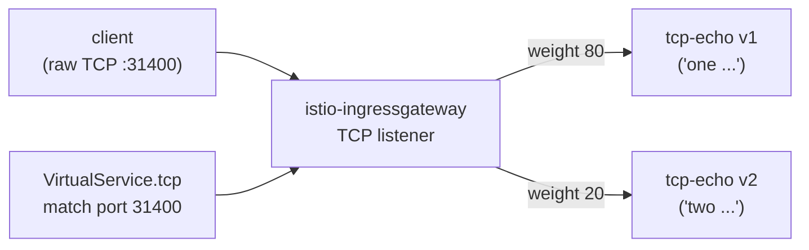

[RU version](README_RU.MD) · [Eng version](README.MD)

# Lab 28 - Enrutamiento TCP: enrutar tráfico no-HTTP

## Resumen

No todo el tráfico es HTTP. Bases de datos, brokers y protocolos personalizados funcionan sobre
TCP crudo, donde no hay host/path/cabeceras. Istio enruta ese tráfico a nivel L4: mediante un
`Gateway` con `protocol: TCP` y `VirtualService.tcp`, donde la ruta se elige por el **puerto**
del listener.

En el lab se despliega el servicio de eco TCP `tcp-echo` en dos versiones (en el puerto TCP
crudo `9000`):
- **v1** responde con el prefijo `one`;
- **v2** responde con el prefijo `two`.

El ingress gateway ya escucha TCP en el NodePort `31400`.



## Tarea

1. Crear un `Gateway` con un servidor `protocol: TCP` en el puerto `31400`.
2. Crear un `DestinationRule` con los subsets `v1`/`v2`.
3. Crear un `VirtualService` con una ruta `tcp` (match por el puerto 31400) que distribuya las
   conexiones de forma ponderada entre v1 (80%) y v2 (20%).
4. Comprobar que el TCP crudo a través del gateway llega al servicio y el eco vuelve.

## Paso 1. Gateway con listener TCP

```bash
kubectl apply -f - <<'EOF'
apiVersion: networking.istio.io/v1
kind: Gateway
metadata:
  name: tcp-echo-gateway
  namespace: app
spec:
  selector:
    istio: ingressgateway
  servers:
    - port:
        number: 31400
        name: tcp
        protocol: TCP
      hosts:
        - "*"
EOF
```

## Paso 2. DestinationRule con subsets

```bash
kubectl apply -f - <<'EOF'
apiVersion: networking.istio.io/v1
kind: DestinationRule
metadata:
  name: tcp-echo
  namespace: app
spec:
  host: tcp-echo
  subsets:
    - name: v1
      labels:
        version: v1
    - name: v2
      labels:
        version: v2
EOF
```

## Paso 3. VirtualService con ruta TCP

```bash
kubectl apply -f - <<'EOF'
apiVersion: networking.istio.io/v1
kind: VirtualService
metadata:
  name: tcp-echo
  namespace: app
spec:
  hosts:
    - "*"
  gateways:
    - tcp-echo-gateway
  tcp:
    - match:
        - port: 31400
      route:
        - destination:
            host: tcp-echo
            port:
              number: 9000
            subset: v1
          weight: 80
        - destination:
            host: tcp-echo
            port:
              number: 9000
            subset: v2
          weight: 20
EOF
```

## Paso 4. Verificación

```bash
for i in $(seq 10); do
  echo "hello" | timeout 3 bash -c 'exec 3<>/dev/tcp/myapp.local/31400; cat >&3; head -n 1 <&3'
done
# ~80% "one hello", ~20% "two hello"
```

(Si está instalado `nc`: `echo hello | nc myapp.local 31400`.)

## Cómo funciona

- El **enrutamiento TCP** trabaja en L4: no hay host/path/cabeceras HTTP, por lo que la ruta se
  elige por el **puerto del listener** (`match.port`). Un `Gateway` con `protocol: TCP` abre un
  listener TCP normal en Envoy, y `VirtualService.tcp` dirige la conexión al subset adecuado.
- **El nombre del puerto importa**: el puerto del servicio/gateway debe llamarse `tcp` (o
  `tcp-*`). Istio determina el protocolo por el prefijo del nombre del puerto; un nombre sin
  prefijo o `http-*` hará que Istio lo considere HTTP y el protocolo crudo se romperá.
- El **TCP ponderado** distribuye *conexiones* (no peticiones) entre los subsets: cada nueva
  conexión TCP se enruta según el peso.
- Las funciones L7 (retries, enrutamiento por cabecera, fault injection) **no se aplican** a las
  rutas TCP; solo las políticas a nivel de conexión (connection pool, timeouts) mediante
  `DestinationRule`.

## Protocolos afines

- **MongoDB/MySQL/Redis** - nombra el puerto `mongo-*` / `mysql-*` / `redis-*` para que Envoy
  aplique el parser de protocolo adecuado; el enrutamiento sigue siendo mediante rutas `tcp`.
- **WebSocket** - a pesar de la conexión de larga duración, funciona sobre HTTP `Upgrade`, así
  que usa rutas `http` normales y nombres de puerto `http-*`, no TCP.

## Verificación del resultado

Ejecuta en el worker PC:

```bash
check_result
```

## Conclusión

Has configurado el enrutamiento de TCP crudo a través del ingress gateway con distribución
ponderada entre versiones. Entender el enrutamiento L4 (por puerto, teniendo en cuenta el
nombrado de puertos) es una habilidad importante para trabajar con cargas no-HTTP (BD, brokers,
protocolos personalizados) en la malla.

## Infraestructura

| Componente | Tipo | Cantidad | Rol |
|---|---|---|---|
| control-plane | `t3.medium` | 1 | master + istiod + ingress gateway |
| worker | `t3.small` | 1 | capacidad para tcp-echo v1/v2 |
| worker PC | `t3.small` | 1 | puesto de trabajo: `kubectl`, `bash /dev/tcp`, `check_result` |

Región: `eu-central-1` (AZ `eu-central-1a` / `eu-central-1b`).
