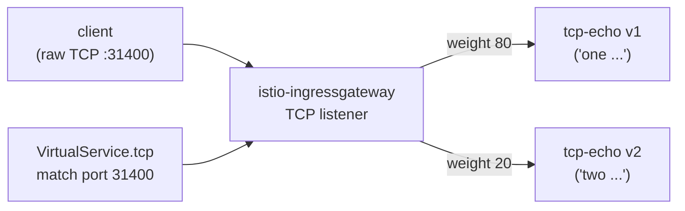

[RU version](README_RU.MD) · [Eng version](README.MD) · [Versión en español](README_ES.MD) · [Deutsche Version](README_DE.MD)

# Lab 28 - TCP routing : routage du trafic non-HTTP

## Aperçu

Tout le trafic n'est pas du HTTP. Les bases de données, les brokers, les protocoles
personnalisés fonctionnent sur du TCP brut, où il n'y a ni host, ni path, ni en-têtes.
Istio route ce trafic au niveau L4 : via un `Gateway` avec `protocol: TCP` et un
`VirtualService.tcp`, où la route est choisie selon le **port** du listener.

Dans ce lab est déployé un service TCP-echo `tcp-echo` en deux versions (sur le port TCP
brut `9000`) :
- **v1** répond avec le préfixe `one` ;
- **v2** répond avec le préfixe `two`.

L'ingress gateway écoute déjà le TCP sur le NodePort `31400`.



## Infrastructure

| Composant | Type | Qté | Rôle |
|---|---|---|---|
| control-plane | `t3.medium` | 1 | master + istiod + ingress gateway |
| worker | `t3.small` | 1 | capacité pour tcp-echo v1/v2 |
| worker PC | `t3.small` | 1 | poste de travail : `kubectl`, `bash /dev/tcp`, `check_result` |

Région : `eu-central-1` (AZ `eu-central-1a` / `eu-central-1b`).

## Déploiement

```bash
TASK=28 make run_ica_task
```

## Exercice

1. Créer un `Gateway` avec un serveur `protocol: TCP` sur le port `31400`.
2. Créer une `DestinationRule` avec les subsets `v1`/`v2`.
3. Créer un `VirtualService` avec une route `tcp` (match sur le port 31400), répartissant
   de façon pondérée les connexions entre v1 (80%) et v2 (20%).
4. Vérifier que le TCP brut à travers le gateway atteint le service et que l'écho revient.

## Étape 1. Gateway avec listener TCP

```bash
kubectl apply -f - <<'EOF'
apiVersion: networking.istio.io/v1
kind: Gateway
metadata:
  name: tcp-echo-gateway
  namespace: app
spec:
  selector:
    istio: ingressgateway
  servers:
    - port:
        number: 31400
        name: tcp
        protocol: TCP
      hosts:
        - "*"
EOF
```

## Étape 2. DestinationRule avec subsets

```bash
kubectl apply -f - <<'EOF'
apiVersion: networking.istio.io/v1
kind: DestinationRule
metadata:
  name: tcp-echo
  namespace: app
spec:
  host: tcp-echo
  subsets:
    - name: v1
      labels:
        version: v1
    - name: v2
      labels:
        version: v2
EOF
```

## Étape 3. VirtualService avec route TCP

```bash
kubectl apply -f - <<'EOF'
apiVersion: networking.istio.io/v1
kind: VirtualService
metadata:
  name: tcp-echo
  namespace: app
spec:
  hosts:
    - "*"
  gateways:
    - tcp-echo-gateway
  tcp:
    - match:
        - port: 31400
      route:
        - destination:
            host: tcp-echo
            port:
              number: 9000
            subset: v1
          weight: 80
        - destination:
            host: tcp-echo
            port:
              number: 9000
            subset: v2
          weight: 20
EOF
```

## Étape 4. Vérification

```bash
for i in $(seq 10); do
  echo "hello" | timeout 3 bash -c 'exec 3<>/dev/tcp/myapp.local/31400; cat >&3; head -n 1 <&3'
done
# ~80% "one hello", ~20% "two hello"
```

(Si `nc` est installé : `echo hello | nc myapp.local 31400`.)

## Comment ça marche

- **Le routage TCP** fonctionne au niveau L4 : pas de host/path/en-têtes HTTP, donc la
  route est choisie selon le **port du listener** (`match.port`). Un `Gateway` avec
  `protocol: TCP` ouvre un listener TCP ordinaire dans Envoy, et `VirtualService.tcp`
  dirige la connexion vers le bon subset.
- **Le nom du port est important** : le port du service/gateway doit s'appeler `tcp` (ou
  `tcp-*`). Istio détermine le protocole d'après le préfixe du nom de port ; un nom sans
  préfixe ou `http-*` forcera Istio à le considérer comme du HTTP et le protocole brut sera
  cassé.
- **Le TCP pondéré** répartit les *connexions* (et non les requêtes) entre les subsets -
  chaque nouvelle connexion TCP est routée selon le poids.
- Les fonctions L7 (retries, header routing, fault injection) **ne s'appliquent pas** aux
  routes TCP - seulement les politiques de niveau connexion (connection pool, timeouts)
  via la `DestinationRule`.

## Protocoles apparentés

- **MongoDB/MySQL/Redis** - nommez le port `mongo-*` / `mysql-*` / `redis-*` pour qu'Envoy
  applique le bon parseur de protocole ; le routage passe malgré tout par des routes `tcp`.
- **WebSocket** - bien qu'il s'agisse d'une connexion longue durée, il fonctionne
  par-dessus HTTP `Upgrade`, utilisez donc des routes `http` ordinaires et des noms de
  port `http-*`, et non du TCP.

## Vérification du résultat

Lancez sur le worker PC :

```bash
check_result
```

## Bilan

Vous avez configuré le routage de TCP brut à travers l'ingress gateway avec répartition
pondérée entre les versions. Comprendre le routage L4 (par port, en tenant compte du
nommage des ports) est une compétence importante pour travailler avec des charges non-HTTP
(BD, brokers, protocoles personnalisés) dans le maillage.
