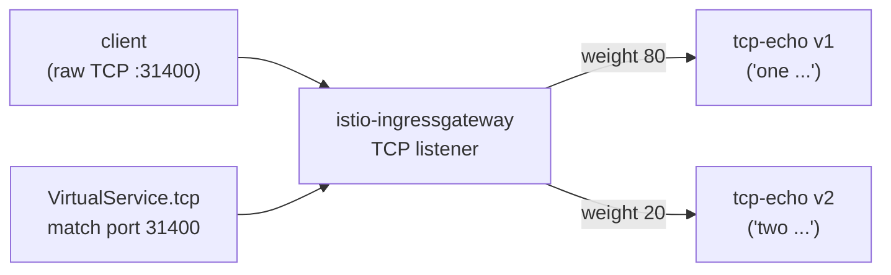

[Русская версия](README_RU.MD) · [Eng version](README.MD) · [Versión en español](README_ES.MD) · [Version française](README_FR.MD) · [Deutsche Version](README_DE.MD) · [繁體中文版](README_TW.MD) · [日本語版](README_JP.MD)

# ლაბორატორია 28 - TCP-მარშრუტიზაცია: არა-HTTP ტრაფიკის მარშრუტიზაცია

> [საცნობარო გადაწყვეტა](worker/files/solutions/1_GE.MD)

## მიმოხილვა

ყველა ტრაფიკი HTTP არ არის. მონაცემთა ბაზები, ბროკერები და მორგებული პროტოკოლები ნედლ
TCP-ზე მუშაობენ, სადაც host/path/სათაურები არ არსებობს. Istio ასეთ ტრაფიკს L4 დონეზე
მარშრუტიზებს: `Gateway`-ის საშუალებით `protocol: TCP`-ით და `VirtualService.tcp`-ით,
სადაც მარშრუტი მსმენელის **პორტის** მიხედვით შეირჩევა.

ლაბორატორიაში გაშლილია TCP echo-სერვისის `tcp-echo` ორი ვერსია (ნედლ TCP-პორტზე `9000`):
- **v1** პასუხობს პრეფიქსით `one`;
- **v2** პასუხობს პრეფიქსით `two`.

Ingress gateway უკვე უსმენს TCP-ს NodePort `31400`-ზე.



## ინფრასტრუქტურა

| კომპონენტი | ტიპი | რაოდენობა | დანიშნულება |
|---|---|---|---|
| control-plane | `t3.medium` | 1 | master + istiod + ingress gateway |
| worker | `t3.small` | 1 | რესურსები tcp-echo v1/v2-ისთვის |
| worker PC | `t3.small` | 1 | სამუშაო გარემო: `kubectl`, `bash /dev/tcp`, `check_result` |

რეგიონი: `eu-central-1` (AZ `eu-central-1a` / `eu-central-1b`).

## გაშლა

```bash
TASK=28 make run_ica_task
```

## დავალება

1. შექმენით `Gateway` სერვერით `protocol: TCP` პორტზე `31400`.
2. შექმენით `DestinationRule` subsets-ით `v1`/`v2`.
3. შექმენით `VirtualService` `tcp`-მარშრუტით (match პორტზე 31400), რომელიც
   კავშირებს წონების მიხედვით ანაწილებს v1-სა (80%) და v2-ს (20%) შორის.
4. შეამოწმეთ, რომ raw-TCP gateway-ის გავლით სერვისამდე მიდის და echo-პასუხი ბრუნდება.

## ნაბიჯი 1. Gateway TCP-მსმენელით

```bash
kubectl apply -f - <<'EOF'
apiVersion: networking.istio.io/v1
kind: Gateway
metadata:
  name: tcp-echo-gateway
  namespace: app
spec:
  selector:
    istio: ingressgateway
  servers:
    - port:
        number: 31400
        name: tcp
        protocol: TCP
      hosts:
        - "*"
EOF
```

## ნაბიჯი 2. DestinationRule subsets-ით

```bash
kubectl apply -f - <<'EOF'
apiVersion: networking.istio.io/v1
kind: DestinationRule
metadata:
  name: tcp-echo
  namespace: app
spec:
  host: tcp-echo
  subsets:
    - name: v1
      labels:
        version: v1
    - name: v2
      labels:
        version: v2
EOF
```

## ნაბიჯი 3. VirtualService TCP-მარშრუტით

```bash
kubectl apply -f - <<'EOF'
apiVersion: networking.istio.io/v1
kind: VirtualService
metadata:
  name: tcp-echo
  namespace: app
spec:
  hosts:
    - "*"
  gateways:
    - tcp-echo-gateway
  tcp:
    - match:
        - port: 31400
      route:
        - destination:
            host: tcp-echo
            port:
              number: 9000
            subset: v1
          weight: 80
        - destination:
            host: tcp-echo
            port:
              number: 9000
            subset: v2
          weight: 20
EOF
```

## ნაბიჯი 4. შემოწმება

```bash
for i in $(seq 10); do
  echo "hello" | timeout 3 bash -c 'exec 3<>/dev/tcp/myapp.local/31400; cat >&3; head -n 1 <&3'
done
# ~80% "one hello", ~20% "two hello"
```

(თუ `nc` დაყენებულია: `echo hello | nc myapp.local 31400`.)

## როგორ მუშაობს

- **TCP-მარშრუტიზაცია** L4 დონეზე მუშაობს: HTTP host/path/სათაურები არ არსებობს, ამიტომ
  მარშრუტი **მსმენელის პორტის** (`match.port`) მიხედვით შეირჩევა. `Gateway` `protocol: TCP`-ით
  Envoy-ში ჩვეულებრივ TCP-listener-ს ხსნის, ხოლო `VirtualService.tcp` კავშირს საჭირო
  subset-ში მიმართავს.
- **პორტის სახელი მნიშვნელოვანია**: სერვისის/gateway-ის პორტს უნდა ერქვას `tcp` (ან `tcp-*`).
  Istio პროტოკოლს პორტის სახელის პრეფიქსით განსაზღვრავს; პრეფიქსის გარეშე სახელი ან
  `http-*` აიძულებს Istio-ს, ის HTTP-დ ჩათვალოს, რის გამოც ნედლი პროტოკოლი დაირღვევა.
- **წონიანი TCP** subsets-ს შორის *კავშირებს* (და არა მოთხოვნებს) ანაწილებს - ყოველი ახალი
  TCP-კავშირი წონის მიხედვით მარშრუტიზდება.
- L7-ფუნქციები (retries, header routing, fault injection) TCP-მარშრუტებზე **არ გამოიყენება** -
  `DestinationRule`-ის საშუალებით ხელმისაწვდომია მხოლოდ კავშირის დონის პოლიტიკები
  (connection pool, timeouts).

## მონათესავე პროტოკოლები

- **MongoDB/MySQL/Redis** - პორტს დაარქვით `mongo-*` / `mysql-*` / `redis-*`, რათა Envoy-მ
  პროტოკოლის შესაბამისი parser გამოიყენოს; მარშრუტიზაცია კვლავ `tcp`-მარშრუტებით ხდება.
- **WebSocket** - ხანგრძლივი კავშირის მიუხედავად, HTTP `Upgrade`-ზე მუშაობს, ამიტომ
  გამოიყენეთ ჩვეულებრივი `http`-მარშრუტები და პორტის სახელები `http-*`, და არა TCP.

## შედეგის შემოწმება

worker PC-ზე გაუშვით:

```bash
check_result
```

## შეჯამება

თქვენ ingress gateway-ის გავლით ნედლი TCP-ის მარშრუტიზაცია ვერსიებს შორის წონიანი
განაწილებით დააკონფიგურირეთ. L4-მარშრუტიზაციის გაგება (პორტის მიხედვით, პორტების
დასახელების გათვალისწინებით) მნიშვნელოვანი უნარია mesh-ში არა-HTTP დატვირთვებთან
(მონაცემთა ბაზები, ბროკერები, მორგებული პროტოკოლები) მუშაობისთვის.
